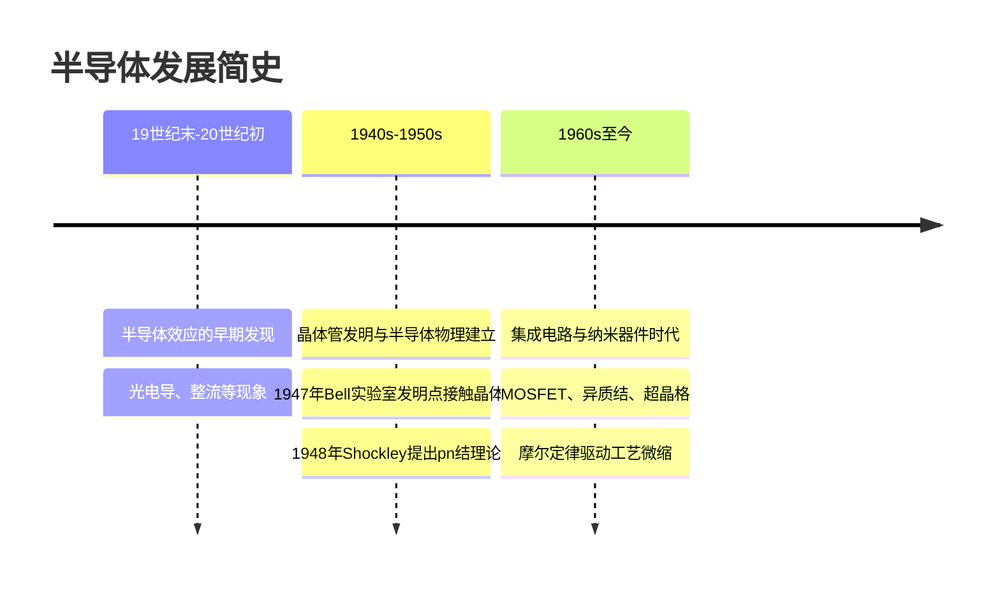
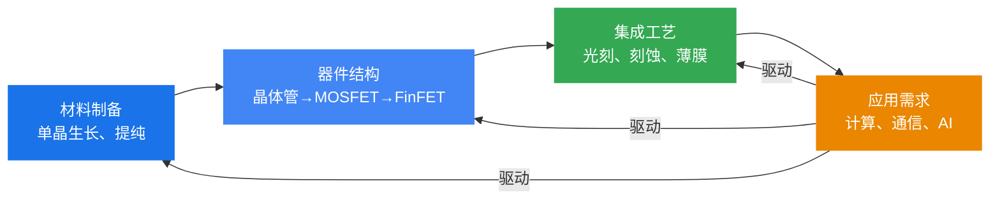

# 第一章 绪论

> 本章是半导体物理课程的导论，介绍半导体的基本概念、研究内容和发展历程，为后续章节奠定背景知识。

---

## 1.1 半导体的研究内容

### 什么是半导体

**半导体**（Semiconductor）是导电能力介于导体和绝缘体之间的物质。其导电率通常在 $10^{-4}$ ~ $10^9\ \Omega^{-1}\cdot\text{cm}^{-1}$ 之间，且具有以下特点：

- **温度敏感性**：温度升高时导电率急剧增大（与金属相反）
- **杂质敏感性**：微量杂质可显著改变导电性能
- **光照敏感性**：光照可改变导电率（光电导效应）
- **场效应**：电场可调控表面导电性能

### 半导体的主要研究内容

半导体物理主要研究以下核心问题：

| 研究方向 | 核心问题 | 对应章节 |
|:---|:---|:---|
| **微观电子状态** | 电子在晶体周期性势场中如何运动？能带如何形成？ | 第二章 |
| **杂质与缺陷** | 杂质和缺陷如何影响能带结构？ | 第三章 |
| **载流子统计** | 热平衡下载流子浓度如何确定？费米能级如何变化？ | 第四章 |
| **输运性质** | 载流子在电场下如何漂移？散射机制是什么？ | 第五章 |
| **非平衡载流子** | 非平衡载流子的注入、复合与扩散规律 | 第六章 |
| **结型器件** | pn结、金半接触的整流特性与物理机制 | 第七、八章 |
| **表面与界面** | MIS结构的C-V特性、表面态的影响 | 第九章 |
| **场效应器件** | MOSFET的工作原理与I-V特性 | 第十章 |
| **异质结构** | 异质结、超晶格的能带工程与器件应用 | 第十一章 |

### 半导体的分类

按化学组成，半导体材料可分为三大类：

**1. 元素半导体**
- 由单一元素组成
- 主要代表：**硅（Si）**、**锗（Ge）**
- 硅是目前集成电路最主要的材料

**2. 化合物半导体**
- 由两种或多种元素组成
- **III-V族**：GaAs、InP、GaN、GaP 等（高频、光电子器件）
- **II-VI族**：CdS、ZnS、ZnSe 等（发光器件、探测器）
- **IV-IV族**：SiC、SiGe 等（高温、高频器件）

**3. 固溶体半导体**
- 两种半导体混合形成的连续固溶体
- 如 Al$_x$Ga$_{1-x}$As、In$_x$Ga$_{1-x}$As$_y$P$_{1-y}$
- 带隙可随组分连续调节，是**能带工程**的基础

> **理解笔记：** 半导体物理的研究遵循一条清晰的主线：从微观（电子状态、能带）到宏观（载流子浓度、导电性），从平衡态到非平衡态，从体材料到结型器件，最终落实到实际器件设计。本课程后续各章正是沿着这条主线展开。

---

## 1.2 半导体的发展简史

### 半导体发展的三个阶段

### 关键历史节点

#### 早期发现（19世纪末~20世纪初）

- **1833年**：法拉第（Faraday）发现 Ag$_2$S 的电阻随温度升高而下降（半导体的温度特性）
- **1873年**：史密斯（Smith）发现硒的光电导效应
- **1874年**：布劳恩（Braun）发现金属-硫化物接触的整流特性
- **1883年**：弗利兹（Fritts）制成第一个硒整流器

> 这一时期虽然发现了半导体的多种效应，但由于缺乏理论指导，半导体被认为是"不完美的导体"，未受到足够重视。

#### 理论奠基与晶体管发明（1930s~1950s）

- **1931年**：威尔逊（Wilson）提出能带理论，奠定了半导体物理的理论基础
- **1939年**：莫特（Mott）和肖特基（Schottky）提出势垒理论
- **1947年12月**：巴丁（Bardeen）、布拉顿（Brattain）在贝尔实验室发明**点接触晶体管**
- **1949年**：肖克利（Shockley）提出**pn结**理论和**结型晶体管**构想
- **1950年**：蒂尔（Teal）和利特尔（Little）生长出锗单晶
- **1952年**：普凡（Pfann）发明区域提纯法
- **1954年**：蒂尔制成第一根硅单晶；德州仪器公司推出第一支硅晶体管
- **1956年**：巴丁、布拉顿、肖克利因晶体管发明获**诺贝尔物理学奖**
- **1957年**：江崎玲於奈（Esaki）发明**隧道二极管**
- **1958年**：基尔比（Kilby）和诺伊斯（Noyce）分别独立发明**集成电路**

> **理解笔记：** 能带理论（Wilson）是半导体物理的理论基石，它解释了为什么有些材料是导体、绝缘体、半导体。晶体管的发明标志着信息时代的开端，被称为"20世纪最重要的发明"。

#### 集成电路与微电子时代（1960s~至今）

- **1960年**：Attala和Kahng发明**MOSFET**（金属-氧化物-半导体场效应晶体管）
- **1962年**：霍尔（Hall）、内森（Nathan）等实现**半导体激光器**（GaAs）
- **1963年**：Gunn发现**耿氏效应**（转移电子效应）
- **1965年**：摩尔（Moore）提出**摩尔定律**——集成电路上晶体管数量约每18个月翻一番
- **1967年**：江崎玲於奈和朱兆祥提出**超晶格**概念
- **1970年**：斯皮瑟（Spicer）提出**界面态钉扎**模型（费米能级钉扎）
- **1980s**：分子束外延（MBE）技术成熟，实现**原子级精度**超晶格生长
- **2000年**：基尔比因集成电路发明获**诺贝尔物理学奖**
- **21世纪**：FinFET、GAA等新结构延续摩尔定律；3nm/2nm工艺量产

### 半导体技术发展的核心驱动力

### 中国半导体发展概况

- **1956年**：中国将半导体技术列为四大紧急措施之一
- **1965年**：研制出第一块集成电路
- **2000s至今**：中芯国际、长江存储、华为海思等快速发展
- **当前**：在成熟工艺（28nm及以上）和特色工艺（功率半导体、化合物半导体）领域取得突破

> **小结**：半导体的发展历程体现了"理论→材料→器件→应用"的螺旋上升过程。从能带理论的建立到晶体管的发明，从MOSFET到超晶格，每一次突破都源于基础物理研究与工艺技术的进步。理解这段历史有助于把握半导体物理各章节之间的内在联系。
