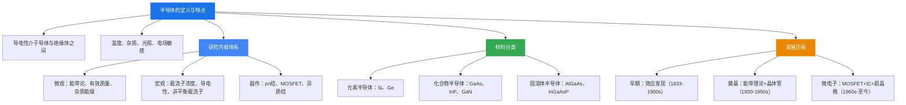

# 本章总结

### 知识脉络

### 核心要点回顾

1. **半导体是导电能力介于导体和绝缘体之间的物质**，其导电性能对温度、杂质、光照和电场高度敏感，这正是半导体器件可调控性的物理基础。

2. **半导体物理的研究主线**：微观电子状态（能带论）→ 杂质与缺陷 → 载流子统计 → 输运性质 → 非平衡过程 → 结型器件 → 场效应器件 → 异质结构。后续各章沿此主线展开。

3. **半导体材料三大类**：元素半导体（Si、Ge）、化合物半导体（GaAs等III-V族）、固溶体半导体（AlGaAs等），其中硅是集成电路的基石。

4. **能带理论（1931, Wilson）是半导体物理的理论基石**，它解释了导体、绝缘体、半导体的本质区别。

5. **晶体管的发明（1947）开启了信息时代**，MOSFET（1960）和集成电路（1958）的发明使微电子技术飞速发展，摩尔定律驱动工艺不断微缩。
