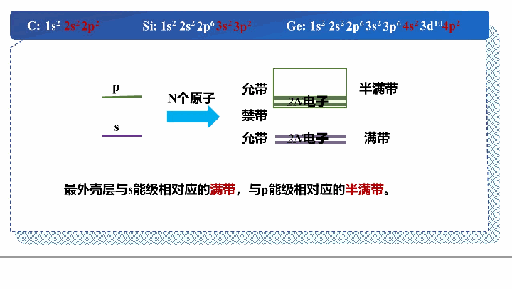

## 2.2 半导体中的电子状态与能带论

### 2.2.1 原子中的电子状态——能级

#### 量子态的描述

孤立原子中的电子状态由四个量子数确定：

| 量子数 | 符号 | 含义 | 取值范围 |
|--------|------|------|---------|
| 主量子数 | $n$ | 能级（电子壳层） | $n = 1, 2, 3, \ldots$ |
| 角量子数 | $l$ | 次能级（轨道形状：s, p, d, f） | $l = 0, 1, 2, \ldots, n-1$ |
| 磁量子数 | $m_l$ | 轨道方向 | $m_l = -l, \ldots, +l$ |
| 自旋量子数 | $m_s$ | 自旋方向 | $m_s = \pm 1/2$ |

**能级公式（氢原子）：**

$$E = -13.6 \times \frac{Z^2}{n^2} \text{ (eV)}$$

每个主量子数 $n$ 对应的量子态总数为 $2n^2$ 个：
- $n=1$（K壳层）：2个态
- $n=2$（L壳层）：8个态
- $n=3$（M壳层）：18个态
- $n=4$（N壳层）：32个态

#### 电子在量子态上的分布

电子填充遵循两个基本原理：

1. **泡利不相容原理**：每个量子态最多容纳一个电子（自旋相反的两个电子占据同一轨道）
2. **能量最小原理**：电子优先填充能量最低的量子态

**填充顺序**：$1s \rightarrow 2s \rightarrow 2p \rightarrow 3s \rightarrow 3p \rightarrow 4s \rightarrow 3d \rightarrow 4p \rightarrow \ldots$

> **关键结论：** 单个原子中的电子总是局限在原子周围的一系列**分立的能级**上，能量是量子化的、不连续的。这是原子中电子状态的基本特征。

**IVA 族元素（半导体材料）的电子排布：**

| 元素 | 原子序数 | 电子排布 |
|------|---------|---------|
| C | 6 | $1s^2 2s^2 2p^2$ |
| Si | 14 | $1s^2 2s^2 2p^6 3s^2 3p^2$ |
| Ge | 32 | $1s^2 2s^2 2p^6 3s^2 3p^6 4s^2 3d^{10} 4p^2$ |

注意它们的最外层都有 4 个价电子（$ns^2 np^2$），这决定了它们的共价键合方式和半导体性质。

*图：孤立原子中的分立能级与电子排布。来源：曹荣荣老师课件（第03次课）*

### 2.2.2 晶体中的电子状态——能带

#### 电子的共有化运动

当 $N$ 个原子相距很远时，各原子的电子独立运动，能级互不影响。但当原子靠近形成晶体时：

1. **电子波函数发生交叠**：相邻原子的外层电子波函数相互重叠
2. **能级分裂**：原来 $N$ 个原子的同一能级分裂为 $N$ 个非常接近的能级
3. **电子共有化运动**：电子不再局限于某一个原子，而可以在整个晶体中运动

**内外层电子的差异：**

| 电子类型 | 能级高低 | 共有化程度 | 能级分裂 | 能带宽度 |
|---------|---------|-----------|---------|---------|
| 内层电子 | 低 | 弱 | 弱 | 窄 |
| 外层电子 | 高 | 强 | 强 | 宽 |

> **理解笔记：** 外层电子离核远，受原子核束缚弱，相邻原子的外层电子波函数重叠大，所以共有化运动强，能级分裂程度大，形成的能带宽。内层电子恰恰相反。这也是为什么在半导体物理中我们主要关注最外层的价电子能带。

#### 能带的形成

$N$ 个原子相互作用时，原来一个原子能级上的 $N$ 个电子，其能量不再相同，分裂成 $N$ 个紧密排列的能级。由于 $N$ 非常大（$\sim 10^{22} \sim 10^{23}$ /cm$^3$），能级间距极小，可以近似视为**连续**的能量区间，称为**能带**。

**各能级的状态数：**

| 亚层 | 角量子数 $l$ | 不计自旋的状态数 | 计入自旋的状态数 | N个原子时的能带容量 |
|------|-------------|----------------|----------------|-------------------|
| s | 0 | 1 | 2 | $2N$ |
| p | 1 | 3 | 6 | $6N$ |
| d | 2 | 5 | 10 | $10N$ |

相邻能带之间可能出现**不允许电子存在的能量区间**，称为**禁带**（带隙）。

*图：原子间距减小导致能级分裂为准连续的能带。来源：曹荣荣老师课件（第03次课）*

**能带重叠与重新分裂：** 在实际晶体中，随着原子间距减小，能带展宽、重叠、重新分裂，使得实际的能带结构比简单的原子能级对应关系更为复杂。

#### 能带中的电子填充——导体、半导体、绝缘体

根据能带填充情况，定义：
- **满带**：完全被电子占据的能带 → **不导电**
- **空带**：完全没有电子的能带 → **不导电**
- **未满带**（半满带）：电子部分填充的能带 → **导电**

在绝对零度（$T = 0$ K）下：
- **价带**（Valence Band）：能量最高的满带
- **导带**（Conduction Band）：价带之上的空带
- **禁带宽度** $E_g$：导带底与价带顶之间的能量差

**三类材料的能带模型（$T = 0$ K）：**

| 材料类型 | 能带特征 | 禁带宽度 | 导电性 |
|---------|---------|---------|-------|
| **导体** | 价带与导带重叠（或价带半满） | 无禁带 | 良好导电 |
| **半导体** | 价带满、导带空 | $\sim 1$ eV | 热激发可导电 |
| **绝缘体** | 价带满、导带空 | $\sim 10$ eV | 几乎不导电 |

*图：三类材料的能带填充模型（T=0K）。来源：曹荣荣老师课件（第03次课）*

### 2.2.3 能带论

#### 单电子近似理论

晶体中的电子受到自身原子核、邻近原子核、以及其他电子的共同作用，是一个复杂的多体问题。为了求解，采用**单电子近似**：

- 将原子核视为固定不动，按严格周期性排列
- 其他电子对某个电子的作用等效为一个**平均势场**，该势场也具有与晶格相同的周期性

这样就把多体问题简化为单电子在周期性势场中运动的问题。

#### 自由电子与晶体电子的区别

**自由电子**的薛定谔方程：

$$-\frac{\hbar^2}{2m_0}\frac{d^2\psi(x)}{dx^2} = E\psi(x)$$

其中 $V(x) = 0$（无势场），解为平面波：$\psi(x) = Ae^{ikx}$

**晶体中电子**的薛定谔方程：

$$-\frac{\hbar^2}{2m_0}\frac{d^2\psi(x)}{dx^2} + V(x)\psi(x) = E\psi(x)$$

其中 $V(x) = V(x + sa)$ 是周期性势场（$a$ 为晶格常数，$s$ 为整数），解为**布洛赫波**：

$$\psi_k(x) = u_k(x)e^{ikx}$$

其中 $u_k(x)$ 具有与晶格相同的周期性，即 $u_k(x) = u_k(x + a)$。

> **布洛赫定理的核心意义：** 晶体中电子的波函数 = 平面波 × 周期调制函数。这意味着电子在整个晶体中是共有化的（类似自由电子的平面波部分），但其振幅受到周期性势场的调制。

#### E-k 关系与布里渊区

**自由电子：** $E(k) = \frac{\hbar^2 k^2}{2m_0}$，能量连续，抛物线关系。

**晶体中电子：** $E(k)$ 具有以下特征：
- $E(k)$ 是 $k$ 的**周期性函数**：$E(k) = E(k + n \cdot 2\pi/a)$
- 每个能带内 $E(k)$ 连续变化
- 相邻能带之间存在**不连续的禁带**（能隙）

**简约布里渊区（Reduced Brillouin Zone）：** 由于 $E(k)$ 的周期性，只需取 $k \in [-\pi/a, \pi/a]$（第一布里渊区）即可完整描述所有能带。将其他区域的 $E(k)$ 曲线平移折叠到第一布里渊区内，称为**简约布里渊区表示**。

> **小结（2.2 电子状态与能带论）**
>
> 本节从原子中的分立能级出发，解释了当大量原子组成晶体时，由于电子波函数交叠和共有化运动，分立能级分裂为准连续的能带。这是能带论的核心思想。通过布洛赫定理，我们知道了晶体中电子的波函数是平面波与周期函数的乘积，E-k关系呈周期性，出现了禁带——这是导体、半导体、绝缘体分类的物理根源。半导体与绝缘体的能带模型相同（满价带 + 空导带），区别仅在于禁带宽度：半导体约 1 eV，绝缘体约 10 eV。

---

