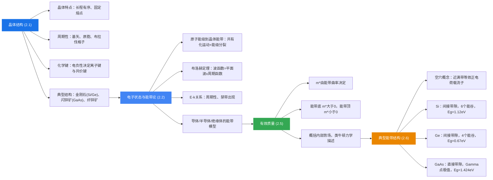

## 2.6 本征半导体的导电机构与典型材料能带结构

### 本征半导体的导电机构

#### 晶体的导电性

晶体的导电性取决于电子在能带中的填充情况：

- **满带不导电**：$E(k) = E(-k)$，电子在 $k$ 空间对称分布；又 $u(k) = -u(-k)$，速度大小相等方向相反，总电流为零。即使加外电场，满带中所有电子以相同速率运动，不改变对称分布，仍不导电。
- **未满带导电**：无外场时也不导电（对称分布）；但**有外场时**，电子在能带中的分布不再对称，正负速度产生的电流不能完全抵消，产生净电流，导电。

#### 导体、半导体、绝缘体的能带模型（温度一定时）

- **绝缘体**：价带为满带，导带为空带，禁带宽度 $\sim 10$ eV，常温下电子无法跃迁到导带
- **半导体**：价带为满带，导带为空带，禁带宽度 $\sim 1$ eV，常温下部分价带电子可热激发到导带
- **导体**：价带与导带重叠，存在未满带，电子自由运动

**本征激发：** 当温度一定时，价带电子受热激发跃迁到导带的过程。本征激发产生**电子-空穴对**。

#### 空穴的概念

当价带中只有一个空位时，在外场作用下，价带电子的总电流等价于一个**带正电荷**粒子的运动：

设价带中电子产生的总电流为 $J = \sum(-q)u(k)$，当用一个电子填充空位后满带不导电（$J_{total} = 0$），即 $J + (-q)u(k_h) = 0$，得 $J = +qu(k_h)$。

**空穴**：价带中空着的状态，等效为带正电荷 $+q$ 的粒子。

**空穴的性质：**
1. 带正电荷 $+q$，电荷量与电子相同
2. 空穴的能量增加方向与电子**相反**（空穴能量向下增加）
3. 空穴一般出现在能带顶部，具有**正有效质量** $m_p^*$（$m_p^* = -m_n^*$，由于价带顶 $m_n^* < 0$，所以 $m_p^* > 0$）
4. 是为处理近满带导电问题而引入的等效概念，用少数空穴描述近满带中大量电子的集体运动行为

#### 硅和锗的空穴有效质量

| 材料 | $(m_p)_{hh}/m_0$（重空穴） | $(m_p)_{lh}/m_0$（轻空穴） |
|------|--------------------------|--------------------------|
| Si | 0.53 | 0.16 |
| Ge | 0.28 | 0.044 |

### 典型半导体的能带结构

#### 简化能带图

在实际应用中，常使用简化能带图，其中：
- 横坐标没有物理意义，纵坐标表示电子能量的允许值
- 忽略了导带和价带的宽度
- 只标出**导带底** $E_c$、**价带顶** $E_v$ 和**禁带宽度** $E_g$

这是因为能够从价带激发到导带的电子数量极少，电子只占据导带底附近的量子态，导带中大量的量子态都是空的，因此导带宽度不重要。

#### 等能面

$k$ 空间中能量相等的点构成的曲面称为等能面。
- 自由电子的等能面是**球面**
- 半导体中的电子，只需考虑能带极值附近的等能面

#### 硅（Si）的能带结构

**导带：**
- 导带在 $[100]$ 方向有一个极小值，距布里渊区中心约 $0.85$ 倍处
- Si 是立方对称，在六个等价的 $\langle 100 \rangle$ 方向上都有极小值，即**六个能谷**
- 导带底等能面为**旋转椭球面**

**价带：**
- 三个价带，其中两个在 $k=0$ 处有相同的极大值（简并）
- 上面的价带曲率小 → 空穴有效质量大 → **重空穴**（heavy hole）
- 下面的价带曲率大 → 空穴有效质量小 → **轻空穴**（light hole）
- 这两个价带的等能面是复杂的扭曲面
- 第三个带由自旋-轨道耦合分裂出来，极值比前两个低，等能面是球面

**禁带宽度：**

| 温度 | $E_g$ |
|------|-------|
| $T = 0$ K | 1.17 eV |
| $T = 300$ K | 1.12 eV |

**Si 是间接带隙半导体**：导带底和价带顶对应 $k$ 空间的不同位置。

#### 锗（Ge）的能带结构

- 导带极小值位于 $[111]$ 方向的布里渊区边界
- 共有 8 个极小值，由于对称性形成**4个等价能谷**
- 价带结构与 Si 类似（重空穴带、轻空穴带、自旋-轨道分裂带）
- **间接带隙半导体**

**禁带宽度：**

| 温度 | $E_g$ |
|------|-------|
| $T = 0$ K | 0.74 eV |
| $T = 300$ K | 0.67 eV |

#### 砷化镓（GaAs）的能带结构

GaAs 是 III-V 族化合物半导体，具有闪锌矿结构。

**导带：**
- 导带极小值位于 $k = 0$ 处（$\Gamma$ 点）
- 在 L 点和 X 点还有较高能量的能谷（较高能谷）

**价带：**
- 价带极大值也在 $k = 0$ 处
- 价带是简并的（重空穴带和轻空穴带在 $\Gamma$ 点简并）

**直接带隙半导体：** 导带底和价带顶在 $k$ 空间的同一点（$k=0$），这是 GaAs 与 Si、Ge 的根本区别。

**关键参数（300 K）：**

| 参数 | 数值 |
|------|------|
| 禁带宽度 $E_g$ | 1.424 eV |
| 导带底电子有效质量 | $0.063 m_0$ |
| 重空穴有效质量 | $0.5 m_0$ |
| 轻空穴有效质量 | $0.076 m_0$ |
| L 能谷电子有效质量 | $0.55 m_0$ |
| X 能谷电子有效质量 | $0.85 m_0$ |
| 自旋-轨道分裂能 | 0.34 eV |

> **理解笔记：** GaAs 的电子有效质量（$0.063 m_0$）远小于 Si 的（$0.26 m_0$），这意味着 GaAs 中的电子更"灵活"，迁移率更高，因此 GaAs 适合用于高频、高速器件。此外，GaAs 的直接带隙特性使其可以高效地发射和吸收光子，是制作激光器和发光二极管（LED）的理想材料，而 Si 作为间接带隙材料，发光效率很低。

> **小结（2.6 典型材料能带结构）**
>
> 本节从本征半导体的导电机制出发，引入了空穴的概念，完善了半导体中两种载流子（电子和空穴）的物理图像。然后介绍了三种最重要的半导体材料（Si、Ge、GaAs）的能带结构。核心区别在于：Si 和 Ge 是间接带隙半导体（导带底和价带顶不在 $k$ 空间同一点），而 GaAs 是直接带隙半导体。这一区别直接决定了它们在光电子器件中的适用性。同时，不同材料的有效质量差异也决定了载流子的输运性能。

---

## 本章总结

### 知识脉络

### 核心要点回顾

1. **晶体结构是理解半导体性质的基础**：周期性排列的原子构成点阵，决定了电子所处的势场具有周期性。

2. **能带论是半导体物理的理论基石**：布洛赫定理告诉我们晶体中电子的波函数是调幅平面波，能量形成带状结构（允带 + 禁带）。

3. **有效质量是连接量子力学与经典力学的桥梁**：它概括了晶格内部势场的影响，使我们能用简单的 $F = m^*a$ 描述晶体中电子的运动。

4. **直接带隙与间接带隙的区别决定了材料的应用方向**：直接带隙材料（GaAs）适合光电器件；间接带隙材料（Si）适合电子器件。

5. **半导体中有两种载流子**：导带中的电子（负电荷，有效质量 $m_n^*$）和价带中的空穴（等效正电荷，有效质量 $m_p^*$）。理解这两种载流子的行为是后续学习载流子浓度、导电性、pn 结等内容的基础。
