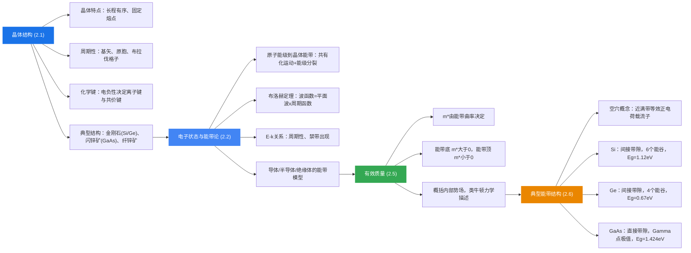

# 本章总结

### 知识脉络

### 核心要点回顾

1. **晶体结构是理解半导体性质的基础**：周期性排列的原子构成点阵，决定了电子所处的势场具有周期性。

2. **能带论是半导体物理的理论基石**：布洛赫定理告诉我们晶体中电子的波函数是调幅平面波，能量形成带状结构（允带 + 禁带）。

3. **有效质量是连接量子力学与经典力学的桥梁**：它概括了晶格内部势场的影响，使我们能用简单的 $F = m^*a$ 描述晶体中电子的运动。

4. **直接带隙与间接带隙的区别决定了材料的应用方向**：直接带隙材料（GaAs）适合光电器件；间接带隙材料（Si）适合电子器件。

5. **半导体中有两种载流子**：导带中的电子（负电荷，有效质量 $m_n^*$）和价带中的空穴（等效正电荷，有效质量 $m_p^*$）。理解这两种载流子的行为是后续学习载流子浓度、导电性、pn 结等内容的基础。
