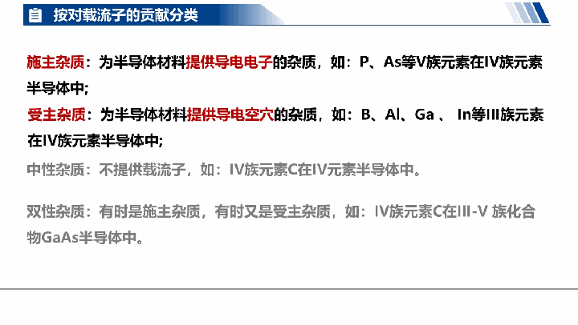
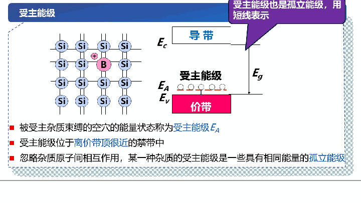
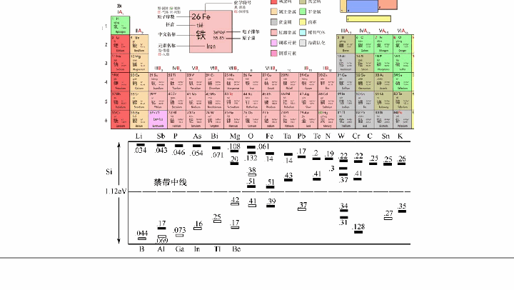
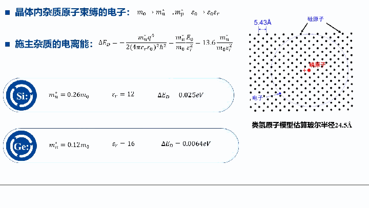

# 第三章 半导体中的杂质和缺陷能级

> 本章是半导体物理的核心章节之一。实际半导体中总是存在杂质和缺陷，它们对半导体的电学性质有着决定性的影响。即使是极微量的杂质（如百万分之一的硼原子），也能使硅的电导率发生数量级的变化。理解杂质和缺陷能级，是掌握半导体器件工作原理的基础。

---

### 3.1.1 半导体中杂质的分类

#### 理想半导体与实际半导体

在讨论杂质之前，首先需要区分理想半导体和实际半导体：

- **理想半导体**：原子严格地按周期性排列在晶格格点位置上，纯净无杂质无缺陷，晶格结构完整。
- **实际半导体**：原子在平衡位置附近做热振动，含有杂质，并且存在点、线、面等各种缺陷。

> **理解提示**：理想半导体是一种理论模型，实际中不存在。正是因为实际半导体中存在杂质和缺陷，才使得我们可以通过"掺杂"来调控半导体的电学性能，这正是半导体技术的核心。

#### 杂质与缺陷的定义

| 概念 | 定义 | 来源 |
|------|------|------|
| **杂质** | 半导体材料中存在的与基质原子不同的元素 | 材料本身固有杂质；人为掺入的杂质（掺杂） |
| **缺陷** | 晶体中某些区域原子的周期性排列遭到破坏 | 制造过程 |

杂质和缺陷的共同后果是：**破坏周期性势场**，从而影响载流子浓度和散射行为，并在禁带中引入能级。

#### 杂质的三种分类方式

**（1）按杂质在晶体中的位置分类**

杂质原子进入半导体硅后，只可能以两种方式存在：

- **替位式杂质**：杂质原子取代晶格格点上的基质原子。通常杂质原子半径与基质原子相近，如 III 族和 V 族元素在 Si、Ge 中。
- **间隙式杂质**：杂质原子位于晶格间隙中。通常杂质原子半径较小，如 Li 在 Si 中。

> **补充**：硅的金刚石结构中原子占空比并不高（约34%），因此间隙位置有一定的空间容纳小原子。杂质浓度用单位体积中的杂质原子数来表示。

**（2）按杂质对载流子的贡献分类**

- **施主杂质（Donor）**：能提供导电电子的杂质。例如 V 族元素（P、As、Sb）在 IV 族半导体（Si、Ge）中。
- **受主杂质（Acceptor）**：能提供导电空穴的杂质。例如 III 族元素（B、Al、Ga、In）在 IV 族半导体中。
- **中性杂质**：不能提供载流子的杂质。例如 IV 族元素 C 在 Si 中。
- **双性杂质（Amphoteric）**：在不同条件下可起施主或受主作用的杂质。例如 IV 族元素 Si 在 III-V 族化合物 GaAs 中。

**（3）按杂质能级在禁带中的位置分类**

- **浅能级杂质**：杂质能级靠近导带底 $E_C$（施主）或价带顶 $E_V$（受主），电离能很小，室温下几乎可以全部电离。
- **深能级杂质**：杂质能级位于禁带深处，远离带边，电离能较大，室温下不易电离。

#### 小结

杂质的分类是理解杂质行为的基础。三种分类角度分别从几何位置、电学贡献和能级位置三个维度对杂质进行了描述。在实际应用中，最常用的是按对载流子的贡献分类（施主/受主）和按能级位置分类（浅能级/深能级）。

---

### 3.1.2 施主杂质与施主能级

#### 施主杂质的物理图像

以硅中掺磷（P）为例。磷是 V 族元素，有5个价电子，而硅只有4个价电子。当磷取代一个硅原子后：

1. 磷的4个价电子与周围4个硅原子形成共价键；
2. **多出1个价电子**，这个多余电子被带正电的磷离子 $P^+$ 所束缚；
3. 这个束缚态的电子不能自由运动，不参与导电。

当该电子获得足够能量（如热能）脱离磷离子的束缚，进入导带成为自由电子后：
- 磷原子变成了**正电中心** $P^+$（固定在晶格上，不能移动）
- 电子成为**导带中的自由电子**，可以参与导电

这个过程称为**施主电离**，施主杂质电离后形成正电中心。

#### 施主能级 ED

被施主杂质束缚的电子所处的能量状态称为**施主能级** $E_D$。

*图：硅中掺磷（P）——施主电离形成正电中心和导带电子。来源：曹荣荣老师课件（第05次课）*

施主能级的特征：
- $E_D$ 位于**禁带中靠近导带底 $E_C$ 的位置**
- 施主能级是**分立能级**（局域化的，未形成能带），在能带图中用短线表示
- 忽略杂质原子间的相互作用时，同一种杂质的所有施主能级具有相同能量，称为**孤立能级**

#### 为什么施主能级在禁带中？

施主电离是指电子从施主能级跃迁到导带。由于施主能级上的电子受到 $P^+$ 的库仑引力束缚，其能量低于导带电子的能量，因此 $E_D$ 必然位于 $E_C$ 之下，即处于禁带之中。

#### 施主电离能

施主电离能 $\Delta E_D$ 定义为将施主能级上的电子激发到导带底所需的能量：

$$\Delta E_D = E_C - E_D$$

实验测得的硅和锗中常见 V 族施主杂质的电离能如下表（单位：eV）：

| 杂质 | P | As | Sb |
|------|------|------|------|
| **Si** | 0.044 | 0.049 | 0.039 |
| **Ge** | 0.0126 | 0.0127 | 0.0096 |

> **关键观察**：施主电离能非常小（约 0.01~0.05 eV），远小于禁带宽度（Si: 1.12 eV），因此在室温下（$k_BT \approx 0.026$ eV），施主杂质几乎可以完全电离。

#### n型半导体

以导带电子为主要载流子的半导体称为 **n 型半导体**。掺入施主杂质后，半导体的电子浓度大幅增加，电导率显著提高。

#### 小结

施主杂质（V 族元素在 Si/Ge 中）通过释放电子到导带，形成正电中心和导电电子。施主能级 $E_D$ 位于禁带中靠近 $E_C$ 的位置，电离能很小，室温下可完全电离。掺施主杂质形成 n 型半导体。

---

### 3.1.3 受主杂质与受主能级

#### 受主杂质的物理图像

以硅中掺硼（B）为例。硼是 III 族元素，只有3个价电子。当硼取代一个硅原子后：

1. 硼的3个价电子只能与周围3个硅原子形成共价键；
2. 第4个键上缺少一个电子，形成一个**空位**（即空穴）；
3. 邻近共价键上的电子可以跃迁过来填充空位，使硼原子变成**负电中心** $B^-$；
4. 同时，电子原来所在的位置产生新的空穴。

空穴的移动实质上是电子的反向运动。当空穴脱离受主杂质的束缚进入价带后，就成为可以自由移动的导电空穴。

这个过程称为**受主电离**，受主杂质电离后形成负电中心。

#### 受主能级 EA

被受主杂质束缚的空穴所处的能量状态称为**受主能级** $E_A$。

受主能级的特征：
- $E_A$ 位于**禁带中靠近价带顶 $E_V$ 的位置**
- 受主能级也是**分立能级**，用短线表示
- 忽略杂质原子间的相互作用时，同一种杂质的受主能级也是孤立能级

#### 受主电离能

受主电离能 $\Delta E_A$ 定义为将受主能级上的空穴激发到价带顶所需的能量：

$$\Delta E_A = E_A - E_V$$

> **注意**：空穴的能量方向与电子相反——空穴能量向下增大。因此受主电离实际上是从价带激发一个电子去填充受主能级上的空穴。

实验测得的硅和锗中常见 III 族受主杂质的电离能如下表（单位：eV）：

| 杂质 | B | Al | Ga |
|------|------|------|------|
| **Si** | 0.045 | 0.057 | 0.065 |
| **Ge** | 0.01 | 0.01 | 0.011 |

*图：硅中掺硼（B）——受主电离形成负电中心和价带空穴。来源：曹荣荣老师课件（第05次课）*

#### p型半导体

以价带空穴为主要载流子的半导体称为 **p 型半导体**。掺入受主杂质后，半导体的空穴浓度大幅增加。

#### 小结

受主杂质（III 族元素在 Si/Ge 中）通过接受价带电子产生空穴，形成负电中心和导电空穴。受主能级 $E_A$ 位于禁带中靠近 $E_V$ 的位置，电离能很小。掺受主杂质形成 p 型半导体。

---

### 3.1.4 浅能级杂质与深能级杂质

#### 浅能级杂质

**定义**：电离能很低的杂质，其施主能级靠近导带底，受主能级靠近价带顶。

在 Si、Ge 中，只有 III 族和 V 族元素才能形成浅能级杂质：
- V 族元素（P、As、Sb）→ 浅施主杂质
- III 族元素（B、Al、Ga、In）→ 浅受主杂质

浅能级杂质在室温下几乎可以全部电离，是调控半导体导电类型和载流子浓度的主要手段。

##### 类氢原子模型

浅能级杂质的电离能可以用**类氢原子模型**来估算。

**氢原子**中电子的能量为：

$$E_n = -\frac{m_0 q^4}{32 \pi^2 \varepsilon_0^2 \hbar^2 n^2} = -\frac{13.6}{n^2} \text{ eV}$$

氢原子基态电离能为：

$$E_0 = E_\infty - E_1 = 13.6 \text{ eV}$$

**晶体中**，施主杂质束缚的多余电子类似于氢原子中的电子，但有两个关键差异：
1. 电子的惯性质量变为有效质量 $m_n^*$
2. 库仑力被晶体的介电常数 $\varepsilon_r$ 所屏蔽

因此施主电离能公式为：

$$\Delta E_D = -\frac{m_n^* q^4}{2(4\pi\varepsilon_r\varepsilon_0)^2 \hbar^2} = \frac{m_n^*}{m_0} \cdot \frac{E_0}{\varepsilon_r^2} = 13.6 \cdot \frac{m_n^*}{m_0 \varepsilon_r^2} \text{ (eV)}$$

**计算示例**：

| 材料 | $m_n^*/m_0$ | $\varepsilon_r$ | 计算值 $\Delta E_D$ |
|------|-------------|----------------|---------------------|
| **Si** | 0.26 | 12 | 0.025 eV |
| **Ge** | 0.12 | 16 | 0.0064 eV |

> **物理意义**：由于有效质量 $m_n^*$ 远小于自由电子质量 $m_0$，且相对介电常数 $\varepsilon_r$ 远大于1，所以施主电离能比氢原子电离能小约2~3个数量级。这也解释了为什么浅能级杂质在室温下就能电离。

此外，类氢模型还给出施主电子的等效玻尔半径：

$$r_D = \frac{\varepsilon_r m_0}{m_n^*} a_0$$

其中 $a_0 = 0.53$ Å 为氢原子玻尔半径。以硅为例，$r_D \approx 24.5$ Å，远大于晶格常数（5.43 Å），说明施主电子的波函数扩展到很大范围，受到大量晶格原子的影响，这也验证了使用介电常数进行屏蔽修正的合理性。

#### 深能级杂质

**定义**：能级位于禁带深处、远离带边的杂质，电离能较大，室温下不易电离。

在 Si、Ge 中，除 III 族和 V 族以外的元素一般产生深能级。

##### 典型例子：金（Au）在锗中

金是 IB 族元素，当 Au 取代一个 Ge 原子时，Au 的最外层只有1个价电子（而 Ge 有4个），因此 Au 可以在不同条件下失去或获得电子，产生**多个能级**：

- **施主能级** $E_D$：Au 失去1个电子（$Au^0 \to Au^+ + e^-$）
- **受主能级** $E_{A1}$：Au 接受第1个电子（$Au^0 + e^- \to Au^-$）
- **受主能级** $E_{A2}$：Au 接受第2个电子（$Au^- + e^- \to Au^{2-}$）
- **受主能级** $E_{A3}$：Au 接受第3个电子（$Au^{2-} + e^- \to Au^{3-}$）

Au 在 Ge 中共产生 4 个能级，可以出现5种荷电状态：$Au^+$、$Au^0$、$Au^-$、$Au^{2-}$、$Au^{3-}$。

##### 深能级杂质的特点与作用

1. **多重能级**：一个深能级杂质原子可以产生多个能级，每次电离对应一个载流子。
2. **双性行为**：既可起施主作用，也可起受主作用。
3. **室温下不易电离**：深能级远离带边，电离能大，对载流子浓度和电导率的贡献较小。
4. **强复合作用**：深能级杂质是有效的**复合中心**，能显著促进电子-空穴对的复合，影响器件的开关速度。例如，在硅中掺入金可以缩短载流子寿命，提高器件的开关速度。

*图：Au在Ge中产生4个能级、5种荷电状态。来源：曹荣荣老师课件（第05次课）*

#### 小结

浅能级杂质（III、V族元素在Si/Ge中）电离能小，室温下完全电离，是控制导电类型的主要手段；深能级杂质电离能大，可产生多个能级，虽然对载流子浓度贡献小，但作为复合中心对器件的动态特性有重要影响。类氢原子模型成功解释了浅能级杂质电离能很小的物理原因。

---

### 3.1.5 杂质的补偿作用

#### 载流子的来源

- **本征激发**：本征半导体中，电子-空穴对成对产生，$n = p$。
- **杂质电离**：施主杂质提供电子（$n \gg p$，n 型）；受主杂质提供空穴（$p \gg n$，p 型）。

#### 补偿作用的定义

当半导体中**同时存在施主杂质和受主杂质**时，它们之间会相互抵消，这种现象称为**杂质的补偿作用**。

#### 三种情况

**（1）$N_D \gg N_A$：n 型半导体**

- 施主提供的电子首先填充受主能级，剩余的电子进入导带。
- 导带电子浓度：$n = N_D - N_A$
- $N_D - N_A$ 称为**有效施主浓度** $N_{\text{eff}}$

**（2）$N_A \gg N_D$：p 型半导体**

- 受主首先接受施主提供的电子，剩余的空穴进入价带。
- 价带空穴浓度：$p = N_A - N_D$
- $N_A - N_D$ 称为**有效受主浓度** $N_{\text{eff}}$

**（3）$N_A \approx N_D$：高度补偿**

- 施主和受主几乎完全相互抵消，自由载流子浓度极低。
- **注意**：这并非高纯半导体！材料中实际含有大量杂质，只是电学效果相互抵消了。
- 这种材料性能差，一般不用于制造半导体器件。

#### 杂质补偿度

$$\gamma = 1 - \frac{|N_D - N_A|}{N_D + N_A}$$

当 $N_A \approx N_D$ 时，$\gamma \to 1$，为高度补偿；当只有一种杂质时，$\gamma = 0$，无补偿。

#### 补偿作用的物理理解

**补偿作用的物理理解：**

*图：施主与受主共存时的补偿效应——电子优先从E_D跃迁到E_A。来源：曹荣荣老师课件（第05次课）*

可以从两个角度理解补偿：

- **空间角度**：施主有多余电子，受主缺少电子，施主的多余电子优先去填充受主的空位，使系统达到稳定状态。
- **能量角度**：施主能级 $E_D$ 靠近导带，受主能级 $E_A$ 靠近价带，电子优先从 $E_D$ 跃迁到 $E_A$（能量更低），而不是进入导带。

#### 补偿作用的应用

杂质补偿是制造各种半导体器件的基础。例如，在 npn 型双极晶体管的制造中，先在 n 型衬底上外延生长 n 型层，然后通过扩散硼（受主）进行补偿，使局部区域转变为 p 型，从而形成 p-n 结。

#### 小结

杂质的补偿作用是半导体技术的基石。通过精确控制施主和受主的浓度比例，可以在半导体的不同区域形成 n 型或 p 型导电类型，进而构造 p-n 结和各种半导体器件。有效杂质浓度 $|N_D - N_A|$ 决定了半导体的实际导电能力。

---
