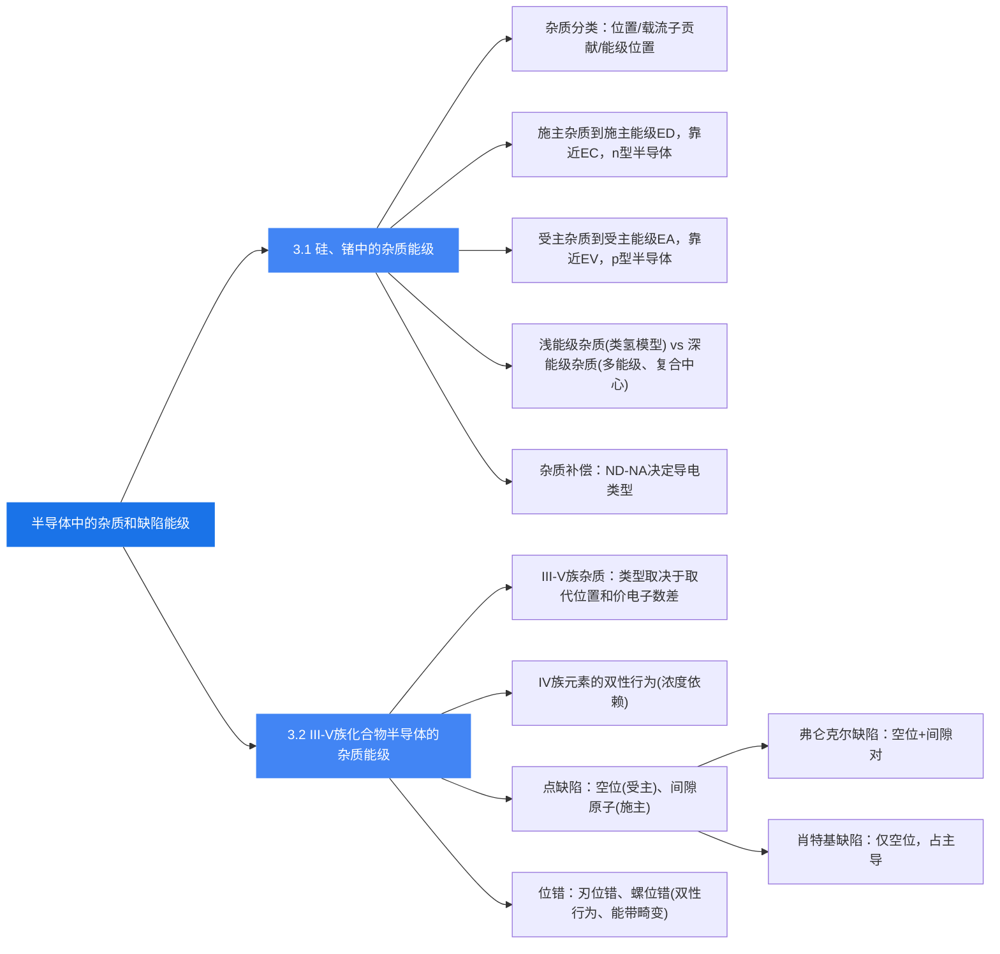

# 本章总结

### 核心知识框架

### 重要公式汇总

| 公式 | 物理意义 |
|------|---------|
| $\Delta E_D = 13.6 \cdot \frac{m_n^*}{m_0 \varepsilon_r^2}$ (eV) | 浅施主杂质的电离能（类氢模型） |
| $r_D = \frac{\varepsilon_r m_0}{m_n^*} a_0$ | 施主电子的等效玻尔半径 |
| $n = N_D - N_A$（$N_D > N_A$ 时） | 补偿后 n 型半导体的电子浓度 |
| $p = N_A - N_D$（$N_A > N_D$ 时） | 补偿后 p 型半导体的空穴浓度 |
| $\gamma = 1 - \frac{|N_D - N_A|}{N_D + N_A}$ | 杂质补偿度 |

### 关键物理思想

1. **微量杂质的决定性影响**：极微量的杂质（百万分之一）就能使半导体的电导率发生数量级变化，这是半导体区别于导体和绝缘体的核心特征之一。

2. **浅能级 vs 深能级**：浅能级杂质是"有用的"掺杂剂，用于控制导电类型和载流子浓度；深能级杂质虽然对载流子浓度贡献不大，但作为复合中心影响器件的动态性能。

3. **补偿作用的工程意义**：通过在同一半导体中先后掺入不同类型的杂质，可以精确控制各区域的导电类型，从而制造 p-n 结和各种半导体器件。

4. **III-V族的复杂性**：III-V族化合物由于有两种不同的晶格位置，杂质行为比 Si/Ge 复杂得多，杂质的类型不仅取决于价电子数差，还取决于占据的格位和掺杂浓度。

5. **缺陷的不可避免性**：在实际半导体中，点缺陷和位错是不可避免的。它们在禁带中引入能级，影响载流子的产生和复合过程，对器件性能有重要影响。
