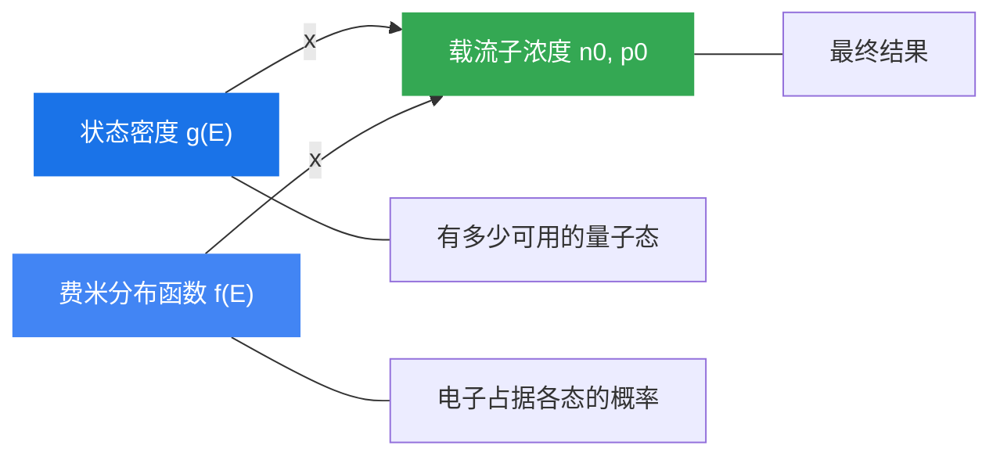

# 第四章 平衡载流子

> **本章核心问题：** 如何计算热平衡状态下半导体中的载流子浓度？载流子浓度如何随温度和掺杂浓度变化？
>
> **核心思路：** 状态密度 × 费米分布函数 → 半导体中载流子浓度

---

## 4.1 状态密度

### 4.1.1 热平衡态的基本概念

在没有外界作用的情况下，半导体材料具有统一的温度和确定的载流子浓度。热平衡时，电子和空穴的产生率等于复合率，达到**动态平衡**。此时：

- 导带电子浓度记为 $n_0$
- 价带空穴浓度记为 $p_0$

要计算载流子浓度，需要两个关键物理量：
1. **状态密度 $g(E)$**：单位能量间隔内的量子态数目
2. **费米分布函数 $f(E)$**：电子占据某一能级的概率

### 4.1.2 k 空间中的量子态密度

半导体中电子的允许能量状态用波矢 $\vec{k}$ 表示。在体积为 $V = L_x L_y L_z$ 的晶体中，$k$ 的取值是离散的：

$$k_x = \frac{2\pi n_x}{L_x}, \quad k_y = \frac{2\pi n_y}{L_y}, \quad k_z = \frac{2\pi n_z}{L_z}$$

其中 $n_x, n_y, n_z$ 为任意整数。

每个 $k$ 状态占据的 $k$ 空间体积为 $(2\pi)^3/V$。考虑电子有两种自旋取向（自旋简并度为 2），$k$ 空间中单位体积的状态数为：

$$\frac{2V}{(2\pi)^3}$$

> **理解注释：** 这里的"乘以2"非常重要——每个空间量子态可以容纳自旋向上和自旋向下两个电子，所以状态数要翻倍。

### 4.1.3 导带状态密度 gc(E)

**等能面：** $k$ 空间中能量相等的点构成的曲面。对于自由电子，等能面是球面；对于半导体中的电子，需区分不同材料：

- **GaAs（砷化镓）：** 导带极小值在布里渊区中心（$\Gamma$ 点），等能面是**球面**，有效质量各向同性
- **Si（硅）：** 导带极小值不在布里渊区中心，等能面是**旋转椭球面**，有 $s=6$ 个等价椭球
- **Ge（锗）：** 等能面也是旋转椭球面，有 $s=4$ 个等价椭球

**推导思路：** 计算能量在 $E$ 到 $E+\Delta E$ 之间的 $k$ 空间体积，再乘以 $k$ 空间状态密度。

对于各向同性情况（球形等能面），导带底附近 $E(k) - E_c = \frac{\hbar^2 k^2}{2m_n^*}$，可得：

$$g_c(E) = \frac{V(2m_{cn}^*)^{3/2}}{2\pi^2\hbar^3}(E - E_c)^{1/2}$$

其中 $m_{cn}^*$ 为**导带电子状态密度有效质量**。

对于各向异性情况（椭球等能面），引入状态密度有效质量：

$$m_{cn}^* = (s^2 \cdot m_l^* \cdot m_t^{*2})^{1/3}$$

使得各向异性和各向同性的状态密度表达式形式一致。

**状态密度的特点：**
- $g_c(E)$ 与 $\sqrt{E - E_c}$ 成正比，呈抛物线关系
- 能量越高，状态密度越大
- 仅适用于能带极值附近
- 有效质量越大，状态密度越大

**常见半导体有效质量（300K）：**

| 材料 | 椭球数 $s$ | $m_{cn}^*/m_0$ |
|:---:|:---:|:---:|
| Si | 6 | 0.26 |
| Ge | 4 | 0.22 |
| GaAs | 1 | 0.067 |

### 4.1.4 价带状态密度 gv(E)

价带顶附近，空穴的状态密度为：

$$g_v(E) = \frac{V(2m_{pv}^*)^{3/2}}{2\pi^2\hbar^3}(E_v - E)^{1/2}$$

其中 $m_{pv}^*$ 为**价带空穴状态密度有效质量**。价带有重空穴带和轻空穴带，需将两者的贡献相加：

$$m_{pv}^* = \left[(m_{hh}^*)^{3/2} + (m_{lh}^*)^{3/2}\right]^{2/3}$$

**常见半导体价带有效质量（300K）：**

| 材料 | $m_{hh}^*/m_0$ | $m_{lh}^*/m_0$ | $m_{pv}^*/m_0$ |
|:---:|:---:|:---:|:---:|
| Si | 0.49 | 0.16 | 0.36 |
| Ge | 0.28 | 0.044 | 0.22 |

### 小结

1. 状态密度 $g(E)$ 描述的是单位能量间隔内可容纳电子的量子态数目
2. 导带状态密度 $g_c(E) \propto (E - E_c)^{1/2}$，从导带底 $E_c$ 向上递增
3. 价带状态密度 $g_v(E) \propto (E_v - E)^{1/2}$，从价带顶 $E_v$ 向下递增
4. 状态密度与有效质量的 3/2 次方成正比——有效质量越大，可用的量子态越多
5. 不同半导体材料因能带结构不同，有效质量和等能面形状各异

---

## 4.2 费米分布函数与本征半导体载流子浓度

### 4.2.1 费米-狄拉克分布函数

热平衡状态下，电子在能级上的占据概率服从**费米-狄拉克分布**：

$$f(E) = \frac{1}{1 + \exp\left(\frac{E - E_F}{k_B T}\right)}$$

其中：
- $E_F$：费米能级（Fermi energy level）
- $k_B$：玻尔兹曼常数（$1.38 \times 10^{-23}$ J/K）
- $T$：绝对温度

**物理意义：** $f(E)$ 表示热平衡时，能量为 $E$ 的量子态被电子占据的概率。

**费米能级 $E_F$ 的含义：**
- $E_F$ 标志着电子填充水平的分界线
- 当 $E = E_F$ 时，$f(E_F) = 1/2$，即费米能级是电子占据概率恰好为 50% 的能级
- $E_F$ 由电子总数 $N$、状态密度 $g(E)$ 和温度 $T$ 共同决定：

$$\sum_E g(E) \cdot f(E) = N$$

**不同温度下的行为：**

| 温度 | $E < E_F$ | $E = E_F$ | $E > E_F$ |
|:---:|:---:|:---:|:---:|
| $T = 0$ K | $f = 1$ | $f = 1$ | $f = 0$ |
| $T > 0$ K | $f > 1/2$ | $f = 1/2$ | $f < 1/2$ |

- **$T=0$ K：** $f(E)$ 为阶跃函数，$E_F$ 以下的态全满，$E_F$ 以上的态全空
- **$T>0$ K：** $f(E)$ 在 $E_F$ 附近变得平缓，温度越高过渡区越宽
- 当 $E - E_F \gg k_BT$ 时，$f(E) \to 0$；当 $E_F - E \gg k_BT$ 时，$f(E) \to 1$

### 4.2.2 玻尔兹曼分布函数（非简并近似）

当 $E - E_F \gg k_BT$（导带中的电子）或 $E_F - E \gg k_BT$（价带中的空穴）时，费米分布可以近似为**玻尔兹曼分布**：

**电子的玻尔兹曼近似：**

$$f_e(E) \approx \exp\left(-\frac{E - E_F}{k_B T}\right)$$

**空穴的玻尔兹曼近似：**（空穴占据概率 = $1 - f(E)$）

$$f_h(E) = 1 - f(E) \approx \exp\left(-\frac{E_F - E}{k_B T}\right)$$

> **理解注释：** 为什么可以用玻尔兹曼近似？因为对于非简并半导体，导带底 $E_c$ 远高于 $E_F$（即 $E_c - E_F \gg k_BT$），此时分母中的指数项远大于 1，费米分布中的"+1"可以忽略，退化为玻尔兹曼分布。这使得后续积分变得可解。

### 4.2.3 导带电子浓度 n₀

导带中的电子浓度通过对导带中所有能级的状态密度乘以占据概率进行积分：

$$n_0 = \frac{1}{V} \int_{E_c}^{\infty} g_c(E) \cdot f_e(E) \, dE$$

代入 $g_c(E)$ 和玻尔兹曼近似 $f_e(E)$，令 $x = (E - E_c)/(k_BT)$，利用积分 $\int_0^\infty x^{1/2} e^{-x} dx = \frac{\sqrt{\pi}}{2}$，可得：

$$\boxed{n_0 = N_c \exp\left(-\frac{E_c - E_F}{k_B T}\right)}$$

其中 $N_c$ 为**导带有效状态密度**：

$$N_c = 2\left(\frac{m_{cn}^* k_B T}{2\pi\hbar^2}\right)^{3/2}$$

### 4.2.4 价带空穴浓度 p₀

类似地，价带中的空穴浓度为：

$$p_0 = \frac{1}{V} \int_{-\infty}^{E_v} g_v(E) \cdot f_h(E) \, dE$$

$$\boxed{p_0 = N_v \exp\left(-\frac{E_F - E_v}{k_B T}\right)}$$

其中 $N_v$ 为**价带有效状态密度**：

$$N_v = 2\left(\frac{m_{pv}^* k_B T}{2\pi\hbar^2}\right)^{3/2}$$

**常见半导体有效状态密度（300K）：**

| 材料 | $N_c$ (cm$^{-3}$) | $N_v$ (cm$^{-3}$) |
|:---:|:---:|:---:|
| Si | $2.8 \times 10^{19}$ | $1.1 \times 10^{19}$ |
| Ge | $1.04 \times 10^{19}$ | $6.0 \times 10^{18}$ |
| GaAs | $4.7 \times 10^{17}$ | $7.0 \times 10^{18}$ |

> **注意：** $N_c$ 和 $N_v$ 与温度有关，$\propto T^{3/2}$。

### 4.2.5 载流子浓度乘积（质量作用定律）

将 $n_0$ 和 $p_0$ 相乘：

$$\boxed{n_0 \cdot p_0 = N_c N_v \exp\left(-\frac{E_g}{k_B T}\right)}$$

其中 $E_g = E_c - E_v$ 为禁带宽度。

**关键结论：**
- $n_0 p_0$ **只与 $E_g$ 和温度 $T$ 有关**，与费米能级 $E_F$ 和掺杂浓度无关！
- 无论是本征半导体还是杂质半导体，只要是热平衡态的非简并半导体，此关系都成立
- 这个公式是热平衡的"质量作用定律"，类似于化学中的平衡常数

### 4.2.6 本征半导体

**本征半导体**是指不含任何杂质的纯净半导体。其电中性条件要求：

$$n_0 = p_0$$

即本征激发的电子和空穴数目相等。记本征载流子浓度为 $n_i$：

**本征费米能级 $E_i$：** 由 $n_0 = p_0$ 的条件解出：

$$E_i = \frac{E_c + E_v}{2} + \frac{3k_B T}{4} \ln\left(\frac{m_{pv}^*}{m_{cn}^*}\right)$$

> **理解注释：** 如果电子和空穴的有效质量相等（$m_{cn}^* = m_{pv}^*$），则 $E_i$ 恰好在禁带正中央。实际上由于有效质量不完全相等，$E_i$ 会略微偏离禁带中线，但偏差很小（因为 $\frac{3k_BT}{4}\ln(\cdots)$ 项很小）。所以通常近似认为 $E_i \approx (E_c + E_v)/2$。

**本征载流子浓度 $n_i$：**

$$n_i = p_i = \sqrt{n_0 p_0} = \sqrt{N_c N_v} \exp\left(-\frac{E_g}{2k_B T}\right)$$

**常见半导体 $n_i$（300K）：**

| 材料 | $E_g$ (eV) | $n_i$ (cm$^{-3}$) |
|:---:|:---:|:---:|
| Si | 1.12 | $1.02 \times 10^{10}$ |
| Ge | 0.67 | $2.33 \times 10^{13}$ |
| GaAs | 1.42 | $1.1 \times 10^{6}$ |

**影响 $n_i$ 的因素：**
- 温度 $T$ 升高 → $n_i$ 增大（指数增长）
- 禁带宽度 $E_g$ 增大 → $n_i$ 减小
- $n_i$ 决定了半导体器件的工作温度上限（当 $n_i$ 接近掺杂浓度时，器件失去正常功能）

### 小结

1. 费米分布函数 $f(E)$ 精确描述电子占据概率；玻尔兹曼分布是其在非简并条件下的近似
2. 导带电子浓度 $n_0 = N_c \exp(-(E_c - E_F)/k_BT)$
3. 价带空穴浓度 $p_0 = N_v \exp(-(E_F - E_v)/k_BT)$
4. 载流子浓度乘积 $n_0 p_0 = N_c N_v \exp(-E_g/k_BT)$，与 $E_F$ 和掺杂无关
5. 本征费米能级 $E_i$ 在禁带中线附近
6. 本征载流子浓度 $n_i = \sqrt{N_c N_v} \exp(-E_g/2k_BT)$

---

## 4.3 杂质半导体的载流子浓度

### 4.3.1 杂质能级的分布函数

杂质半导体中掺入了施主或受主杂质，引入了**杂质能级**。杂质能级上的电子与能带中的电子有本质区别：

- **能带中的能级**：可容纳 2 个电子（自旋相反），电子之间作用较弱
- **杂质能级**：只能容纳 1 个电子（因为电子处于束缚态，库仑排斥使同能级不能容纳两个同种载流子）

因此杂质能级的分布函数与费米分布有所不同，引入了**基态简并度**因子。

**电子占据施主能级的概率：**

$$f_D(E) = \frac{1}{1 + \frac{1}{g_D} \exp\left(\frac{E_D - E_F}{k_B T}\right)}$$

**空穴占据受主能级的概率：**

$$f_A(E) = \frac{1}{1 + \frac{1}{g_A} \exp\left(\frac{E_F - E_A}{k_B T}\right)}$$

其中 $g_D, g_A$ 为基态简并度：
- 施主能级：$g_D = 2$（只能接受一个任意自旋方向的电子）
- 受主能级：$g_A = 4$（价带双重简并，空穴有两种可能的状态）

> **理解注释：** 简并度 $g$ 在物理学中指同一能量对应的不同微观状态数。施主能级只能放 1 个电子，但该电子可自旋向上或向下，所以 $g_D=2$。受主能级由于价带本身是重空穴和轻空穴双重简并的，再乘以自旋 2，所以 $g_A=4$。

**施主能级上的电子浓度和电离施主浓度：**

$$n_D = N_D f_D(E) = \frac{N_D}{1 + \frac{1}{2}\exp\left(\frac{E_D - E_F}{k_B T}\right)}$$

$$n_D^+ = N_D - n_D = \frac{N_D}{1 + 2\exp\left(-\frac{E_D - E_F}{k_B T}\right)}$$

**电离受主浓度：**

$$p_A^- = N_A - p_A = \frac{N_A}{1 + 4\exp\left(-\frac{E_F - E_A}{k_B T}\right)}$$

**三种极限情况（以施主为例）：**
- 当 $E_F \gg E_D$（$E_D - E_F \ll -k_BT$）：$n_D^+ \approx N_D$，施主几乎全部电离
- 当 $E_F = E_D$：$n_D^+ = \frac{1}{3}N_D$，部分电离
- 当 $E_F \ll E_D$（$E_D - E_F \gg k_BT$）：$n_D^+ \approx 0$，施主几乎不电离

### 4.3.2 n 型半导体载流子浓度

#### 电中性条件

对于只含一种施主杂质的 n 型半导体，电中性条件为：

$$n_0 + p_A^- = p_0 + n_D^+$$

简化为（无受主时）：

$$n_0 = p_0 + n_D^+$$

代入各浓度表达式，得到**一般表达式**：

$$N_c \exp\left(-\frac{E_c - E_F}{k_B T}\right) = \frac{N_D}{1 + 2\exp\left(-\frac{E_D - E_F}{k_B T}\right)} + N_v \exp\left(-\frac{E_F - E_v}{k_B T}\right)$$

这是一个关于 $E_F$ 的超越方程，需要根据不同温度区间进行近似求解。

#### 不同温度区间的分析

**（1）低温弱电离区**

温度极低，本征激发可忽略（$p_0 \approx 0$），施主只有少部分电离。电中性条件简化为 $n_0 = n_D^+$。

**费米能级：**

$$E_F = \frac{E_c + E_D}{2} + \frac{k_B T}{2} \ln\left(\frac{N_D}{2N_c}\right)$$

当 $T \to 0$ 时：$E_F \to \frac{E_c + E_D}{2}$，即费米能级位于导带底和施主能级的中间位置。

**电子浓度：**

$$n_0 = \left(\frac{N_D N_c}{2}\right)^{1/2} \exp\left(-\frac{\Delta E_D}{2k_B T}\right)$$

其中 $\Delta E_D = E_c - E_D$ 为施主电离能。

**特点：**
- $E_F$ 从 $(E_c + E_D)/2$ 出发，随温度升高而变化
- 当 $N_c = 0.11 N_D$ 时，$E_F$ 取极大值
- $N_D$ 越大，$E_F$ 达到极大值所需的温度越高

**（2）中间电离区**

温度升高，施主电离增加，$E_F$ 开始下降。

**（3）强电离饱和区**

施主几乎全部电离（$n_D^+ \approx N_D$），但本征激发仍可忽略（$p_0 \approx 0$）。

电中性条件：$n_0 = N_D$

**费米能级：**

$$E_F = E_c + k_B T \ln\left(\frac{N_D}{N_c}\right)$$

> **理解注释：** 这是最常用的工作区间！室温下大多数掺杂半导体都处于这个区域。此时 $n_0 \approx N_D$ 为常数，费米能级位置由掺杂浓度决定。掺杂越重，$E_F$ 越靠近 $E_c$。

**例题：** 室温下 Si 中 $N_D = 10^{16}$ cm$^{-3}$，$N_c = 2.8 \times 10^{19}$ cm$^{-3}$：
$$E_F = E_c + 0.026 \ln\left(\frac{10^{16}}{2.8 \times 10^{19}}\right) = E_c - 0.206 \text{ eV}$$

**（4）本征激发区**

温度继续升高，$n_i$ 接近或超过 $N_D$，本征激发占主导：

$$n_0 \approx n_i = \sqrt{N_c N_v} \exp\left(-\frac{E_g}{2k_B T}\right)$$

费米能级趋向禁带中线 $E_i$。

### 4.3.3 温度和杂质浓度对载流子的影响

**费米能级随掺杂浓度的变化：**

在强电离饱和区，$E_F = E_c + k_BT \ln(N_D/N_c)$：
- 对于 **n 型半导体**：随着施主浓度 $N_D$ 增加，$E_F$ 从禁带中线逐渐移向导带底
- 对于 **p 型半导体**：随着受主浓度 $N_A$ 增加，$E_F$ 从禁带中线逐渐移向价带顶
- $E_F$ 的位置不仅反映导电类型（n 型在 $E_i$ 上方，p 型在 $E_i$ 下方），还反映掺杂水平

**费米能级随温度的变化（n 型半导体）：**
- 低温：$E_F$ 在 $(E_c + E_D)/2$ 附近
- 中温：$E_F$ 达到极大值后下降
- 室温附近（饱和区）：$E_F$ 在 $E_c$ 下方
- 高温：$E_F$ 趋近 $E_i$（本征费米能级）

### 4.3.4 补偿情形

当半导体中同时存在施主和受主杂质时（$N_D > N_A$），称为**补偿掺杂**。

**电中性条件：**

$$n_0 + N_A = p_0 + n_D^+$$

在强电离饱和区（$n_D^+ \approx N_D$, $p_0 \approx 0$）：

$$n_0 = N_D - N_A$$

> **理解注释：** 补偿的效果相当于"有效掺杂浓度"变为 $N_D - N_A$。受主先"吃掉"一部分施主提供的电子，剩余的施主才对导带电子有贡献。对于饱和区的分析，只需将非补偿情形公式中的 $N_D$ 替换为 $N_D - N_A$ 即可。

**在低温弱电离情况下：**
- 施主电离很弱，本征激发忽略
- $E_F$ 在 $E_D$ 附近，远在 $E_A$ 之上，$E_A$ 完全被电子填充
- 施主电离产生的电子一部分填充 $E_A$，一部分被激发到导带
- 电中性条件：$n_0 + N_A = n_D^+$，即 $n_0 = N_D - N_A - n_D$

### 小结

1. 杂质能级只能容纳 1 个电子，分布函数含简并度因子 $g_D=2$, $g_A=4$
2. n 型半导体电中性条件：$n_0 = p_0 + n_D^+$
3. 不同温度区间对应不同的物理机制：低温弱电离 → 饱和区 → 本征激发区
4. 饱和区最重要：$n_0 \approx N_D$，$E_F = E_c + k_BT\ln(N_D/N_c)$
5. 掺杂浓度越高 → $E_F$ 越靠近导带底（n 型）或价带顶（p 型）
6. 补偿掺杂的效果等价于有效掺杂浓度 $N_D - N_A$

---

## 4.4 简并半导体

### 4.4.1 简并的概念

**简并态**的本质含义是量子效应起作用的情况，即需要考虑**泡利不相容原理**限制的情况：

- **泡利不相容原理：** 在同一系统中，不能有两个或两个以上的粒子处于完全相同的状态
- 一个原子轨道最多容纳 2 个电子，且自旋方向必须相反
- 能带中的能级可容纳 2 个电子，杂质能级只能容纳 1 个电子

当载流子浓度非常高时，大量电子（或空穴）填充能带中的低能态，使得费米能级进入或超过能带边缘，此时必须考虑泡利不相容原理——这就是**简并化**。

### 4.4.2 简并半导体的定义

回顾 n 型半导体在强电离饱和区的费米能级公式：

$$E_F = E_c + k_B T \ln\left(\frac{N_D}{N_c}\right)$$

当掺杂浓度 $N_D$ 非常高，使得 $N_D \gg N_c$ 时，$\ln(N_D/N_c) > 0$，导致：

$$E_F \geq E_c$$

即**费米能级进入导带**（或对于 p 型，$E_F \leq E_v$，费米能级进入价带）。

**此时发生的关键变化：**
- 导带底附近的量子态基本上被电子占据
- **玻尔兹曼分布不再适用**，必须使用完整的费米-狄拉克分布函数
- 必须考虑泡利不相容原理对电子填充的限制

### 4.4.3 简并半导体载流子浓度

对于简并半导体，导带电子浓度不能再用玻尔兹曼近似，必须使用费米积分：

$$n_0 = \frac{1}{V}\int_{E_c}^{\infty} g_c(E) \cdot f(E) \, dE = N_c \cdot \frac{2}{\sqrt{\pi}} F_{1/2}\left(\frac{E_F - E_c}{k_B T}\right)$$

其中 $F_{1/2}(\xi)$ 为**费米-狄拉克积分**：

$$F_{1/2}(\xi) = \int_0^{\infty} \frac{x^{1/2}}{1 + \exp(x - \xi)} dx$$

类似地，价带空穴浓度为：

$$p_0 = N_v \cdot \frac{2}{\sqrt{\pi}} F_{1/2}\left(\frac{E_v - E_F}{k_B T}\right)$$

**对比非简并与简并情况：**

| | 非简并（玻尔兹曼近似） | 简并（费米积分） |
|:---|:---|:---|
| 电子浓度 | $n_B = N_c \exp\left(-\frac{E_c - E_F}{k_BT}\right)$ | $n_0 = N_c \cdot \frac{2}{\sqrt{\pi}} F_{1/2}\left(\frac{E_F - E_c}{k_BT}\right)$ |
| 物理含义 | 近似值 | 真实值 |
| 适用条件 | $E_c - E_F \gg k_BT$ | 任意 $E_F$ 位置 |

**相对误差：**

$$\frac{\Delta n}{n} = \frac{n_0 - n_B}{n_0}$$

当 $E_F$ 远离 $E_c$ 时，$n_B \approx n_0$，误差可忽略；当 $E_F$ 接近或超过 $E_c$ 时，玻尔兹曼近似严重低估载流子浓度。

### 4.4.4 简并半导体的判据

根据 $E_c - E_F$ 的大小，可以将半导体分为三类：

| 条件 | 类型 |
|:---|:---|
| $E_c - E_F > 2k_BT$ | **非简并**半导体 |
| $0 < E_c - E_F < 2k_BT$ | **弱简并**半导体 |
| $E_c - E_F < 0$（即 $E_F > E_c$） | **强简并**半导体 |

**发生简并的条件：**

$$N_D > 0.68 N_c \left[1 + 2\exp\left(\frac{\Delta E_D}{k_B T}\right)\right] \approx 2.1 N_c$$

**关键结论：**
- 发生简并时，$N_D > N_c$，对应**重掺杂**（约 $10^{19}$ cm$^{-3}$ 以上）
- 杂质电离能 $\Delta E_D$ 越小，较低掺杂就会发生简并；$\Delta E_D$ 越大，需要更高掺杂才简并
- 若 $N_D$ 一定，简并只发生在特定温度区间——温度太低和太高都不会简并
- **简并半导体：低温、重掺杂容易发生，费米能级在导带及以上**
- 发生简并时，$n_D^+ < N_D$，**杂质不能充分电离**

### 4.4.5 n 型半导体载流子浓度随温度的变化

综合所有温度区间，n 型半导体电子浓度随温度的变化（$\ln n_0$ 对 $1/T$ 图）可分为三个区域：

1. **低温杂质电离区**（右侧，$1/T$ 大）：
   $$n_0 = \left(\frac{N_D N_c}{2}\right)^{1/2} \exp\left(-\frac{\Delta E_D}{2k_B T}\right)$$
   斜率为 $-\Delta E_D / 2k_B$

2. **饱和区**（中间，平坦段）：
   $$n_0 \approx N_D$$
   施主全部电离，载流子浓度基本不随温度变化

3. **本征激发区**（左侧，$1/T$ 小）：
   $$n_0 = \sqrt{N_c N_v} \exp\left(-\frac{E_g}{2k_B T}\right)$$
   斜率为 $-E_g / 2k_B$

> **理解注释：** 半导体器件通常工作在饱和区，此时载流子浓度稳定（由掺杂浓度决定），器件性能可靠。当温度过高进入本征区时，本征载流子浓度暴增，器件将失去正常的半导体特性（例如 pn 结失效）。这就是为什么宽禁带半导体（如 SiC, GaN）适合高温应用——它们的 $E_g$ 大，本征区出现的温度更高。

### 小结

1. 简并化的本质是高浓度下载流子的量子效应——泡利不相容原理不可忽略
2. 判据：$E_c - E_F > 2k_BT$ 非简并，$E_c - E_F < 0$ 强简并
3. 简并半导体必须用费米-狄拉克积分 $F_{1/2}$ 计算载流子浓度，玻尔兹曼近似失效
4. 简并发生在重掺杂（$N_D > N_c \sim 10^{19}$ cm$^{-3}$）条件下
5. 简并时杂质不能充分电离（$n_D^+ < N_D$）

---

## 本章总结

### 知识脉络

本章围绕"热平衡态半导体载流子浓度"这一核心问题，按以下逻辑展开：

### 核心公式速查表

| 物理量 | 公式 |
|:---|:---|
| 导带状态密度 | $g_c(E) = \frac{V(2m_{cn}^*)^{3/2}}{2\pi^2\hbar^3}(E - E_c)^{1/2}$ |
| 价带状态密度 | $g_v(E) = \frac{V(2m_{pv}^*)^{3/2}}{2\pi^2\hbar^3}(E_v - E)^{1/2}$ |
| 费米分布函数 | $f(E) = \frac{1}{1 + \exp\left(\frac{E - E_F}{k_BT}\right)}$ |
| 导带有效态密度 | $N_c = 2\left(\frac{m_{cn}^* k_BT}{2\pi\hbar^2}\right)^{3/2}$ |
| 导带电子浓度 | $n_0 = N_c \exp\left(-\frac{E_c - E_F}{k_BT}\right)$ |
| 价带空穴浓度 | $p_0 = N_v \exp\left(-\frac{E_F - E_v}{k_BT}\right)$ |
| 载流子浓度积 | $n_0 p_0 = N_c N_v \exp\left(-\frac{E_g}{k_BT}\right)$ |
| 本征费米能级 | $E_i = \frac{E_c + E_v}{2} + \frac{3k_BT}{4}\ln\left(\frac{m_{pv}^*}{m_{cn}^*}\right)$ |
| 本征载流子浓度 | $n_i = \sqrt{N_c N_v}\exp\left(-\frac{E_g}{2k_BT}\right)$ |
| 饱和区费米能级 | $E_F = E_c + k_BT\ln(N_D/N_c)$ |
| 简并半导体电子浓度 | $n_0 = N_c \cdot \frac{2}{\sqrt{\pi}} F_{1/2}\left(\frac{E_F - E_c}{k_BT}\right)$ |

### 半导体分类总结

| 类型 | 费米能级位置 | 载流子来源 | 浓度关系 |
|:---|:---|:---|:---|
| 本征半导体 | $E_F \approx E_i$（禁带中线） | 本征激发 | $n_0 = p_0 = n_i$ |
| n 型（非简并） | $E_i < E_F < E_c$ | 施主电离 | $n_0 \approx N_D \gg p_0$ |
| p 型（非简并） | $E_v < E_F < E_i$ | 受主电离 | $p_0 \approx N_A \gg n_0$ |
| n 型（简并） | $E_F \geq E_c$ | 重掺杂 | 需用费米积分 |
| p 型（简并） | $E_F \leq E_v$ | 重掺杂 | 需用费米积分 |

### 关键物理图像

1. **费米能级是"电子填充水位线"**——$E_F$ 越高，电子填充越多，导带电子越多（n 型特征）；$E_F$ 越低，空穴越多（p 型特征）
2. **温度是"搅拌器"**——温度升高使电子获得能量跃迁到更高能级，模糊了费米能级的"分界线"效果
3. **掺杂是"调节器"**——通过控制杂质种类和浓度，可以精确调控费米能级位置和载流子浓度
4. **非简并→简并的转变**——当掺杂浓度高到费米能级进入能带时，经典的玻尔兹曼统计失效，必须使用量子统计（费米-狄拉克分布）
