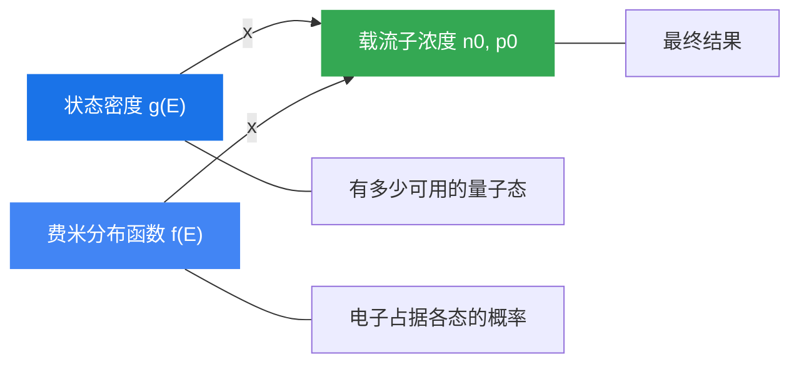

## 4.4 简并半导体

### 4.4.1 简并的概念

**简并态**的本质含义是量子效应起作用的情况，即需要考虑**泡利不相容原理**限制的情况：

- **泡利不相容原理：** 在同一系统中，不能有两个或两个以上的粒子处于完全相同的状态
- 一个原子轨道最多容纳 2 个电子，且自旋方向必须相反
- 能带中的能级可容纳 2 个电子，杂质能级只能容纳 1 个电子

当载流子浓度非常高时，大量电子（或空穴）填充能带中的低能态，使得费米能级进入或超过能带边缘，此时必须考虑泡利不相容原理——这就是**简并化**。

### 4.4.2 简并半导体的定义

回顾 n 型半导体在强电离饱和区的费米能级公式：

$$E_F = E_c + k_B T \ln\left(\frac{N_D}{N_c}\right)$$

当掺杂浓度 $N_D$ 非常高，使得 $N_D \gg N_c$ 时，$\ln(N_D/N_c) > 0$，导致：

$$E_F \geq E_c$$

即**费米能级进入导带**（或对于 p 型，$E_F \leq E_v$，费米能级进入价带）。

**此时发生的关键变化：**
- 导带底附近的量子态基本上被电子占据
- **玻尔兹曼分布不再适用**，必须使用完整的费米-狄拉克分布函数
- 必须考虑泡利不相容原理对电子填充的限制

### 4.4.3 简并半导体载流子浓度

对于简并半导体，导带电子浓度不能再用玻尔兹曼近似，必须使用费米积分：

$$n_0 = \frac{1}{V}\int_{E_c}^{\infty} g_c(E) \cdot f(E) \, dE = N_c \cdot \frac{2}{\sqrt{\pi}} F_{1/2}\left(\frac{E_F - E_c}{k_B T}\right)$$

其中 $F_{1/2}(\xi)$ 为**费米-狄拉克积分**：

$$F_{1/2}(\xi) = \int_0^{\infty} \frac{x^{1/2}}{1 + \exp(x - \xi)} dx$$

类似地，价带空穴浓度为：

$$p_0 = N_v \cdot \frac{2}{\sqrt{\pi}} F_{1/2}\left(\frac{E_v - E_F}{k_B T}\right)$$

**对比非简并与简并情况：**

| | 非简并（玻尔兹曼近似） | 简并（费米积分） |
|:---|:---|:---|
| 电子浓度 | $n_B = N_c \exp\left(-\frac{E_c - E_F}{k_BT}\right)$ | $n_0 = N_c \cdot \frac{2}{\sqrt{\pi}} F_{1/2}\left(\frac{E_F - E_c}{k_BT}\right)$ |
| 物理含义 | 近似值 | 真实值 |
| 适用条件 | $E_c - E_F \gg k_BT$ | 任意 $E_F$ 位置 |

**相对误差：**

$$\frac{\Delta n}{n} = \frac{n_0 - n_B}{n_0}$$

当 $E_F$ 远离 $E_c$ 时，$n_B \approx n_0$，误差可忽略；当 $E_F$ 接近或超过 $E_c$ 时，玻尔兹曼近似严重低估载流子浓度。

### 4.4.4 简并半导体的判据

根据 $E_c - E_F$ 的大小，可以将半导体分为三类：

| 条件 | 类型 |
|:---|:---|
| $E_c - E_F > 2k_BT$ | **非简并**半导体 |
| $0 < E_c - E_F < 2k_BT$ | **弱简并**半导体 |
| $E_c - E_F < 0$（即 $E_F > E_c$） | **强简并**半导体 |

**发生简并的条件：**

$$N_D > 0.68 N_c \left[1 + 2\exp\left(\frac{\Delta E_D}{k_B T}\right)\right] \approx 2.1 N_c$$

**关键结论：**
- 发生简并时，$N_D > N_c$，对应**重掺杂**（约 $10^{19}$ cm$^{-3}$ 以上）
- 杂质电离能 $\Delta E_D$ 越小，较低掺杂就会发生简并；$\Delta E_D$ 越大，需要更高掺杂才简并
- 若 $N_D$ 一定，简并只发生在特定温度区间——温度太低和太高都不会简并
- **简并半导体：低温、重掺杂容易发生，费米能级在导带及以上**
- 发生简并时，$n_D^+ < N_D$，**杂质不能充分电离**

### 4.4.5 n 型半导体载流子浓度随温度的变化

综合所有温度区间，n 型半导体电子浓度随温度的变化（$\ln n_0$ 对 $1/T$ 图）可分为三个区域：

1. **低温杂质电离区**（右侧，$1/T$ 大）：
   $$n_0 = \left(\frac{N_D N_c}{2}\right)^{1/2} \exp\left(-\frac{\Delta E_D}{2k_B T}\right)$$
   斜率为 $-\Delta E_D / 2k_B$

2. **饱和区**（中间，平坦段）：
   $$n_0 \approx N_D$$
   施主全部电离，载流子浓度基本不随温度变化

3. **本征激发区**（左侧，$1/T$ 小）：
   $$n_0 = \sqrt{N_c N_v} \exp\left(-\frac{E_g}{2k_B T}\right)$$
   斜率为 $-E_g / 2k_B$

> **理解注释：** 半导体器件通常工作在饱和区，此时载流子浓度稳定（由掺杂浓度决定），器件性能可靠。当温度过高进入本征区时，本征载流子浓度暴增，器件将失去正常的半导体特性（例如 pn 结失效）。这就是为什么宽禁带半导体（如 SiC, GaN）适合高温应用——它们的 $E_g$ 大，本征区出现的温度更高。

### 小结

1. 简并化的本质是高浓度下载流子的量子效应——泡利不相容原理不可忽略
2. 判据：$E_c - E_F > 2k_BT$ 非简并，$E_c - E_F < 0$ 强简并
3. 简并半导体必须用费米-狄拉克积分 $F_{1/2}$ 计算载流子浓度，玻尔兹曼近似失效
4. 简并发生在重掺杂（$N_D > N_c \sim 10^{19}$ cm$^{-3}$）条件下
5. 简并时杂质不能充分电离（$n_D^+ < N_D$）

---

## 本章总结

### 知识脉络

本章围绕"热平衡态半导体载流子浓度"这一核心问题，按以下逻辑展开：

### 核心公式速查表

| 物理量 | 公式 |
|:---|:---|
| 导带状态密度 | $g_c(E) = \frac{V(2m_{cn}^*)^{3/2}}{2\pi^2\hbar^3}(E - E_c)^{1/2}$ |
| 价带状态密度 | $g_v(E) = \frac{V(2m_{pv}^*)^{3/2}}{2\pi^2\hbar^3}(E_v - E)^{1/2}$ |
| 费米分布函数 | $f(E) = \frac{1}{1 + \exp\left(\frac{E - E_F}{k_BT}\right)}$ |
| 导带有效态密度 | $N_c = 2\left(\frac{m_{cn}^* k_BT}{2\pi\hbar^2}\right)^{3/2}$ |
| 导带电子浓度 | $n_0 = N_c \exp\left(-\frac{E_c - E_F}{k_BT}\right)$ |
| 价带空穴浓度 | $p_0 = N_v \exp\left(-\frac{E_F - E_v}{k_BT}\right)$ |
| 载流子浓度积 | $n_0 p_0 = N_c N_v \exp\left(-\frac{E_g}{k_BT}\right)$ |
| 本征费米能级 | $E_i = \frac{E_c + E_v}{2} + \frac{3k_BT}{4}\ln\left(\frac{m_{pv}^*}{m_{cn}^*}\right)$ |
| 本征载流子浓度 | $n_i = \sqrt{N_c N_v}\exp\left(-\frac{E_g}{2k_BT}\right)$ |
| 饱和区费米能级 | $E_F = E_c + k_BT\ln(N_D/N_c)$ |
| 简并半导体电子浓度 | $n_0 = N_c \cdot \frac{2}{\sqrt{\pi}} F_{1/2}\left(\frac{E_F - E_c}{k_BT}\right)$ |

### 半导体分类总结

| 类型 | 费米能级位置 | 载流子来源 | 浓度关系 |
|:---|:---|:---|:---|
| 本征半导体 | $E_F \approx E_i$（禁带中线） | 本征激发 | $n_0 = p_0 = n_i$ |
| n 型（非简并） | $E_i < E_F < E_c$ | 施主电离 | $n_0 \approx N_D \gg p_0$ |
| p 型（非简并） | $E_v < E_F < E_i$ | 受主电离 | $p_0 \approx N_A \gg n_0$ |
| n 型（简并） | $E_F \geq E_c$ | 重掺杂 | 需用费米积分 |
| p 型（简并） | $E_F \leq E_v$ | 重掺杂 | 需用费米积分 |

### 关键物理图像

1. **费米能级是"电子填充水位线"**——$E_F$ 越高，电子填充越多，导带电子越多（n 型特征）；$E_F$ 越低，空穴越多（p 型特征）
2. **温度是"搅拌器"**——温度升高使电子获得能量跃迁到更高能级，模糊了费米能级的"分界线"效果
3. **掺杂是"调节器"**——通过控制杂质种类和浓度，可以精确调控费米能级位置和载流子浓度
4. **非简并→简并的转变**——当掺杂浓度高到费米能级进入能带时，经典的玻尔兹曼统计失效，必须使用量子统计（费米-狄拉克分布）
