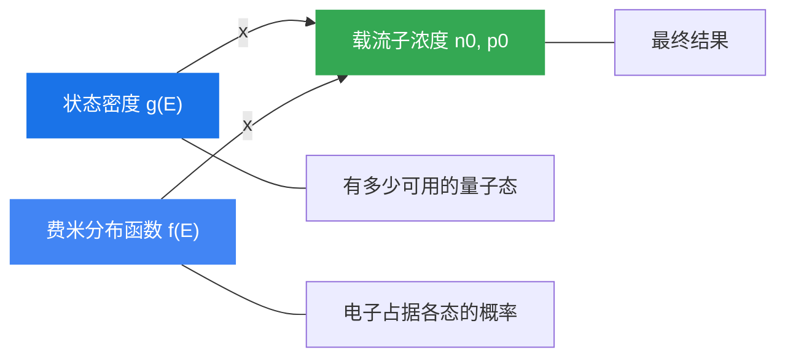

# 本章总结

### 知识脉络

本章围绕"热平衡态半导体载流子浓度"这一核心问题，按以下逻辑展开：

### 核心公式速查表

| 物理量 | 公式 |
|:---|:---|
| 导带状态密度 | $g_c(E) = \frac{V(2m_{cn}^*)^{3/2}}{2\pi^2\hbar^3}(E - E_c)^{1/2}$ |
| 价带状态密度 | $g_v(E) = \frac{V(2m_{pv}^*)^{3/2}}{2\pi^2\hbar^3}(E_v - E)^{1/2}$ |
| 费米分布函数 | $f(E) = \frac{1}{1 + \exp\left(\frac{E - E_F}{k_BT}\right)}$ |
| 导带有效态密度 | $N_c = 2\left(\frac{m_{cn}^* k_BT}{2\pi\hbar^2}\right)^{3/2}$ |
| 导带电子浓度 | $n_0 = N_c \exp\left(-\frac{E_c - E_F}{k_BT}\right)$ |
| 价带空穴浓度 | $p_0 = N_v \exp\left(-\frac{E_F - E_v}{k_BT}\right)$ |
| 载流子浓度积 | $n_0 p_0 = N_c N_v \exp\left(-\frac{E_g}{k_BT}\right)$ |
| 本征费米能级 | $E_i = \frac{E_c + E_v}{2} + \frac{3k_BT}{4}\ln\left(\frac{m_{pv}^*}{m_{cn}^*}\right)$ |
| 本征载流子浓度 | $n_i = \sqrt{N_c N_v}\exp\left(-\frac{E_g}{2k_BT}\right)$ |
| 饱和区费米能级 | $E_F = E_c + k_BT\ln(N_D/N_c)$ |
| 简并半导体电子浓度 | $n_0 = N_c \cdot \frac{2}{\sqrt{\pi}} F_{1/2}\left(\frac{E_F - E_c}{k_BT}\right)$ |

### 半导体分类总结

| 类型 | 费米能级位置 | 载流子来源 | 浓度关系 |
|:---|:---|:---|:---|
| 本征半导体 | $E_F \approx E_i$（禁带中线） | 本征激发 | $n_0 = p_0 = n_i$ |
| n 型（非简并） | $E_i < E_F < E_c$ | 施主电离 | $n_0 \approx N_D \gg p_0$ |
| p 型（非简并） | $E_v < E_F < E_i$ | 受主电离 | $p_0 \approx N_A \gg n_0$ |
| n 型（简并） | $E_F \geq E_c$ | 重掺杂 | 需用费米积分 |
| p 型（简并） | $E_F \leq E_v$ | 重掺杂 | 需用费米积分 |

### 关键物理图像

1. **费米能级是"电子填充水位线"**——$E_F$ 越高，电子填充越多，导带电子越多（n 型特征）；$E_F$ 越低，空穴越多（p 型特征）
2. **温度是"搅拌器"**——温度升高使电子获得能量跃迁到更高能级，模糊了费米能级的"分界线"效果
3. **掺杂是"调节器"**——通过控制杂质种类和浓度，可以精确调控费米能级位置和载流子浓度
4. **非简并→简并的转变**——当掺杂浓度高到费米能级进入能带时，经典的玻尔兹曼统计失效，必须使用量子统计（费米-狄拉克分布）
