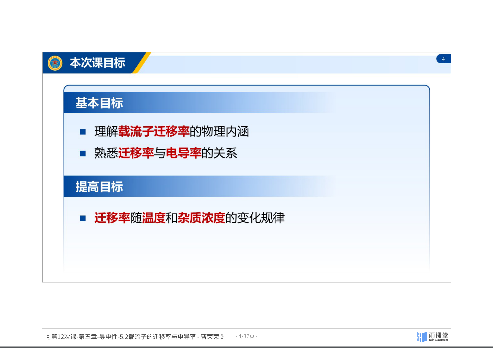
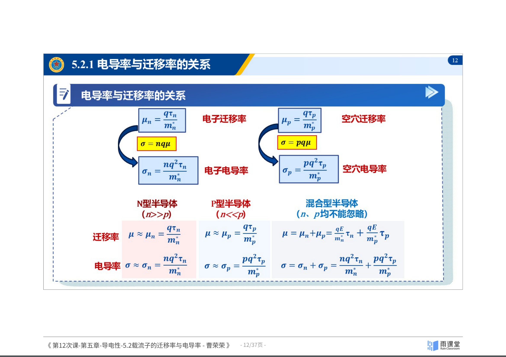
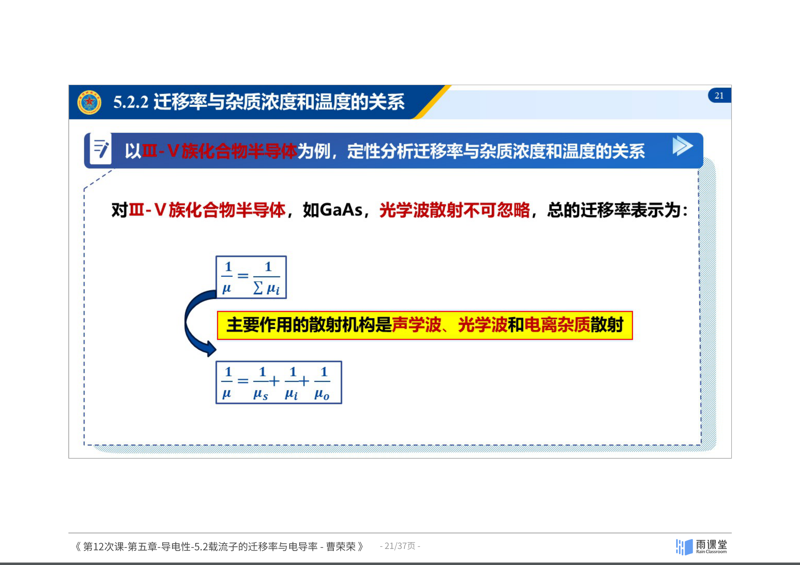
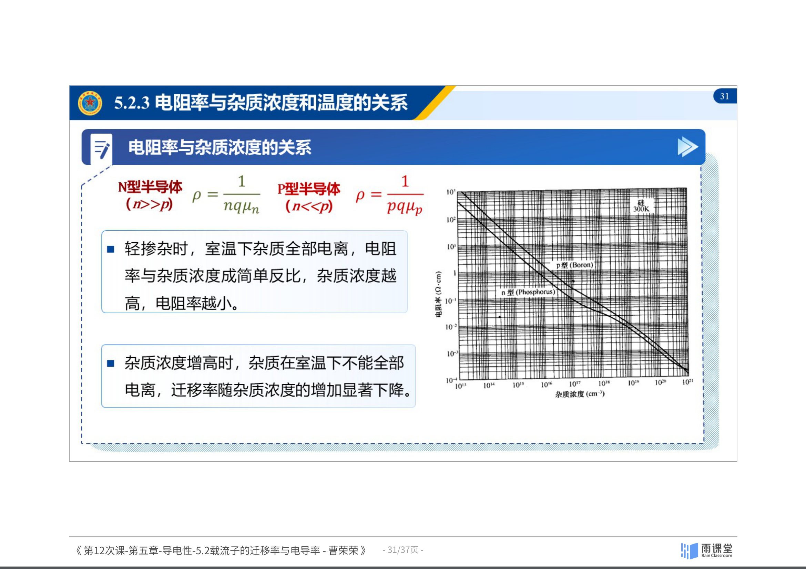

## 5.2 载流子的迁移率与电导率

### 迁移率与电导率的关系

#### 散射概率与平均自由时间

- **散射概率 $P$**：单位时间内一个载流子被散射的次数，描述载流子在半导体中受散射的难易程度。
- **平均自由时间 $\tau$**：载流子在电场中做漂移运动，只有在连续两次散射之间的时间内才作加速运动，这段时间称为自由时间。取很多次求平均值称为平均自由时间 $\tau$。

**两者的关系推导**：

设 $N$ 个电子以速度 $v$ 沿某方向运动，$N(t)$ 表示在 $t$ 时刻尚未遭到散射的电子数。则 $t$ 到 $t + \Delta t$ 时间内被散射的电子数为 $N(t) P \Delta t$：

$$\frac{dN(t)}{dt} = -P N(t)$$

解得：

$$N(t) = N_0 e^{-Pt}$$

随着时间的推移，未被散射的电子越来越少，时间足够长则全部电子被散射。

平均自由时间为：

$$\tau = \frac{\int_0^\infty t N_0 e^{-Pt} P \, dt}{N_0} = \frac{1}{P}$$

$$\boxed{\tau = \frac{1}{P}}$$

**平均自由时间 $\tau$ 和散射概率 $P$ 互为倒数。**

#### 迁移率与平均自由时间的理论推导

假设沿 $x$ 方向施加电场 $E$，电子具有各向同性的有效质量 $m_n^*$。令 $t = 0$ 时某个电子恰好遭到散射，散射后沿 $x$ 方向的速度为 $v_x(0)$，经过时间 $t$ 后又遭到散射，在 $0 \sim t$ 时间内作加速运动，第二次散射前的速度为：

$$v_x(t) = v_x(0) - \frac{qE}{m_n^*} t$$

对大量电子求和再取平均，$v_x(0)$ 为电子的热运动初速度，根据统计物理 $v_x(0) = 0$，因此平均漂移速度为：

$$v_{xd} = 0 - \frac{qE}{m_n^*} \tau_n$$

又因为 $v_d = \mu E$，可得：

$$\boxed{\mu_n = \frac{q\tau_n}{m_n^*}} \quad \text{（电子迁移率）}$$

$$\boxed{\mu_p = \frac{q\tau_p}{m_p^*}} \quad \text{（空穴迁移率）}$$

*图：迁移率与平均自由时间的关系推导。来源：曹荣荣老师课件（第12次课）*

> **核心结论**：迁移率与平均自由时间成正比，与有效质量成反比。

#### 电导率的理论表达式

由 $\sigma = nq\mu$ 和 $\mu = q\tau/m^*$ 可得：

- 电子电导率：$\sigma_n = \dfrac{nq^2\tau_n}{m_n^*}$
- 空穴电导率：$\sigma_p = \dfrac{pq^2\tau_p}{m_p^*}$

不同半导体类型：

| 类型 | 迁移率 | 电导率 |
|:---:|:---:|:---:|
| N 型 ($n \gg p$) | $\mu \approx \mu_n = \dfrac{q\tau_n}{m_n^*}$ | $\sigma \approx \sigma_n = \dfrac{nq^2\tau_n}{m_n^*}$ |
| P 型 ($p \gg n$) | $\mu \approx \mu_p = \dfrac{q\tau_p}{m_p^*}$ | $\sigma \approx \sigma_p = \dfrac{pq^2\tau_p}{m_p^*}$ |
| 混合型 | $\mu = \mu_n + \mu_p$ | $\sigma = \sigma_n + \sigma_p = \dfrac{nq^2\tau_n}{m_n^*} + \dfrac{pq^2\tau_p}{m_p^*}$ |

#### 电导有效质量

对硅等多能谷半导体，不同能谷中电子沿不同方向的迁移率不同。设横、纵有效质量分别为 $m_t$ 和 $m_l$：

- 对 [100] 能谷：$\mu_1 = \dfrac{q\tau_n}{m_l}$
- 对其余能谷：$\mu_2 = \mu_3 = \dfrac{q\tau_n}{m_t}$

定义**电导迁移率** $\mu_c$ 为各能谷迁移率的平均：

$$\mu_c = \frac{1}{3}(\mu_1 + \mu_2 + \mu_3)$$

对应的**电导有效质量** $m_c$：

$$\frac{1}{m_c} = \frac{1}{3}\left(\frac{1}{m_l} + \frac{2}{m_t}\right)$$

对于 Si：$m_c = 0.26 m_0$（$m_0$ 为自由电子质量）。

> **小结**：迁移率的微观本质是 $\mu = q\tau/m^*$，与平均自由时间成正比，与有效质量成反比。散射概率越大，平均自由时间越短，迁移率越小。

### 迁移率与杂质浓度和温度的关系

#### 分析思路

核心关系链：散射概率 $P$ $\rightarrow$ 平均自由时间 $\tau = 1/P$ $\rightarrow$ 迁移率 $\mu = q\tau/m^*$

各散射机构对应的迁移率温度依赖关系：

| 散射机构 | 散射概率 $P$ | 平均自由时间 $\tau$ | 迁移率 $\mu$ |
|:---:|:---:|:---:|:---:|
| 电离杂质 | $P_i \propto N_i T^{-3/2}$ | $\tau_i \propto N_i^{-1} T^{3/2}$ | $\mu_i \propto N_i^{-1} T^{3/2}$ |
| 声学波 | $P_s \propto T^{3/2}$ | $\tau_s \propto T^{-3/2}$ | $\mu_s \propto T^{-3/2}$ |
| 光学波 | $P_o \propto \dfrac{1}{e^{\hbar\omega_q/k_0T} - 1}$ | $\tau_o \propto e^{\hbar\omega_q/k_0T} - 1$ | $\mu_o \propto e^{\hbar\omega_q/k_0T} - 1$ |

#### 多种散射同时存在

若几种散射同时起作用，总的散射概率是各种散射概率之和：

$$P = \sum P_i$$

由此推导：

$$\frac{1}{\tau} = \sum \frac{1}{\tau_i}$$

$$\boxed{\frac{1}{\mu} = \sum \frac{1}{\mu_i}}$$

**三条重要结论**：
1. 总平均自由时间的倒数等于各散射机构分别存在时所决定的平均自由时间倒数之和
2. **总迁移率的倒数等于各散射机构分别存在时所决定的迁移率倒数之和**
3. 同时存在多种散射机构时，散射概率变大，平均自由时间变短，迁移率变小。实际情况下应找到起主要作用的散射机构，迁移率主要由它决定

*图：多种散射机构共存时的迁移率。来源：曹荣荣老师课件（第12次课）*

#### 以掺杂 Si、Ge 半导体为例

对 Si、Ge，主要散射机构是**声学波散射**和**电离杂质散射**：

$$\frac{1}{\mu} = \frac{1}{\mu_s} + \frac{1}{\mu_i}$$

其中：
- $\mu_s = \dfrac{q}{m_n^*} \cdot \dfrac{1}{A T^{3/2}}$（声学波散射决定的迁移率）
- $\mu_i = \dfrac{q}{m_n^*} \cdot \dfrac{T^{3/2}}{B N_i}$（电离杂质散射决定的迁移率）

代入化简得：

$$\boxed{\mu = \frac{q}{m_n^*} \cdot \frac{1}{A T^{3/2} + \dfrac{B N_i}{T^{3/2}}}}$$

#### 以 III-V 族化合物半导体（如 GaAs）为例

对 GaAs，**光学波散射不可忽略**，总迁移率表示为：

$$\frac{1}{\mu} = \frac{1}{\mu_s} + \frac{1}{\mu_i} + \frac{1}{\mu_o}$$

主要散射机构是声学波、光学波和电离杂质散射。

#### 迁移率随温度的变化（杂质浓度不变）

**杂质浓度不变时，迁移率随着温度上升先增加后下降。**

具体分三种情况：
1. **高纯样品**（$10^{13} \sim 10^{17} \text{cm}^{-3}$）：声学波散射为主，$T \uparrow \rightarrow \mu \downarrow$
2. **中等掺杂**（$10^{18} \sim 10^{19} \text{cm}^{-3}$）：电离杂质散射增强，$T \uparrow \rightarrow \mu$ 下降趋势变缓
3. **重掺杂**（$> 10^{19} \text{cm}^{-3}$）：低温区（0~275 K）声学波散射弱，$T \uparrow \rightarrow \mu \uparrow$；高温区（>500 K）声学波散射为主，$T \uparrow \rightarrow \mu \downarrow$

*图：迁移率随温度的变化关系。来源：曹荣荣老师课件（第12次课）*

#### 迁移率随杂质浓度的变化（温度不变，T = 300 K）

**室温下，$\mu$ 随着杂质浓度的上升而下降。** 初始阶段不明显，当掺杂达到一定程度时（$10^{17} \sim 10^{18} \text{cm}^{-3}$），迁移率明显下降。

对 n 型和 p 型 Si 中多子和少子的迁移率：
1. 低杂质浓度时，多子和少子的迁移率相差不大（电子约 1330，空穴约 495 $\text{cm}^2/(\text{V} \cdot \text{s})$）
2. 随着浓度的增加，迁移率均单调下降
3. **给定杂质浓度下，少子的迁移率大于多子的迁移率**
4. 相同杂质浓度条件下，少子与多子迁移率的差别随杂质浓度的增大而增大
5. 通常在低掺杂水平下（$< 10^{17} \sim 10^{18} \text{cm}^{-3}$），电子迁移率总大于空穴迁移率

#### 室温下高纯样品的迁移率

| 材料 | 电子迁移率 $\mu_n$ ($\text{cm}^2\text{V}^{-1}\text{s}^{-1}$) | 空穴迁移率 $\mu_p$ ($\text{cm}^2\text{V}^{-1}\text{s}^{-1}$) |
|:---:|:---:|:---:|
| Si | 1450 | 500 |
| Ge | 3800 | 1800 |
| GaAs | 8000 | 400 |

**规律**：
- 同一样品：$\mu_n > \mu_p$
- 不同样品的电子迁移率：$\mu_{\text{GaAs}} > \mu_{\text{Ge}} > \mu_{\text{Si}}$

> **小结**：迁移率受散射机制的调控。多种散射同时存在时，总迁移率满足 $\frac{1}{\mu} = \sum \frac{1}{\mu_i}$。杂质浓度不变时，迁移率随温度先增后降；温度不变时，迁移率随杂质浓度上升而下降。

### 电阻率与杂质浓度和温度的关系

#### 电阻率与迁移率的关系

由 $\rho = 1/\sigma$ 和 $\sigma = nq\mu_n + pq\mu_p$：

$$\boxed{\rho = \frac{1}{nq\mu_n + pq\mu_p}}$$

不同半导体类型：

| 类型 | 条件 | 电阻率 |
|:---:|:---:|:---:|
| N 型 | $n \gg p$ | $\rho = \dfrac{1}{nq\mu_n}$ |
| P 型 | $p \gg n$ | $\rho = \dfrac{1}{pq\mu_p}$ |
| 混合型 | $n$、$p$ 均不能忽略 | $\rho = \dfrac{1}{nq\mu_n + pq\mu_p}$ |

电阻率 $\rho$ 取决于**载流子浓度**和**迁移率**两个因素，而迁移率又受杂质浓度和温度的影响。

#### 电阻率与温度的关系

对掺杂半导体，电阻率随温度变化的曲线可分为三段（A→B→C→D）：

**AB 段（低温区）**：
- 载流子浓度：杂质电离阶段，随 $T \uparrow$ 载流子浓度 $\uparrow$
- 迁移率：电离杂质散射和晶格振动散射均处于次要地位
- 电阻率：主要由载流子浓度增大决定，$\rho$ 随 $T \uparrow$ 而 **下降**

**BC 段（中温区）**：
- 载流子浓度：杂质已完全电离，载流子浓度不变
- 迁移率：声学波散射逐渐增强，$\mu$ 随 $T \uparrow$ 而 $\downarrow$
- 电阻率：主要由迁移率下降决定，$\rho$ 随 $T \uparrow$ 而 **上升**

**CD 段（高温区）**：
- 载流子浓度：本征激发急剧增加，大量本征载流子的产生远远大于迁移率降低的影响
- 电阻率：$\rho$ 随 $T \uparrow$ 而 **下降**

> **注意**：杂质浓度越高 / 材料禁带宽度越大，进入本征导电占优势的温度越高。

*图：电阻率随温度的变化关系（掺杂半导体）。来源：曹荣荣老师课件（第12次课）*

> **小结**：电阻率 $\rho = 1/(nq\mu_n + pq\mu_p)$，同时受载流子浓度和迁移率的影响。掺杂半导体的电阻率随温度变化呈非单调行为：低温段因杂质电离载流子增多而下降，中温段因晶格散射增强迁移率下降而上升，高温段因本征激发载流子剧增而再次下降。

---
