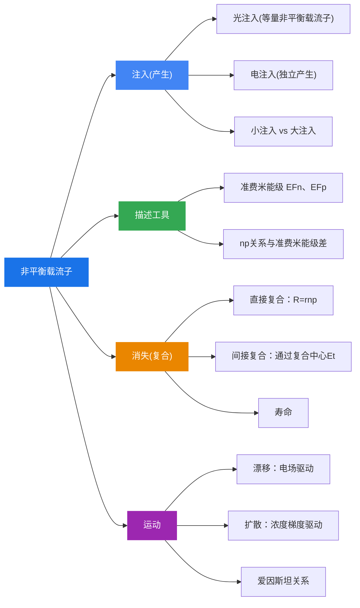

# 本章总结

### 核心公式速查

| 知识点 | 核心公式 |
|--------|---------|
| 热平衡判据 | $n_0 p_0 = n_i^2$ |
| 非平衡载流子 | $n = n_0 + \Delta n$, $p = p_0 + \Delta p$ |
| 附加电导 | $\Delta\sigma = \Delta p \cdot q(\mu_n + \mu_p)$ |
| 指数衰减 | $\Delta p(t) = (\Delta p)_0 e^{-t/\tau}$ |
| 准费米能级 | $np = n_i^2 \exp\left(\frac{E_{Fn} - E_{Fp}}{k_0 T}\right)$ |
| 直接复合净复合率 | $U_d = r(np - n_i^2)$ |
| 直接复合寿命（小注入） | $\tau \approx \frac{1}{r(n_0 + p_0)}$ |
| 间接复合寿命 | $\tau = \tau_p \frac{n_0 + n_1}{n_0 + p_0} + \tau_n \frac{p_0 + p_1}{n_0 + p_0}$ |
| 稳态扩散方程 | $D_p \frac{d^2 \Delta p(x)}{dx^2} = \frac{\Delta p(x)}{\tau}$ |
| 扩散长度 | $L_p = \sqrt{D_p \tau}$ |
| 扩散电流密度 | $(J_p)_{\text{扩}} = -q D_p \frac{d\Delta p}{dx}$ |
| 爱因斯坦关系 | $\frac{D_n}{\mu_n} = \frac{D_p}{\mu_p} = \frac{k_0 T}{q}$ |

### 知识脉络

