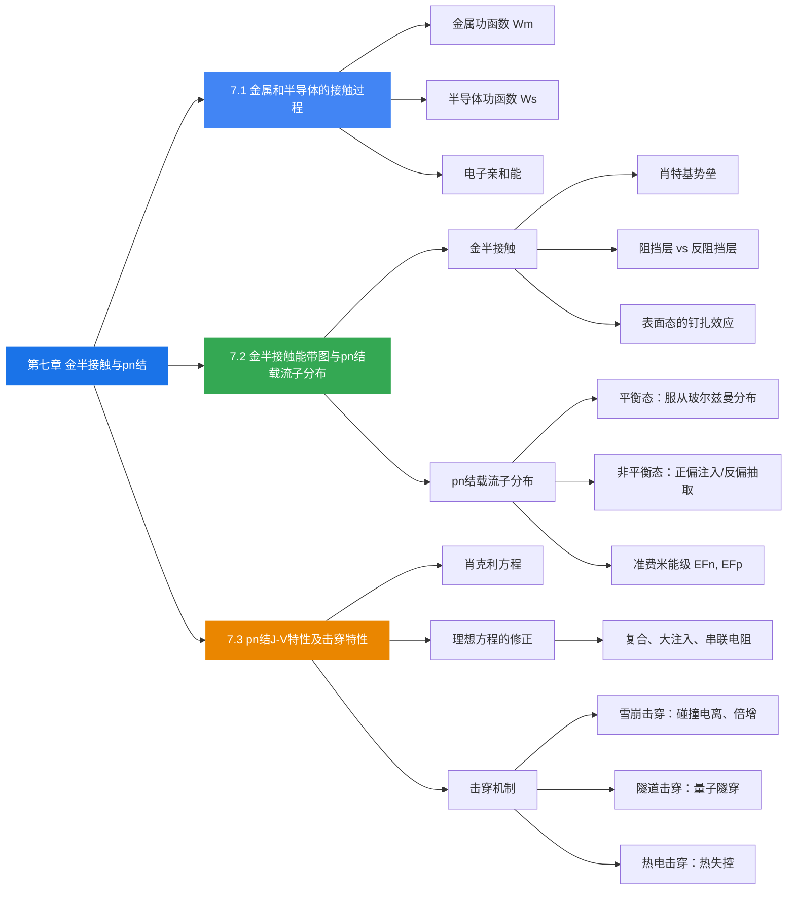

# 第七章 pn结与金属-半导体接触

> 本章是半导体器件物理的核心内容，围绕两大类结构展开：
> 1. **金属-半导体接触**（金半接触）：分析金属与半导体接触后的能带弯曲、阻挡层与反阻挡层；
> 2. **pn结**：讨论pn结的形成、载流子分布、电流-电压特性以及击穿机制。

---

## 7.1 金属和半导体的接触过程

### 功函数与接触电势差

#### 金属的功函数

**金属功函数** $W_m$ 定义为：一个起始能量等于费米能级的电子，从金属内部逸出到真空中所需要的最小能量。

$$
W_m = E_0 - (E_F)_m
$$

其中：
- $E_0$：真空中静止电子的能量（真空能级）
- $(E_F)_m$：金属的费米能级

> **理解笔记**：功函数本质上是"电子逃逸金属所需的门槛能量"。功函数越大，电子越难逃出金属。不同金属的功函数不同，典型的如 Cs（1.93 eV）很低，Pt（5.36 eV）很高。

#### 半导体的功函数

**半导体功函数** $W_s$ 定义为真空能级 $E_0$ 与半导体费米能级 $E_{Fs}$ 之差：

$$
W_s = E_0 - E_{Fs}
$$

**电子亲和能** $\chi$：半导体导带底的电子逸出体外所需的最小能量：

$$
\chi = E_0 - E_c
$$

半导体功函数可以用电子亲和能表示：

- **n型半导体**：$W_s = \chi + (E_c - E_F) = \chi + E_n$
- **p型半导体**：$W_s = \chi + [E_g - (E_F - E_v)]$

其中 $E_n = E_c - E_F$ 是导带底到费米能级的距离。

> **理解笔记**：半导体的功函数与掺杂浓度和类型有关——费米能级随杂质浓度变化，因此功函数也相应变化。这是金半接触行为多样化的根源。

#### 费米能级的物理意义（回顾）

费米-狄拉克分布函数：

$$
f(E) = \frac{1}{1 + \exp\left(\frac{E - E_F}{k_0 T}\right)}
$$

**核心性质：**
- **T = 0 K 时**：$E < E_F$ 的量子态全部被电子占据（$f = 1$），$E > E_F$ 的量子态全部为空（$f = 0$）
- **T > 0 K 时**：$E = E_F$ 处 $f(E_F) = 1/2$，即费米能级是被占据概率为50%的能级
- **物理意义**：费米能级标志着电子填充能级的水平，是量子态基本上被占据或基本上空着的分界线

> 当 $E - E_F > 5k_0T$ 时，$f(E) < 0.007$（基本为空）；当 $E - E_F < -5k_0T$ 时，$f(E) > 0.993$（基本填满）。

### 小结

- 金属功函数 $W_m = E_0 - E_{Fm}$，是电子从费米能级逸出到真空的最小能量
- 半导体功函数 $W_s = E_0 - E_{Fs}$，与掺杂类型和浓度有关
- 电子亲和能 $\chi = E_0 - E_c$，只与半导体材料本身有关
- 费米能级是电子占据概率的分界线，决定了接触前后的电子流动方向

---

## 7.2 金半接触能带图与pn结载流子分布

### 金半接触能带图

#### 接触过程（以金属与n型半导体接触为例）

**基本假设：** 金属和半导体有共同的真空能级 $E_0$，并假定 $W_m > W_s$。

**接触前：**
- 金属费米能级 $(E_F)_m$ 低于半导体费米能级 $(E_F)_s$
- 两者各自独立，有不同的费米能级

**接触后（紧密接触）：**
- 半导体中的电子向金属流动（因为 $E_{Fs} > E_{Fm}$，高能级电子流向低能级）
- 金属表面带**负电**，半导体表面带**正电**
- 平衡时，金属和半导体的费米能级统一在同一水平上

**接触电势差：**

$$
V_{ms} = V_m - V_s' = \frac{W_s - W_m}{q}
$$

当忽略间隙时（紧密接触），$V_{ms}$ 可以忽略，接触电势差几乎全部降落在半导体的空间电荷区：

$$
\frac{W_s - W_m}{q} \approx V_s
$$

#### 半导体一边的势垒高度

$$
qV_D = W_m - W_s \quad (\text{忽略间隙时})
$$

#### 金属一边的势垒高度（肖特基势垒）

$$
q\phi_{ns} = qV_D + E_n = W_m - \chi
$$

> **理解笔记**：肖特基势垒高度 $q\phi_{ns} = W_m - \chi$ 是一个非常重要的量——它决定了金属到半导体的电子注入难易程度。势垒越高，电子越难通过。

#### 四种接触情况总结

| 条件 | 半导体类型 | 结果 | 能带弯曲 | 特性 |
|------|-----------|------|---------|------|
| $W_m > W_s$ | n型 | **电子阻挡层** | 向上翘 | 电子耗尽，高电阻 |
| $W_m < W_s$ | n型 | **电子反阻挡层** | 向下弯 | 电子积累，低电阻 |
| $W_m > W_s$ | p型 | **空穴反阻挡层** | 向上翘 | 空穴积累，低电阻 |
| $W_m < W_s$ | p型 | **空穴阻挡层** | 向下弯 | 空穴耗尽，高电阻 |

> **记忆口诀**：对于n型，$W_m > W_s$ 时能带上翘形成阻挡层（多子耗尽、高阻）；$W_m < W_s$ 时能带下弯形成反阻挡层（多子积累、低阻）。p型情况恰好相反。

**阻挡层的物理特征：**
- 空间电荷区中多子耗尽
- 电阻率高，形成高阻层
- 对电流有显著的整流效应

**反阻挡层的物理特征：**
- 半导体表面带负电（n型），电场方向从表面指向体内
- 能带向下弯曲，表面电子浓度远大于体内
- 形成很薄的高电导层，对接触电阻影响很小

#### 表面态的影响

实验发现：不同金属与同一种半导体接触时，势垒高度相差很小（如表7-3所示，n-Ge与Au、Al、W接触时 $\phi_m$ 分别约为0.45V、0.48V、0.48V）。

这说明：**金属功函数对势垒高度影响不大**，原因在于半导体表面态的"钉扎"效应。

**表面态密度很高时：**
- 表面态可以屏蔽金属接触的影响
- 半导体内的势垒高度与金属功函数无关
- 势垒高度基本上由半导体的表面性质决定
- 接触电势差全部降落在两个表面之间

### pn结的形成与载流子分布

#### 平衡pn结的定义体系

取p区与n区的交界面为 $x = 0$：
- $-x_p$：p区势垒区边界
- $x_n$：n区势垒区边界
- 取p区电势为零：$V_p = 0$，$V_n = V_D$

**内建电势差（接触电势差）：**

$$
qV_D = E_{Fn} - E_{Fp}
$$

平衡时pn结具有统一的费米能级 $E_F$。

#### 势垒区的载流子分布

**电子浓度分布：**

$$
n(x) = n_{n0} \exp\left(-\frac{qV_D - qV(x)}{k_0 T}\right)
$$

边界条件验证：
- $x = x_n$ 时：$n(x_n) = n_{n0}$（n区中性区电子浓度）
- $x = -x_p$ 时：$n(-x_p) = n_{n0} \exp\left(-\frac{qV_D}{k_0 T}\right) = n_{p0}$（p区少子浓度）

最终形式：

$$
n(x) = n_{p0} \exp\left(\frac{qV(x)}{k_0 T}\right)
$$

**空穴浓度分布：**

$$
p(x) = p_{p0} \exp\left(-\frac{qV(x)}{k_0 T}\right)
$$

边界条件验证：
- $x = -x_p$ 时：$p(-x_p) = p_{p0}$
- $x = x_n$ 时：$p(x_n) = p_{p0} \exp\left(-\frac{qV_D}{k_0 T}\right) = p_{n0}$

**耗尽层近似：** 势垒区载流子浓度与掺杂浓度相比可以忽略，空间电荷区的电荷密度等于电离杂质浓度。

> **理解笔记**：例如在室温下，势垒高度为0.7 eV，若势垒区某处电势能比 $E_{cn}$ 高0.1 eV，则 $n(x) = N_D/50$，$p(x) = 10^{-10} N_A$，远小于掺杂浓度，可以近似认为该区域已耗尽。

#### 非平衡pn结

**正向偏压（$V > 0$，p区接正，n区接负）：**
- 外电场与内建电场方向**相反**
- 结区电场**削弱**
- 耗尽层宽度**减小**，势垒高度**降低**：$q(V_D - V)$
- 扩散大于漂移，产生载流子净扩散流
- 向p区注入非平衡空穴，向n区注入非平衡电子
- n区能带整体上移

**反向偏压（$V < 0$，p区接负，n区接正）：**
- 外电场与内建电场方向**相同**
- 结区电场**增强**
- 耗尽层宽度**增大**，势垒高度**升高**：$q(V_D + |V|)$
- 漂移大于扩散，产生载流子净漂移流
- 从p、n区**抽取**非平衡载流子
- 由自身少子（本征激发产生）提供，电流微弱且反偏增大时几乎不变

**pn结形成过程的物理链条：**

浓度梯度 $\rightarrow$ 扩散 $\rightarrow$ 破坏电中性 $\rightarrow$ 自建电场 $\rightarrow$ 漂移电流 $\rightarrow$ 动态平衡 $\rightarrow$ 净电流为零

#### 准费米能级

当热平衡被破坏（存在非平衡载流子）时：
- 导带和价带各自仍处于局部平衡态
- 但导带和价带之间不再平衡
- 分别引入**电子准费米能级** $E_{Fn}$ 和**空穴准费米能级** $E_{Fp}$
- 两者之差反映非平衡程度：$E_{Fn} - E_{Fp} = qV$（外加偏压）

### 小结

- 金半接触的四种情况取决于功函数大小关系和半导体类型，形成阻挡层（高阻）或反阻挡层（低阻）
- 肖特基势垒高度 $q\phi_{ns} = W_m - \chi$，实际中受表面态影响而与金属功函数关系不大
- 平衡pn结中载流子浓度服从玻尔兹曼分布，势垒区可用耗尽近似
- 正偏降低势垒、注入载流子；反偏升高势垒、抽取载流子
- 非平衡态引入准费米能级 $E_{Fn}$ 和 $E_{Fp}$，两者之差等于 $qV$

---

## 7.3 pn结J-V特性及击穿特性

### 理想pn结的电流-电压关系

#### 推导思路

**第1步：确定非平衡少数载流子分布**

在正向偏压 $V$ 下，势垒区边界处注入的非平衡少数载流子浓度为：

$$
\Delta p(x_n) = p_{n0}\left[\exp\left(\frac{qV}{k_0 T}\right) - 1\right]
$$

$$
\Delta n(-x_p) = n_{p0}\left[\exp\left(\frac{qV}{k_0 T}\right) - 1\right]
$$

在扩散区（样品足够厚），利用稳态扩散方程得到非平衡载流子的空间分布：

$$
\Delta p(x) = \Delta p(x_n) \exp\left(-\frac{x - x_n}{L_p}\right), \quad x > x_n
$$

$$
\Delta n(x) = \Delta n(-x_p) \exp\left(\frac{x + x_p}{L_n}\right), \quad x < -x_p
$$

其中 $L_p$、$L_n$ 分别为空穴和电子的扩散长度。

**第2步：计算扩散电流密度**

在势垒区边界处，少数载流子的扩散电流密度为：

$$
J_p(x_n) = -q D_p \left.\frac{d\Delta p}{dx}\right|_{x=x_n} = \frac{q D_p}{L_p} p_{n0}\left[\exp\left(\frac{qV}{k_0 T}\right) - 1\right]
$$

$$
J_n(-x_p) = q D_n \left.\frac{d\Delta n}{dx}\right|_{x=-x_p} = \frac{q D_n}{L_n} n_{p0}\left[\exp\left(\frac{qV}{k_0 T}\right) - 1\right]
$$

#### 肖克利方程（Shockley Equation）

两种载流子的扩散电流密度相加，得到理想pn结的电流-电压方程：

$$
\boxed{J = J_s \left[\exp\left(\frac{qV}{k_0 T}\right) - 1\right]}
$$

其中**反向饱和电流密度**：

$$
J_s = \frac{q D_p}{L_p} p_{n0} + \frac{q D_n}{L_n} n_{p0}
$$

利用 $p_{n0} = n_i^2 / N_D$、$n_{p0} = n_i^2 / N_A$，可改写为：

$$
J_s = \frac{q D_p n_i^2}{L_p N_D} + \frac{q D_n n_i^2}{L_n N_A}
$$

#### J-V特性的物理含义

**正向偏压（$V > 0$）：**
- $\exp(qV/k_0T) \gg 1$，$J \approx J_s \exp(qV/k_0T)$
- 电流随电压指数增长
- 正偏导通，呈小电阻，电流较大

**反向偏压（$V < 0$，$q|V| \gg k_0T$）：**
- $\exp(qV/k_0T) \to 0$，$J \approx -J_s$
- 电流为很小的反向饱和电流
- 反偏截止，电阻很大，电流近似为零

**反向偏压时的载流子分布：**

$$
\Delta p(x_n) = -p_{n0}, \quad \Delta n(-x_p) = -n_{p0}
$$

$$
\Delta p(x) = -p_{n0} \exp\left(-\frac{x - x_n}{L_p}\right)
$$

即边界处少子浓度被"抽取"至零。

### 理想J-V关系的修正

实际pn结的J-V特性偏离理想肖克利方程，主要修正因素包括：

1. **势垒区中的产生和复合**：在低正偏压下，势垒区内的复合电流占主导
   - 复合电流：$J_r \propto \exp(qV / 2k_0T)$
2. **大注入条件**：高正偏压下注入载流子浓度接近多子浓度
3. **串联电阻**：高电流下体电阻压降不可忽略，$J = V/R$
4. **表面效应**：表面漏电等

实际J-V曲线在不同偏压区域由不同机制主导：
- **低正偏**：势垒区复合电流主导，$\propto \exp(qV / 2k_0T)$
- **中等正偏**：扩散电流主导，$\propto \exp(qV / k_0T)$（理想区）
- **高正偏**：大注入和串联电阻效应，电流增长变缓
- **反偏**：产生电流主导（而非理想的饱和电流）

### 击穿机制（雪崩击穿与隧道击穿）

当反向偏压增大到某一临界值 $V_{BR}$ 时，反向电流急剧增大，称为**pn结击穿**。

#### 雪崩击穿

**物理机制：**
1. 反偏时结区电场增强
2. 少子在强电场中加速，获得足够高的动能
3. 与晶格原子碰撞，产生新的电子-空穴对（碰撞电离）
4. 新产生的载流子又被加速，继续碰撞电离
5. 形成**雪崩倍增效应**，电流急剧增大

**电离率** $\alpha$：一个载流子在强电场作用下走过单位距离时产生的电子-空穴对数目，用来表征碰撞电离的强弱。

**雪崩击穿的特点：**
1. **空间电荷区要有一定宽度**：如果太窄（小于一个平均自由程），载流子加速达不到雪崩倍增所需的动能
2. **击穿电压较高**，击穿曲线比较陡直（硬击穿）
3. 一般 Ge、Si 器件中，雪崩击穿电压在 $6E_g/q$ 以上
4. 具有**正温度系数**：温度升高 $\rightarrow$ 晶格散射增强 $\rightarrow$ 平均自由程缩短 $\rightarrow$ 需要更高电压才能击穿 $\rightarrow$ $V_{BR}$ 升高

> **常见于掺杂浓度较低的pn结**——因为低掺杂时势垒区宽，载流子有足够的加速距离。

#### 隧道击穿（齐纳击穿）

**物理机制：**
1. 重掺杂pn结中，势垒区非常窄
2. 在反向偏压下，p区价带顶可以高于n区导带底
3. 电子可以通过**量子隧穿效应**，从p区价带直接穿过禁带到达n区导带
4. 隧穿概率：

$$
P = \exp\left[-\frac{8\pi}{3}\left(\frac{2m_n^*}{h^2}\right)^{1/2} E_g^{1/2} \Delta x\right]
$$

其中 $\Delta x$ 为隧穿距离（势垒宽度），$E_g$ 为禁带宽度。

**齐纳击穿的特点：**
1. 掺杂浓度高，势垒区窄
2. 击穿电压较低，一般 $V_{BR} < 4E_g/q$
3. 具有**负温度系数**：温度升高 $\rightarrow$ $E_g$ 减小 $\rightarrow$ 隧穿概率增大 $\rightarrow$ $V_{BR}$ 降低
4. 击穿曲线较平缓（软击穿）

> **理解笔记**：隧道击穿和雪崩击穿的区分关键在于掺杂浓度。高掺杂 $\rightarrow$ 窄势垒 $\rightarrow$ 利于隧穿；低掺杂 $\rightarrow$ 宽势垒 $\rightarrow$ 利于雪崩。中间区域（$4E_g/q \sim 6E_g/q$）两种机制可能共存。

#### 热电击穿

**物理机制：** 反向电流导致热损耗，结温上升，本征载流子浓度 $n_i$ 增大，反向饱和电流 $J_s$ 进一步增大，形成正反馈：

$$
V \uparrow \rightarrow \text{功耗} P \uparrow \rightarrow \text{结温} \uparrow \rightarrow n_i \uparrow \rightarrow J_s \uparrow \rightarrow J_s \uparrow\uparrow \rightarrow \text{热电击穿}
$$

**特点：**
- 禁带宽度小的半导体，反向饱和电流密度较大，更易发生热电击穿
- 可通过使用**宽带隙材料**来提高器件的击穿电压

### 小结

- **肖克利方程** $J = J_s[\exp(qV/k_0T) - 1]$ 是理想pn结的核心公式，正偏指数增长，反偏趋于饱和
- 反向饱和电流密度 $J_s$ 与少子浓度、扩散系数和扩散长度有关
- 实际J-V特性需要考虑势垒区复合、大注入、串联电阻等修正
- **雪崩击穿**：低掺杂、宽势垒、高击穿电压（$> 6E_g/q$）、正温度系数
- **隧道击穿**：高掺杂、窄势垒、低击穿电压（$< 4E_g/q$）、负温度系数
- **热电击穿**：反向电流引起的热失控正反馈过程

---

## 本章总结

### 知识脉络

### 核心公式速查

| 公式 | 含义 |
|------|------|
| $W_m = E_0 - E_{Fm}$ | 金属功函数 |
| $W_s = E_0 - E_{Fs}$ | 半导体功函数 |
| $\chi = E_0 - E_c$ | 电子亲和能 |
| $q\phi_{ns} = W_m - \chi$ | 肖特基势垒高度 |
| $qV_D = W_m - W_s$ | 半导体侧势垒高度 |
| $n(x) = n_{p0} \exp(qV(x)/k_0T)$ | 势垒区电子分布 |
| $p(x) = p_{p0} \exp(-qV(x)/k_0T)$ | 势垒区空穴分布 |
| $J = J_s[\exp(qV/k_0T) - 1]$ | 肖克利方程 |
| $J_s = \frac{qD_p}{L_p}p_{n0} + \frac{qD_n}{L_n}n_{p0}$ | 反向饱和电流密度 |
| $P = \exp[-\frac{8\pi}{3}(\frac{2m_n^*}{h^2})^{1/2} E_g^{1/2} \Delta x]$ | 隧穿概率 |

### 关键物理图像

1. **金半接触**的核心是功函数差驱动电子流动，直到费米能级统一，形成势垒
2. **pn结**的本质是两个不同类型半导体的接触，内建电场和扩散运动达到动态平衡
3. **正偏**降低势垒 $\rightarrow$ 多子注入 $\rightarrow$ 大电流；**反偏**升高势垒 $\rightarrow$ 少子抽取 $\rightarrow$ 微小饱和电流
4. **击穿**是pn结在强反偏下的失效机制，雪崩击穿和隧道击穿是最常见的两种类型，分别对应低掺杂和高掺杂场景
