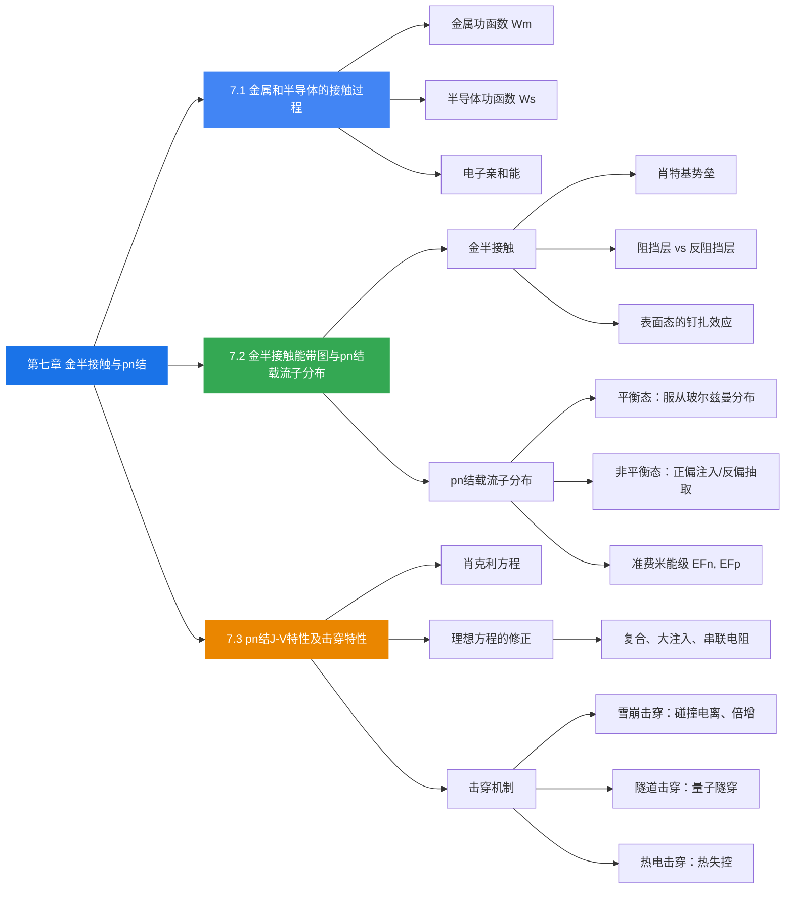

## 7.3 pn结J-V特性及击穿特性

### 理想pn结的电流-电压关系

#### 推导思路

**第1步：确定非平衡少数载流子分布**

在正向偏压 $V$ 下，势垒区边界处注入的非平衡少数载流子浓度为：

$$
\Delta p(x_n) = p_{n0}\left[\exp\left(\frac{qV}{k_0 T}\right) - 1\right]
$$

$$
\Delta n(-x_p) = n_{p0}\left[\exp\left(\frac{qV}{k_0 T}\right) - 1\right]
$$

在扩散区（样品足够厚），利用稳态扩散方程得到非平衡载流子的空间分布：

$$
\Delta p(x) = \Delta p(x_n) \exp\left(-\frac{x - x_n}{L_p}\right), \quad x > x_n
$$

$$
\Delta n(x) = \Delta n(-x_p) \exp\left(\frac{x + x_p}{L_n}\right), \quad x < -x_p
$$

其中 $L_p$、$L_n$ 分别为空穴和电子的扩散长度。

**第2步：计算扩散电流密度**

在势垒区边界处，少数载流子的扩散电流密度为：

$$
J_p(x_n) = -q D_p \left.\frac{d\Delta p}{dx}\right|_{x=x_n} = \frac{q D_p}{L_p} p_{n0}\left[\exp\left(\frac{qV}{k_0 T}\right) - 1\right]
$$

$$
J_n(-x_p) = q D_n \left.\frac{d\Delta n}{dx}\right|_{x=-x_p} = \frac{q D_n}{L_n} n_{p0}\left[\exp\left(\frac{qV}{k_0 T}\right) - 1\right]
$$

#### 肖克利方程（Shockley Equation）

两种载流子的扩散电流密度相加，得到理想pn结的电流-电压方程：

$$
\boxed{J = J_s \left[\exp\left(\frac{qV}{k_0 T}\right) - 1\right]}
$$

其中**反向饱和电流密度**：

$$
J_s = \frac{q D_p}{L_p} p_{n0} + \frac{q D_n}{L_n} n_{p0}
$$

利用 $p_{n0} = n_i^2 / N_D$、$n_{p0} = n_i^2 / N_A$，可改写为：

$$
J_s = \frac{q D_p n_i^2}{L_p N_D} + \frac{q D_n n_i^2}{L_n N_A}
$$

#### J-V特性的物理含义

**正向偏压（$V > 0$）：**
- $\exp(qV/k_0T) \gg 1$，$J \approx J_s \exp(qV/k_0T)$
- 电流随电压指数增长
- 正偏导通，呈小电阻，电流较大

**反向偏压（$V < 0$，$q|V| \gg k_0T$）：**
- $\exp(qV/k_0T) \to 0$，$J \approx -J_s$
- 电流为很小的反向饱和电流
- 反偏截止，电阻很大，电流近似为零

**反向偏压时的载流子分布：**

$$
\Delta p(x_n) = -p_{n0}, \quad \Delta n(-x_p) = -n_{p0}
$$

$$
\Delta p(x) = -p_{n0} \exp\left(-\frac{x - x_n}{L_p}\right)
$$

即边界处少子浓度被"抽取"至零。

### 理想J-V关系的修正

实际pn结的J-V特性偏离理想肖克利方程，主要修正因素包括：

1. **势垒区中的产生和复合**：在低正偏压下，势垒区内的复合电流占主导
   - 复合电流：$J_r \propto \exp(qV / 2k_0T)$
2. **大注入条件**：高正偏压下注入载流子浓度接近多子浓度
3. **串联电阻**：高电流下体电阻压降不可忽略，$J = V/R$
4. **表面效应**：表面漏电等

实际J-V曲线在不同偏压区域由不同机制主导：
- **低正偏**：势垒区复合电流主导，$\propto \exp(qV / 2k_0T)$
- **中等正偏**：扩散电流主导，$\propto \exp(qV / k_0T)$（理想区）
- **高正偏**：大注入和串联电阻效应，电流增长变缓
- **反偏**：产生电流主导（而非理想的饱和电流）

### 击穿机制（雪崩击穿与隧道击穿）

当反向偏压增大到某一临界值 $V_{BR}$ 时，反向电流急剧增大，称为**pn结击穿**。

#### 雪崩击穿

**物理机制：**
1. 反偏时结区电场增强
2. 少子在强电场中加速，获得足够高的动能
3. 与晶格原子碰撞，产生新的电子-空穴对（碰撞电离）
4. 新产生的载流子又被加速，继续碰撞电离
5. 形成**雪崩倍增效应**，电流急剧增大

**电离率** $\alpha$：一个载流子在强电场作用下走过单位距离时产生的电子-空穴对数目，用来表征碰撞电离的强弱。

**雪崩击穿的特点：**
1. **空间电荷区要有一定宽度**：如果太窄（小于一个平均自由程），载流子加速达不到雪崩倍增所需的动能
2. **击穿电压较高**，击穿曲线比较陡直（硬击穿）
3. 一般 Ge、Si 器件中，雪崩击穿电压在 $6E_g/q$ 以上
4. 具有**正温度系数**：温度升高 $\rightarrow$ 晶格散射增强 $\rightarrow$ 平均自由程缩短 $\rightarrow$ 需要更高电压才能击穿 $\rightarrow$ $V_{BR}$ 升高

> **常见于掺杂浓度较低的pn结**——因为低掺杂时势垒区宽，载流子有足够的加速距离。

#### 隧道击穿（齐纳击穿）

**物理机制：**
1. 重掺杂pn结中，势垒区非常窄
2. 在反向偏压下，p区价带顶可以高于n区导带底
3. 电子可以通过**量子隧穿效应**，从p区价带直接穿过禁带到达n区导带
4. 隧穿概率：

$$
P = \exp\left[-\frac{8\pi}{3}\left(\frac{2m_n^*}{h^2}\right)^{1/2} E_g^{1/2} \Delta x\right]
$$

其中 $\Delta x$ 为隧穿距离（势垒宽度），$E_g$ 为禁带宽度。

**齐纳击穿的特点：**
1. 掺杂浓度高，势垒区窄
2. 击穿电压较低，一般 $V_{BR} < 4E_g/q$
3. 具有**负温度系数**：温度升高 $\rightarrow$ $E_g$ 减小 $\rightarrow$ 隧穿概率增大 $\rightarrow$ $V_{BR}$ 降低
4. 击穿曲线较平缓（软击穿）

> **理解笔记**：隧道击穿和雪崩击穿的区分关键在于掺杂浓度。高掺杂 $\rightarrow$ 窄势垒 $\rightarrow$ 利于隧穿；低掺杂 $\rightarrow$ 宽势垒 $\rightarrow$ 利于雪崩。中间区域（$4E_g/q \sim 6E_g/q$）两种机制可能共存。

#### 热电击穿

**物理机制：** 反向电流导致热损耗，结温上升，本征载流子浓度 $n_i$ 增大，反向饱和电流 $J_s$ 进一步增大，形成正反馈：

$$
V \uparrow \rightarrow \text{功耗} P \uparrow \rightarrow \text{结温} \uparrow \rightarrow n_i \uparrow \rightarrow J_s \uparrow \rightarrow J_s \uparrow\uparrow \rightarrow \text{热电击穿}
$$

**特点：**
- 禁带宽度小的半导体，反向饱和电流密度较大，更易发生热电击穿
- 可通过使用**宽带隙材料**来提高器件的击穿电压

### 小结

- **肖克利方程** $J = J_s[\exp(qV/k_0T) - 1]$ 是理想pn结的核心公式，正偏指数增长，反偏趋于饱和
- 反向饱和电流密度 $J_s$ 与少子浓度、扩散系数和扩散长度有关
- 实际J-V特性需要考虑势垒区复合、大注入、串联电阻等修正
- **雪崩击穿**：低掺杂、宽势垒、高击穿电压（$> 6E_g/q$）、正温度系数
- **隧道击穿**：高掺杂、窄势垒、低击穿电压（$< 4E_g/q$）、负温度系数
- **热电击穿**：反向电流引起的热失控正反馈过程

---

## 本章总结

### 知识脉络

### 核心公式速查

| 公式 | 含义 |
|------|------|
| $W_m = E_0 - E_{Fm}$ | 金属功函数 |
| $W_s = E_0 - E_{Fs}$ | 半导体功函数 |
| $\chi = E_0 - E_c$ | 电子亲和能 |
| $q\phi_{ns} = W_m - \chi$ | 肖特基势垒高度 |
| $qV_D = W_m - W_s$ | 半导体侧势垒高度 |
| $n(x) = n_{p0} \exp(qV(x)/k_0T)$ | 势垒区电子分布 |
| $p(x) = p_{p0} \exp(-qV(x)/k_0T)$ | 势垒区空穴分布 |
| $J = J_s[\exp(qV/k_0T) - 1]$ | 肖克利方程 |
| $J_s = \frac{qD_p}{L_p}p_{n0} + \frac{qD_n}{L_n}n_{p0}$ | 反向饱和电流密度 |
| $P = \exp[-\frac{8\pi}{3}(\frac{2m_n^*}{h^2})^{1/2} E_g^{1/2} \Delta x]$ | 隧穿概率 |

### 关键物理图像

1. **金半接触**的核心是功函数差驱动电子流动，直到费米能级统一，形成势垒
2. **pn结**的本质是两个不同类型半导体的接触，内建电场和扩散运动达到动态平衡
3. **正偏**降低势垒 $\rightarrow$ 多子注入 $\rightarrow$ 大电流；**反偏**升高势垒 $\rightarrow$ 少子抽取 $\rightarrow$ 微小饱和电流
4. **击穿**是pn结在强反偏下的失效机制，雪崩击穿和隧道击穿是最常见的两种类型，分别对应低掺杂和高掺杂场景
