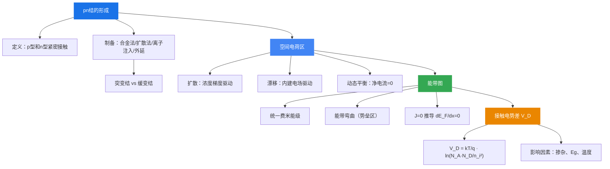

# 7.1 pn结及其能带图

> **本节对应第16次课**。pn结是半导体器件的最基本单元--不管多复杂多简单的集成电路，都是由pn结构成的。本节讨论pn结的形成、空间电荷区的建立、平衡pn结能带图以及接触电势差。

---

## 7.1.1 pn结的形成

### pn结的定义

将 **p型半导体** 和 **n型半导体** 紧密接触，在两者交界处形成的界面称为 **pn结**。

实际工艺中，在一块n型半导体单晶上，用适当的工艺方法把p型杂质掺入其中，使不同区域分别具有n型和p型导电类型，交界面处即形成pn结。

### pn结的制备方法

#### 一、合金法

将铝放在n型硅单晶上，加热至约500°C使铝硅熔融，降温凝固后形成高浓度铝的p型硅薄层，交界面处形成pn结（铝硅合金结）。

**特点**：合金法制备的pn结一般为 **突变结**，杂质浓度在结面处突变：

$$
\begin{cases}
x < x_j,\ N_A(x) = N_A \\
x > x_j,\ N_D(x) = N_D
\end{cases}
$$

实际中通常 $N_A \gg N_D$ 或 $N_D \gg N_A$，称为 **单边突变结**（如 $p^+n$ 结或 $n^+p$ 结）。

#### 二、扩散法

在n型硅片上通过氧化、光刻、扩散等工艺制得的pn结，称为 **扩散结**。

**特点**：杂质浓度在结面处逐渐变化，一般为 **缓变结**：

$$
\begin{cases}
x < x_j,\ N_A > N_D \\
x > x_j,\ N_D > N_A
\end{cases}
$$

根据扩散结的杂质分布，可进一步分为：
- **线性缓变结**：低表面浓度的深扩散结，杂质浓度线性变化
- **突变结近似**：高表面浓度的浅扩散结，$x_j$ 处斜率 $\alpha_j$ 很大，可用突变结近似

#### 三、离子注入法

将杂质原子离化为带电离子，在强电场下加速后轰击半导体基片，再经退火激活杂质，形成一定的杂质分布。

| 优点 | 缺点 |
|:---|:---|
| 低温工艺，避免混入其他杂质 | 设备昂贵 |
| 可精确控制浓度和结深 | |
| 可在大面积上形成薄而均匀的掺杂层 | |
| 控制离子束扫描区域，实现选择注入，不需掩膜 | |

#### 四、外延法

在单晶衬底上沿原晶向生长一层完整的单晶薄膜。外延工艺可：
- 在一种单晶材料上生长另一种单晶材料
- 方便地形成不同导电类型、不同杂质浓度、杂质分布陡峭的外延层

---

## 7.1.2 空间电荷区

### 扩散运动

接触前，p型半导体中空穴多、电子少，n型半导体中电子多、空穴少，各自电中性。接触后存在 **浓度梯度**：

- **电子** 从n区 → p区扩散
- **空穴** 从p区 → n区扩散

扩散的结果：
- p区空穴离开后，留下不可动的 **电离受主**（负电荷），出现负电荷区
- n区电子离开后，留下不可动的 **电离施主**（正电荷），出现正电荷区

> 这些电离施主和电离受主所带电荷称为 **空间电荷**，所在区域称为 **空间电荷区**（也称 **耗尽区**）。

### 漂移运动

空间电荷区中的电荷产生 **内建电场** $\mathcal{E}$，方向从n区指向p区。内建电场驱动载流子做与扩散方向相反的运动：

- **电子** 从p区 → n区漂移
- **空穴** 从n区 → p区漂移

内建电场起着 **阻碍** 电子和空穴继续扩散的作用。

### 平衡pn结

| 载流子运动 | 原因 | 电子方向 | 空穴方向 |
|:---|:---|:---|:---|
| **扩散运动** | 浓度梯度 | n → p | p → n |
| **漂移运动** | 内建电场 | p → n | n → p |

**动态平衡过程**：

**平衡条件**：
- 电子的扩散电流 = 电子的漂移电流，空穴的扩散电流 = 空穴的漂移电流
- 流过pn结的 **净电流为零**
- 空间电荷数量一定，空间电荷区宽度一定，内建电场一定

> **理解笔记**：扩散和漂移无时无刻都在进行（动态平衡），不是载流子停止运动，而是两个方向的流量相等。

---

## 7.1.3 pn结能带图

### 接触前的能带

p型和n型半导体未接触前，各自有独立的费米能级：
- n型：费米能级 $E_{Fn}$ 靠近导带底 $E_c$
- p型：费米能级 $E_{Fp}$ 靠近价带顶 $E_v$

且 $E_{Fn} > E_{Fp}$（n型费米能级高于p型）。

### 平衡pn结能带图

接触后，电子从费米能级高的n区流向费米能级低的p区：
- $E_{Fn}$ 下降，$E_{Fp}$ 上升
- 直到形成 **统一的费米能级** $E_F$

**能带图特征**：
1. 费米能级 $E_F$ 处处水平相等
2. 空间电荷区外（中性区），p区和n区能带各自平直
3. 空间电荷区内，能带发生 **弯曲**--这是空间电荷区中电势能变化的结果
4. n区能带整体低于p区（电子势能n区低、p区高）

> **理解笔记**：费米能级处处相等标志每种载流子的扩散电流和漂移电流互相抵消，没有净电流通过pn结。

### 费米能级与电流密度关系

电子电流密度由漂移电流和扩散电流两部分组成：

$$
J_n = n_0 q\mu_n \mathcal{E} + qD_n \frac{dn_0}{dx}
$$

利用爱因斯坦关系 $D_n = \mu_n \frac{k_0 T}{q}$ 和 $n_0 = n_i \exp\left(\frac{E_F - E_i}{k_0 T}\right)$，代入推导可得：

$$
\boxed{J_n = n_0 \mu_n \frac{dE_F}{dx}}
$$

平衡时 $J_n = 0$，故 $\dfrac{dE_F}{dx} = 0$，即 **费米能级处处相等，不随位置变化**。

同理对空穴：$J_p = p_0 \mu_p \dfrac{dE_F}{dx} = 0$，结论一致。

### 势垒区

由于能带弯曲，电子从势能低的n区向势能高的p区运动时，必须克服这一势能"高坡"。因此pn结的空间电荷区也称为 **势垒区**。

**画平衡pn结能带图的步骤**：
1. 画统一的费米能级 $E_F$（水平线）
2. 确定空间电荷区宽度
3. 画空间电荷区两侧中性区的能带（p区在上、n区在下）
4. 在空间电荷区内连接两侧能带，形成弯曲

---

## 7.1.4 pn结的接触电势差

### 定义

平衡pn结空间电荷区两端的电势差 $V_D$ 称为 **接触电势差**（内建电势差）：

$$
qV_D = E_{Fn} - E_{Fp}
$$

### 推导

由平衡时载流子浓度公式：

$$
n_{n0} = n_i \exp\left(\frac{E_{Fn} - E_i}{k_0 T}\right), \quad n_{p0} = n_i \exp\left(\frac{E_{Fp} - E_i}{k_0 T}\right)
$$

取比值：

$$
\ln\frac{n_{n0}}{n_{p0}} = \frac{E_{Fn} - E_{Fp}}{k_0 T}
$$

代入 $n_{n0} = N_D$（n区多子）、$n_{p0} = \dfrac{n_i^2}{p_{p0}} = \dfrac{n_i^2}{N_A}$（p区少子），得到：

$$
\boxed{V_D = \frac{k_0 T}{q} \ln\frac{N_D N_A}{n_i^2}}
$$

> **记忆要点**：此公式必须记住，是考试常考推导题。

### 影响因素

| 因素 | 影响规律 | 原因 |
|:---|:---|:---|
| **掺杂浓度** $N_D, N_A$ | 掺杂越高，$V_D$ 越大 | 费米能级离 $E_i$ 更远，$E_{Fn} - E_{Fp}$ 增大 |
| **禁带宽度** $E_g$ | $E_g$ 越大，$n_i$ 越小，$V_D$ 越大 | $n_i$ 在分母，$n_i$ 减小使对数项增大 |
| **温度** $T$ | 温度升高，$V_D$ 减小 | $n_i$ 随温度指数增大，影响超过 $T$ 的线性增长 |

**典型数值**（$N_A = 10^{17}\,\text{cm}^{-3}$，$N_D = 10^{15}\,\text{cm}^{-3}$，室温）：

| 材料 | $V_D$ |
|:---|:---|
| 硅（Si） | 0.70 V |
| 锗（Ge） | 0.32 V |

硅pn结的 $V_D$ 比锗大，因为硅的禁带宽度更大（$E_{g,\text{Si}} = 1.12\,\text{eV}$ > $E_{g,\text{Ge}} = 0.67\,\text{eV}$）。

---

## 本节小结

