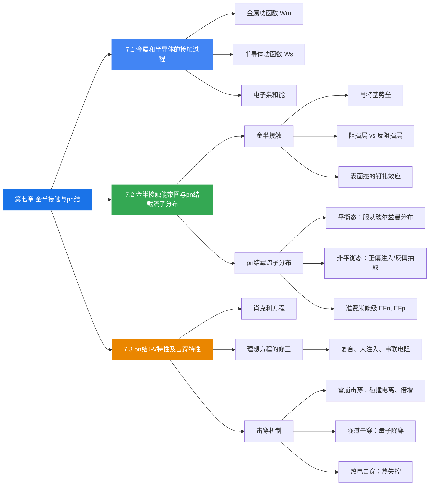

# 本章总结

### 知识脉络

### 核心公式速查

| 公式 | 含义 |
|------|------|
| $W_m = E_0 - E_{Fm}$ | 金属功函数 |
| $W_s = E_0 - E_{Fs}$ | 半导体功函数 |
| $\chi = E_0 - E_c$ | 电子亲和能 |
| $q\phi_{ns} = W_m - \chi$ | 肖特基势垒高度 |
| $qV_D = W_m - W_s$ | 半导体侧势垒高度 |
| $n(x) = n_{p0} \exp(qV(x)/k_0T)$ | 势垒区电子分布 |
| $p(x) = p_{p0} \exp(-qV(x)/k_0T)$ | 势垒区空穴分布 |
| $J = J_s[\exp(qV/k_0T) - 1]$ | 肖克利方程 |
| $J_s = \frac{qD_p}{L_p}p_{n0} + \frac{qD_n}{L_n}n_{p0}$ | 反向饱和电流密度 |
| $P = \exp[-\frac{8\pi}{3}(\frac{2m_n^*}{h^2})^{1/2} E_g^{1/2} \Delta x]$ | 隧穿概率 |

### 关键物理图像

1. **金半接触**的核心是功函数差驱动电子流动，直到费米能级统一，形成势垒
2. **pn结**的本质是两个不同类型半导体的接触，内建电场和扩散运动达到动态平衡
3. **正偏**降低势垒 $\rightarrow$ 多子注入 $\rightarrow$ 大电流；**反偏**升高势垒 $\rightarrow$ 少子抽取 $\rightarrow$ 微小饱和电流
4. **击穿**是pn结在强反偏下的失效机制，雪崩击穿和隧道击穿是最常见的两种类型，分别对应低掺杂和高掺杂场景
