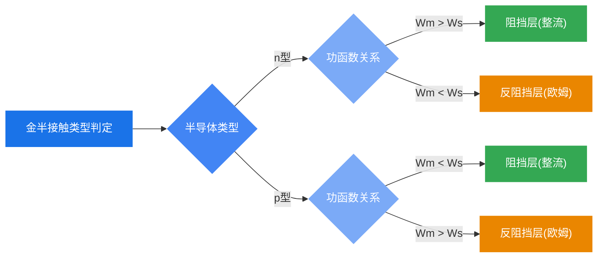

# 本章总结

### 核心概念一览

| 概念 | 公式/条件 | 物理意义 |
|------|----------|---------|
| 金属功函数 | $W_m = E_0 - (E_F)_m$ | 电子从金属逸出所需最小能量 |
| 半导体功函数 | $W_s = E_0 - (E_F)_s$ | 电子从半导体逸出所需最小能量 |
| 电子亲和能 | $\chi = E_0 - E_c$ | 导带底电子逸出所需最小能量 |
| 肖特基势垒高度 | $q\phi_{ns} = W_m - \chi$ | 金属侧电子进入半导体需越过的势垒 |
| 半导体侧势垒 | $qV_D = W_m - W_s$ | 空间电荷区中的内建电势 |

### 四种金半接触的判定

### 整流接触 vs 欧姆接触

| | 整流接触（肖特基接触） | 欧姆接触 |
|---|---|---|
| **形成条件** | 阻挡层（$W_m > W_s$ for n型） | 反阻挡层或重掺杂隧道效应 |
| **J-V特性** | 单向导电（指数型） | 线性对称 |
| **应用** | 肖特基二极管、高频整流 | 半导体器件的金属电极 |

### 知识关联

- 本章与**pn结**（第七章）的关系：肖特基二极管与pn结都具有单向导电性，但肖特基是多子器件，pn结是少子器件
- 本章为**MIS结构**（第九章）和**MOSFET**（第十章）打下基础：金属-绝缘体-半导体结构中的能带弯曲与金半接触密切相关
- **表面态**的概念贯穿多个章节，是理解实际器件行为的关键
