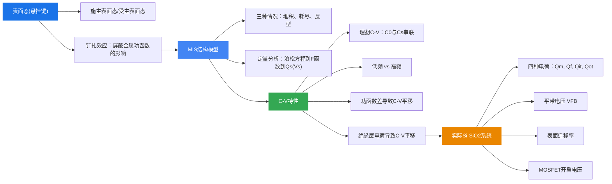

# 第九章 半导体表面与MIS结构

> 本章是半导体物理中极为重要的章节，从表面态的基本概念出发，逐步深入到MIS结构的C-V特性，最后讨论实际Si-SiO₂系统的性质。这些内容是理解MOSFET等现代半导体器件工作原理的基石。

---

## 9.1 表面态及电场效应

### 9.1.1 表面态的概念与产生原因

#### 什么是表面态

**表面态**是指固体自由表面或固体间接口附近的**局域性电子能态**。

理想半导体中，原子严格周期性排列在晶格格点位置，晶格结构完整、纯净无杂质。但在**实际半导体**中：

- 含有杂质
- 存在点、线、面的缺陷
- 原子在平衡位置附近振动

#### 理想表面与实际表面

| 对比项 | 理想表面 | 实际表面 |
|--------|----------|----------|
| 原子排列 | 对称性与体内完全相同 | 最外层原子有未配对电子 |
| 附着物 | 不附着任何原子或分子 | 表面吸附原子或存在缺陷 |
| 化学键 | 完整 | 存在**悬挂键**（dangling bonds） |

#### 表面态密度

表面态密度的量级非常大：

- 硅表面单位面积上的原子数量约为 $10^{15}\,\text{cm}^{-2}$，悬挂键的数量也为 $10^{15}\,\text{cm}^{-2}$
- 硅的掺杂浓度典型值为 $10^{15}\,\text{cm}^{-3}$，以典型的 $1\,\mu\text{m}$ 有效厚度计算，体内电子数仅为 $10^{11}$
- **内部电子只能填充表面悬挂键的万分之一**

这意味着表面态对半导体性质的影响极为巨大。

#### 表面能级

受悬挂键影响，在靠近半导体表面的**禁带**中，会出现一些允许载流子存在的能级，称为**表面能级**。

#### 表面态的分类

表面态分为**施主表面态**和**受主表面态**：

- **施主表面态**：能级被电子占据时呈电中性，可释放电子呈正电性
- **受主表面态**：能级空着时为电中性，可接收电子呈负电性

#### 表面态的影响——"钉扎效应"

在金半接触时，金属中的电子本来要注入硅晶体内部，但经过表面时绝大部分**被截留**了，用来填补表面海量的悬挂键，很难进入硅内部。

因此，**金属的影响力被硅的表面态给屏蔽了**——金属的功函数大小都不重要了，金属变成了"配角"。硅的表面态才是"主角"，主导了硅内部建电场的形态。

例如，在n型硅半导体中，表面态吸引了大量电子显负电，内部产生一段耗尽层显正电，一个由硅内部指向表面的**内建电场**就诞生了。这个电场是由表面效应派生的，不需要与金属接触，也不需要与另一种半导体结合。

#### 消除表面态——钝化

**钝化**可以消除表面态：在硅表面形成一层氧化层，氧原子与硅表面悬挂键形成共价键。场效应管栅极就是这么处理的。

### 9.1.2 表面电场效应与空间电荷区

#### MIS结构的基本模型

MIS（Metal-Insulator-Semiconductor，金属-绝缘层-半导体）结构是研究表面电场效应的核心器件模型。

**理想MIS结构的三个假设：**

1. 金属与半导体间的功函数差为零，即 $W_m = W_s$
2. 绝缘层内没有任何电荷且绝缘层完全不导电
3. 绝缘体与半导体界面处不存在任何界面态

#### 引起空间电荷区的原因

1. **功函数**：由于功函数不同，金属与半导体接触时，在半导体表面形成空间电荷区
2. **外电场**：外电场作用于半导体时，在表面形成空间电荷区
3. **表面态**：半导体表面存在不饱和悬挂键或吸附离子时，在表面形成空间电荷区
4. **绝缘层中的电荷**：与半导体接触的绝缘层中存在电荷时，在半导体表面形成空间电荷区

#### 空间电荷层与表面势

在空间电荷区内，从半导体表面到体内电场逐渐减小。由于电场是变化的，空间电荷区内的电势也随距离逐渐变化，即从表面到体内存在一个电势差，能带也因此而弯曲。

**表面势 $V_s$**：空间电荷层两端的电势差。

$$V_s = -\frac{E_{is} - E_{ib}}{q}$$

其中 $E_{is}$ 为表面处本征能级，$E_{ib}$ 为体内本征能级。

**符号约定**：
- $V_s > 0$：表面电势比内部高
- $V_s < 0$：表面电势比内部低

**助记规则**：电力线从正电荷出发终止于负电荷，电势沿电力线方向减小。

### 9.1.3 空间电荷区的三种情况（以P型半导体为例）

#### (1) 多子堆积 (VG < 0, Vs < 0)

- 金属与半导体之间加**负电压** $V_G < 0$
- 表面势 $V_s < 0$，表面电势低于体内
- 表面电子能量高于体内，**表面处能带向上弯曲**
- 价带顶逐渐移近甚至高过费米能级，空穴浓度增加
- 表面层出现**空穴堆积**（多子堆积）：$p_s \gg p_{p0}$

#### (2) 多子耗尽 (VG > 0, Vs > 0)

- 金属与半导体之间加**正电压** $V_G > 0$
- 表面势 $V_s > 0$，表面电势高于体内
- 表面电子能量低于体内，**表面处能带向下弯曲**
- 价带顶逐渐远离费米能级，空穴浓度降低
- 形成**空穴耗尽层**（多子耗尽）：$p_s \ll p_{p0}$
- 表面层的负电荷基本上等于电离受主杂质浓度

#### (3) 本征状态 (Vs = VB)

- 正电压 $V_G$ 进一步加大
- 表面处费米能级等于禁带中央 $E_i$
- 表面处空穴浓度等于电子浓度
- 半导体表面处于**本征状态**：$p_s = n_s = n_i \ll p_{p0}$

#### (4) 少子反型 (Vs > VB)

- 正电压 $V_G$ 继续加大
- 表面处禁带中央 $E_i$ 低于费米能级
- 费米能级离导带底比价带顶更近
- 电子浓度超过空穴浓度：$p_s < n_s$
- 形成与衬底导电类型相反的**反型层**

反型层与半导体内部夹着一层耗尽层。空间电荷区内负电荷由两部分组成：

$$Q = Q_n + Q_A$$

其中 $Q_n$ 为反型层中电子电荷，$Q_A$ 为耗尽层中电离受主电荷。

### 9.1.4 定量分析——表面电荷随表面势的变化

#### 泊松方程与电荷密度

空间电荷区中电势满足泊松方程：

$$\frac{d^2V}{dx^2} = -\frac{\rho(x)}{\varepsilon_r \varepsilon_0}$$

其中电荷密度为：

$$\rho(x) = q(n_D^+ - p_A^- + p_p - n_p)$$

将载流子浓度表达式 $p_p = p_{p0}e^{-qV/k_0T}$ 和 $n_p = n_{p0}e^{qV/k_0T}$ 代入，得：

$$\rho(x) = q\left[p_{p0}\left(e^{-qV/k_0T} - 1\right) - n_{p0}\left(e^{qV/k_0T} - 1\right)\right]$$

#### 德拜长度

$$L_D = \sqrt{\frac{\varepsilon_r \varepsilon_0 k_0 T}{q^2 p_{p0}}}$$

德拜长度是表征空间电荷区特征尺度的重要参数。

#### 表面电场与表面电荷密度

表面处电场：

$$E_s = \pm \frac{\sqrt{2}k_0T}{qL_D} F\left(\frac{qV_s}{k_0T},\, \frac{n_{p0}}{p_{p0}}\right)$$

其中 $F$ 函数的完整表达式为：

$$F\left(\frac{qV_s}{k_0T},\, \frac{n_{p0}}{p_{p0}}\right) = \left[e^{-\frac{qV_s}{k_0T}} + \frac{qV_s}{k_0T} - 1 + \frac{n_{p0}}{p_{p0}}\left(e^{\frac{qV_s}{k_0T}} - \frac{qV_s}{k_0T} - 1\right)\right]^{1/2}$$

由高斯定理，表面电荷面密度为：

$$Q_s = -\varepsilon_r \varepsilon_0 E_s = \mp \frac{\sqrt{2}\varepsilon_r \varepsilon_0 k_0T}{qL_D} F\left(\frac{qV_s}{k_0T},\, \frac{n_{p0}}{p_{p0}}\right)$$

**重要结论**：
- $Q_s$ 随 $V_s$ 而变，相当于一个**电容效应**
- 金属电极为正，$V_s > 0$ 时，$E_s$ 取正，$Q_s$ 取负
- 金属电极为负，$V_s < 0$ 时，$E_s$ 取负，$Q_s$ 取正

#### 各区域定量划分

| 区域 | 条件 | 物理特征 |
|------|------|----------|
| 平带 | $V_s = 0$ | $Q_s = 0$，能带不弯曲 |
| 多子堆积 | $V_s < 0$ | 能带上弯，多子堆积 |
| 多子耗尽 | $0 < V_s < V_B$ | 能带下弯，多子减少 |
| 本征点 | $V_s = V_B$ | $E_F$ 位于禁带中央，$n_p(0) = p_p(0) = n_i$ |
| 弱反型 | $V_B < V_s < 2V_B$ | $n_p(0) > p_p(0)$ |
| 强反型 | $V_s > 2V_B$ | $n_p(0) > p_{p0}$ |

> **注意**：对于N型半导体，情况正好相反——$V_G > 0$ 时为多子堆积，$V_G < 0$ 时先耗尽后反型。

### 小结

本节从表面态的物理起源（悬挂键）出发，介绍了表面态的分类（施主/受主型）及其对金半接触的"钉扎"效应。然后以MIS结构为模型，定性分析了P型半导体表面在外加电压下的三种基本情况（堆积、耗尽、反型），并给出了定量描述表面电荷与表面势关系的泊松方程和 $F$ 函数表达式。掌握这些内容是理解后续MIS结构C-V特性的基础。

---

## 9.2 MIS结构的C-V特性

### 9.2.1 理想MIS结构的C-V特性

#### MIS结构电容的推导

MIS结构可以看作两个电容的串联：绝缘层电容 $C_0$ 和半导体表面电容 $C_s$。

推导过程：

1. 总电压关系：$V_G = -\frac{Q_s}{C_0} + V_s$
2. 求微分（小信号条件下）：$dV_G = -\frac{dQ_s}{C_0} + dV_s$
3. MIS结构的电容：$C = \frac{dQ_m}{dV_G} = -\frac{dQ_s}{dV_G}$
4. 令 $C_s = -\frac{dQ_s}{dV_s}$（半导体表面微分电容）

最终得到：

$$\boxed{C = \frac{1}{\dfrac{1}{C_0} + \dfrac{1}{C_s}}}$$

即MIS结构的总电容等于绝缘层电容 $C_0$ 与半导体表面电容 $C_s$ 的**串联**。

其中绝缘层电容为：

$$C_0 = \frac{\varepsilon_{r0}\varepsilon_0}{d_0}$$

$d_0$ 为绝缘层厚度，$\varepsilon_{r0}$ 为绝缘层相对介电常数。

#### 分段描述C-V特性

**低频情况（10~100 Hz）**

低频下，反型层中的少数载流子能够跟上交流小信号的变化。

- **多子堆积区**（$V_G < 0, V_s < 0$）：$C/C_0 \approx 1$，电容等于绝缘层电容
- **平带**（$V_G = 0, V_s \to 0$）：
  - $Q_s = 0$
  - 平带电容：$C_{FB} = \frac{\varepsilon_{rs}\varepsilon_0}{L_D}$
  - 归一化平带电容：$\frac{C_{FB}}{C_0} = \frac{1}{1 + \frac{\varepsilon_{r0}}{\varepsilon_{rs}}\left[\frac{\varepsilon_{rs}\varepsilon_0 k_0T}{q^2 N_A d_0^2}\right]^{1/2}}$
- **耗尽区**（$V_G > 0$）：电容随 $V_G$ 增大而下降
- **强反型区**（$V_s > 2V_B$）：$C/C_0 \to 1$，电容又上升到等于绝缘层电容

**高频情况（$10^4$~$10^6$ Hz）**

高频下，反型层中的少数载流子**不能**跟上交流信号的变化。

- 强反型时，耗尽层宽度达到**最大值** $x_{dm}$，不随偏压变化：

$$x_{dm} = \left(\frac{4\varepsilon_{rs}\varepsilon_0 V_B}{qN_A}\right)^{1/2}$$

- 此时耗尽区贡献的电容达到极小值并保持不变：

$$C_s = \frac{\varepsilon_{rs}\varepsilon_0}{x_{dm}}$$

- 归一化最小电容：

$$\frac{C'_{\min}}{C_0} = \frac{1}{1 + \frac{2\varepsilon_{r0}}{q\varepsilon_{rs}}\left[\frac{\varepsilon_{rs}\varepsilon_0 k_0T}{N_A}\ln\left(\frac{N_A}{n_i}\right)\right]^{1/2} \cdot \frac{1}{d_0}}$$

**低频与高频C-V曲线的区别**：在强反型区，低频曲线电容回升至 $C_0$，而高频曲线电容维持在最小值不变。

> **实用提示**：利用C-V测量表面参数时，需计算 $C_{FB}/C_0$，做一族曲线供查询。只要知道 $N_A$ 和 $C_{FB}$ 就可以确定。

### 9.2.2 金属与半导体功函数差对C-V特性的影响

#### 功函数差引起的电势分布

以Al-SiO₂-Si（P型）为例，$W_s > W_m$，电子从金属流向半导体，半导体中电子的电势能相对于金属提高了。

$$qV_{ms} = W_s - W_m \quad (V_{ms} > 0)$$

虽然外加偏压为零（$V_G = 0$），但半导体表面层**不处于平带状态**——能带已经因为功函数差而弯曲。

#### 对C-V曲线的影响

功函数差使整个C-V曲线沿电压轴发生**平移**。要实现平带条件，需要外加一个补偿电压 $V_{FB}$（平带电压）：

$$V_{FB} = V_{ms}$$

- 若 $W_m < W_s$（如Al-P型Si），$V_{ms} > 0$，C-V曲线向**负电压方向**平移
- 若 $W_m > W_s$，$V_{ms} < 0$，C-V曲线向**正电压方向**平移

### 9.2.3 绝缘层中电荷对C-V特性的影响

#### 绝缘层电荷的影响

若绝缘层中存在正电荷 $Q_i$：

- 正电荷在金属表面和半导体表面感应出负电荷
- 能带下弯
- 需要金属板加**负电压**来抵消散导体表面层内的负电荷，才能恢复平带

#### 对C-V曲线的平移

绝缘层中的电荷同样使C-V曲线沿电压轴平移。平带电压变为：

$$V_{FB} = V_{ms} - \frac{Q_i}{C_0}$$

若为正电荷，曲线向负电压方向平移；若为负电荷，曲线向正电压方向平移。

**综合效应**：实际MIS结构的平带电压同时受功函数差和绝缘层电荷的影响：

$$V_{FB} = V_{ms} - \frac{Q_i}{C_0}$$

### 小结

MIS结构的C-V特性是分析半导体表面性质的核心工具。理想MIS的总电容是绝缘层电容 $C_0$ 与半导体表面电容 $C_s$ 的串联。C-V曲线随外加电压的变化经历堆积、平带、耗尽、反型等阶段。低频和高频下强反型区的行为有本质区别：低频时少数载流子能跟上信号变化，电容回升至 $C_0$；高频时不能跟上，电容维持在最小值。实际MIS结构中，功函数差和绝缘层电荷会使C-V曲线沿电压轴平移，平移量由平带电压 $V_{FB}$ 表征。

---

## 9.3 Si-SiO₂系统的性质

### 9.3.1 SiO₂的结构与可动离子

#### SiO₂的网状结构

SiO₂ 由硅氧四面体构成：

- 硅原子居于四面体中心，氧原子位于四个角顶
- 两个相邻四面体通过一个**桥键氧原子**连接，构成网络状结构

SiO₂ 网络中的外来杂质分为：

- **替位式杂质**：磷（P）、硼（B）——替代硅或氧的位置
- **间隙式杂质**：钠（Na）、钾（K）——位于网络间隙

#### 可动离子（Na⁺, K⁺）

碱金属离子（特别是Na$^+$）是SiO₂中最常见的可动离子污染物。它们以间隙式存在，可以在SiO₂网络中迁移。

**B-T实验（温度偏压实验）**——测量钠离子沾污程度：

1. 求初始C-V曲线与加偏压后C-V曲线之差 $\Delta V_{FB}$
2. 计算单位面积的钠离子电荷量：$Q_{Na} = C_0 \Delta V_{FB}$
3. 计算单位面积的钠离子数：$N_{Na} = Q_{Na}/q$

可动离子使C-V曲线产生**滞后回线**（hysteresis），这是判断可动离子污染的重要特征。

### 9.3.2 SiO₂中的固定表面电荷

#### 固定表面电荷的特征

在硅氧化过程中，需要破坏原来的Si-Si键形成Si-O键。大量的Si-Si键被破坏后**没有形成Si-O键**，以过剩的Si$^{4+}$形式存在于SiO$_x$过渡层中。

**关键特性**：
- 位于Si-SiO₂界面附近约2nm的SiO$_x$过渡层中
- 不可移动——既不失电子也不得电子
- 密度约为 $10^{10}$~$10^{11}\,\text{cm}^{-2}$
- 带正电
- 与氧化工艺条件密切相关

### 9.3.3 Si-SiO₂界面处的快界面态

#### 快界面态的特征

- **慢界面态**（外表面态）：位于SiO₂外表面附近
- **快界面态** $Q_{it}$：位于Si-SiO₂界面处，界面态面密度为 $D_{it}$
- 快界面态能级位于硅**禁带中**，可以是分立的或连续的电子能态

#### 产生的原因

1. 表面处晶格中断，未饱和的**悬挂键**产生表面能级
2. 表面处的**缺陷和损伤**引起的表面能级
3. 表面**吸附的杂质**引入的表面能级

#### 快界面态对能带的影响

- 外加偏压 $V_G$ 时，表面层能带发生弯曲
- $V_G < 0$：P型硅能带向上弯曲（空穴堆积）
- $V_G > 0$：P型硅能带向下弯曲（耗尽/反型）

快界面态的充放电过程会影响C-V曲线的形状，使曲线变得"拉伸"或出现畸变。

### 9.3.4 SiO₂中的陷阱电荷

#### 陷阱电荷的特征

陷阱电荷是由SiO₂中的结构缺陷（如氧空位）引起的。它们可以俘获载流子，导致器件性能退化。

#### 解决方法——退火

**退火**可以消除陷阱电荷：

- 将固体加温至充分高（约400$^\circ$C），再让其徐徐冷却
- 加温时，固体内部粒子随温升变为无序状，内能增大
- 徐徐冷却时粒子渐趋有序，在每个温度都达到平衡态

### 9.3.5 Si-SiO₂系统的四种电荷总结

| 电荷类型 | 符号 | 位置 | 特性 |
|----------|------|------|------|
| 可动离子 | $Q_m$ | SiO₂体内 | Na$^+$、K$^+$，可迁移 |
| 固定表面电荷 | $Q_f$ | Si-SiO₂界面附近 | 过剩Si$^{4+}$，不可移动 |
| 快界面态 | $Q_{it}$ | Si-SiO₂界面 | 与硅交换电荷，响应快 |
| 陷阱电荷 | $Q_{ot}$ | SiO₂体内 | 氧空位等缺陷引起 |

### 9.3.6 表面电导及迁移率

#### 表面迁移率

受**表面散射**和**表面态**的影响，表面电子迁移率约等于体内电子迁移率的一半：

$$\mu_s \approx \frac{1}{2}\mu_b$$

#### 表面电导

载流子浓度随电势的变化：

$$n_p = n_{p0}\exp(qV/k_0T)$$
$$p_p = p_{p0}\exp(-qV/k_0T)$$

单位面积的表面层中载流子的改变量：

$$\Delta p = \int_0^\infty p_{p0}\left[\exp\left(-\frac{qV}{k_0T}\right) - 1\right]dx$$

$$\Delta n = \int_0^\infty n_{p0}\left[\exp\left(\frac{qV}{k_0T}\right) - 1\right]dx$$

表面电导的变化：

$$\Delta\sigma_s = q(\mu_{ns}\Delta n_s + \mu_{ps}\Delta p_s)$$

表面电导率：

$$\sigma_s(V_s) = \sigma_s(0) + q(\mu_{ns}\Delta n_s + \mu_{ps}\Delta p_s)$$

其中 $\sigma_s(0)$ 为**平带薄层电导**。

垂直于表面方向的电场对表面电导起**控制作用**，这正是场效应管的工作原理。

### 小结

实际Si-SiO₂系统存在四种电荷形式：可动离子（Na$^+$、K$^+$）、固定表面电荷（过剩Si$^{4+}$）、快界面态（悬挂键等）和陷阱电荷（氧空位）。这些电荷会影响MIS结构的C-V曲线，使其发生平移或畸变。通过B-T实验可以测量可动离子污染程度，退火可以消除陷阱电荷。表面迁移率约为体内的一半，表面电导受垂直电场控制——这些是MOSFET器件工作的物理基础。

---

## 本章总结

### 知识脉络

### 核心公式速查

| 公式 | 含义 |
|------|------|
| $V_s = -(E_{is} - E_{ib})/q$ | 表面势定义 |
| $L_D = \sqrt{\varepsilon_r\varepsilon_0 k_0T/(q^2 p_{p0})}$ | 德拜长度 |
| $C = 1/(1/C_0 + 1/C_s)$ | MIS总电容（串联） |
| $x_{dm} = \sqrt{4\varepsilon_{rs}\varepsilon_0 V_B/(qN_A)}$ | 最大耗尽层宽度 |
| $V_{FB} = V_{ms} - Q_i/C_0$ | 平带电压 |
| $Q_{Na} = C_0\Delta V_{FB}$ | 可动离子面电荷密度 |
| $\mu_s \approx \mu_b/2$ | 表面迁移率 |

### 物理意义

1. **表面态**是理解一切半导体表面现象的起点——悬挂键产生的高密度能级主导了表面行为
2. **MIS结构**是MOSFET的核心，其C-V特性是表征半导体表面性质的最重要实验手段
3. **强反型条件** $V_s > 2V_B$ 是MOSFET开启的物理判据
4. 实际Si-SiO₂系统中的**四种电荷**是器件制造中必须控制的工艺参数
5. 低频与高频C-V曲线的区别揭示了**少数载流子响应速度**的物理本质
