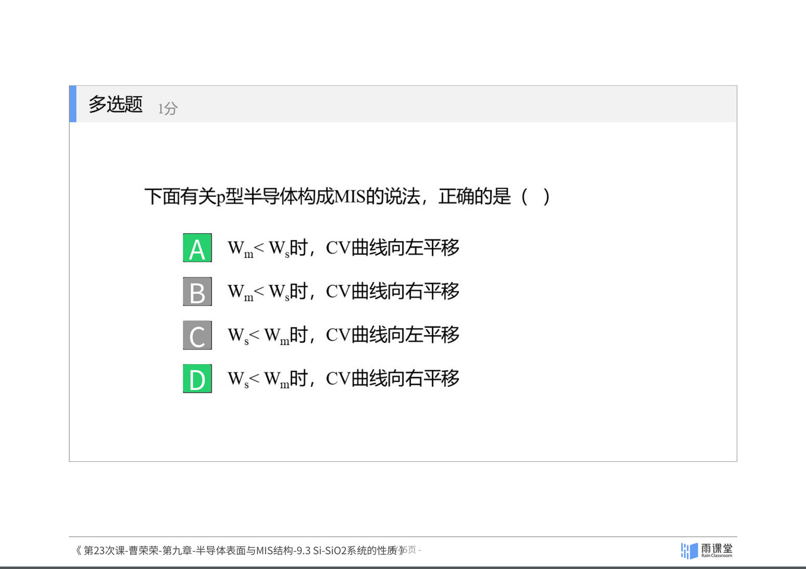
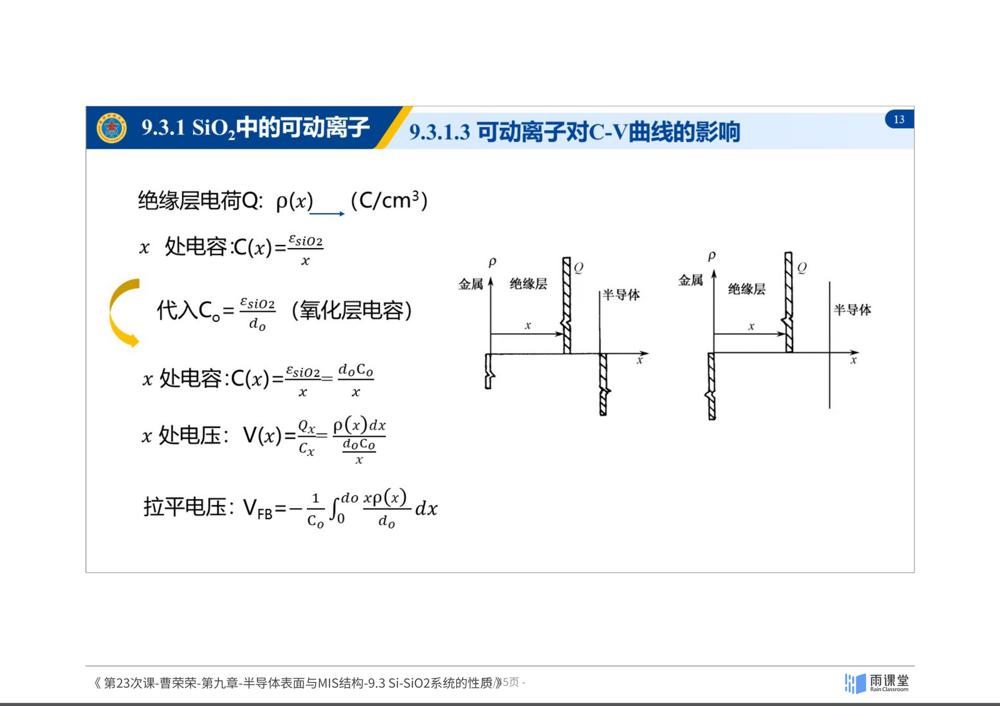
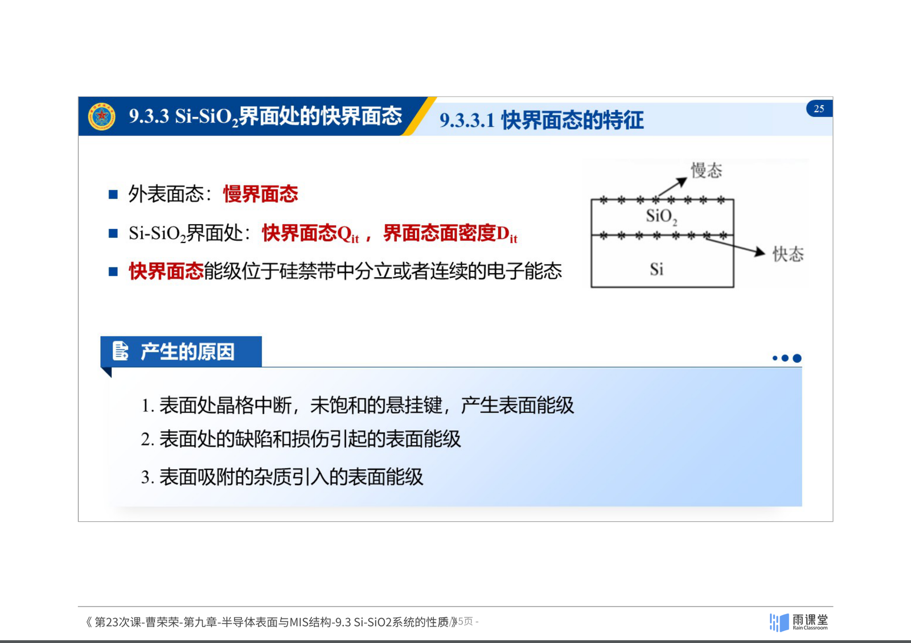
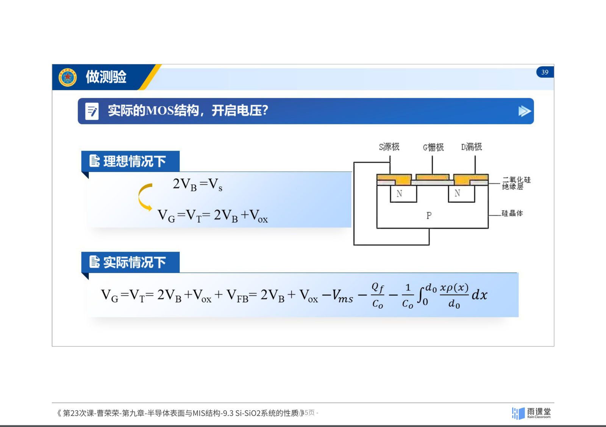

## 9.3 Si-SiO₂系统的性质

### 9.3.1 SiO₂的结构与可动离子

*图：SiO₂的四面体网状结构。来源：曹荣荣老师课件（第23次课）*

#### SiO₂的网状结构

SiO₂ 由硅氧四面体构成：

- 硅原子居于四面体中心，氧原子位于四个角顶
- 两个相邻四面体通过一个**桥键氧原子**连接，构成网络状结构

SiO₂ 网络中的外来杂质分为：

- **替位式杂质**：磷（P）、硼（B）——替代硅或氧的位置
- **间隙式杂质**：钠（Na）、钾（K）——位于网络间隙

#### 可动离子（Na⁺, K⁺）

碱金属离子（特别是Na$^+$）是SiO₂中最常见的可动离子污染物。它们以间隙式存在，可以在SiO₂网络中迁移。

**B-T实验（温度偏压实验）**——测量钠离子沾污程度：

1. 求初始C-V曲线与加偏压后C-V曲线之差 $\Delta V_{FB}$
2. 计算单位面积的钠离子电荷量：$Q_{Na} = C_0 \Delta V_{FB}$
3. 计算单位面积的钠离子数：$N_{Na} = Q_{Na}/q$

可动离子使C-V曲线产生**滞后回线**（hysteresis），这是判断可动离子污染的重要特征。

### 9.3.2 SiO₂中的固定表面电荷

*图：Si-SiO₂界面处的固定表面电荷。来源：曹荣荣老师课件（第23次课）*

#### 固定表面电荷的特征

在硅氧化过程中，需要破坏原来的Si-Si键形成Si-O键。大量的Si-Si键被破坏后**没有形成Si-O键**，以过剩的Si$^{4+}$形式存在于SiO$_x$过渡层中。

**关键特性**：
- 位于Si-SiO₂界面附近约2nm的SiO$_x$过渡层中
- 不可移动——既不失电子也不得电子
- 密度约为 $10^{10}$~$10^{11}\,\text{cm}^{-2}$
- 带正电
- 与氧化工艺条件密切相关

### 9.3.3 Si-SiO₂界面处的快界面态

#### 快界面态的特征

- **慢界面态**（外表面态）：位于SiO₂外表面附近
- **快界面态** $Q_{it}$：位于Si-SiO₂界面处，界面态面密度为 $D_{it}$
- 快界面态能级位于硅**禁带中**，可以是分立的或连续的电子能态

#### 产生的原因

1. 表面处晶格中断，未饱和的**悬挂键**产生表面能级
2. 表面处的**缺陷和损伤**引起的表面能级
3. 表面**吸附的杂质**引入的表面能级

*图：快界面态对半导体能带弯曲的影响。来源：曹荣荣老师课件（第23次课）*

#### 快界面态对能带的影响

- 外加偏压 $V_G$ 时，表面层能带发生弯曲
- $V_G < 0$：P型硅能带向上弯曲（空穴堆积）
- $V_G > 0$：P型硅能带向下弯曲（耗尽/反型）

快界面态的充放电过程会影响C-V曲线的形状，使曲线变得"拉伸"或出现畸变。

### 9.3.4 SiO₂中的陷阱电荷

#### 陷阱电荷的特征

陷阱电荷是由SiO₂中的结构缺陷（如氧空位）引起的。它们可以俘获载流子，导致器件性能退化。

#### 解决方法——退火

**退火**可以消除陷阱电荷：

- 将固体加温至充分高（约400$^\circ$C），再让其徐徐冷却
- 加温时，固体内部粒子随温升变为无序状，内能增大
- 徐徐冷却时粒子渐趋有序，在每个温度都达到平衡态

### 9.3.5 Si-SiO₂系统的四种电荷总结

| 电荷类型 | 符号 | 位置 | 特性 |
|----------|------|------|------|
| 可动离子 | $Q_m$ | SiO₂体内 | Na$^+$、K$^+$，可迁移 |
| 固定表面电荷 | $Q_f$ | Si-SiO₂界面附近 | 过剩Si$^{4+}$，不可移动 |
| 快界面态 | $Q_{it}$ | Si-SiO₂界面 | 与硅交换电荷，响应快 |
| 陷阱电荷 | $Q_{ot}$ | SiO₂体内 | 氧空位等缺陷引起 |

*图：表面载流子浓度与表面电导计算。来源：曹荣荣老师课件（第23次课）*

### 9.3.6 表面电导及迁移率

#### 表面迁移率

受**表面散射**和**表面态**的影响，表面电子迁移率约等于体内电子迁移率的一半：

$$\mu_s \approx \frac{1}{2}\mu_b$$

#### 表面电导

载流子浓度随电势的变化：

$$n_p = n_{p0}\exp(qV/k_0T)$$
$$p_p = p_{p0}\exp(-qV/k_0T)$$

单位面积的表面层中载流子的改变量：

$$\Delta p = \int_0^\infty p_{p0}\left[\exp\left(-\frac{qV}{k_0T}\right) - 1\right]dx$$

$$\Delta n = \int_0^\infty n_{p0}\left[\exp\left(\frac{qV}{k_0T}\right) - 1\right]dx$$

表面电导的变化：

$$\Delta\sigma_s = q(\mu_{ns}\Delta n_s + \mu_{ps}\Delta p_s)$$

表面电导率：

$$\sigma_s(V_s) = \sigma_s(0) + q(\mu_{ns}\Delta n_s + \mu_{ps}\Delta p_s)$$

其中 $\sigma_s(0)$ 为**平带薄层电导**。

垂直于表面方向的电场对表面电导起**控制作用**，这正是场效应管的工作原理。

### 小结

实际Si-SiO₂系统存在四种电荷形式：可动离子（Na$^+$、K$^+$）、固定表面电荷（过剩Si$^{4+}$）、快界面态（悬挂键等）和陷阱电荷（氧空位）。这些电荷会影响MIS结构的C-V曲线，使其发生平移或畸变。通过B-T实验可以测量可动离子污染程度，退火可以消除陷阱电荷。表面迁移率约为体内的一半，表面电导受垂直电场控制——这些是MOSFET器件工作的物理基础。

---
