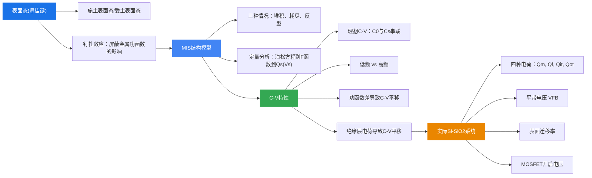

# 本章总结

### 知识脉络

### 核心公式速查

| 公式 | 含义 |
|------|------|
| $V_s = -(E_{is} - E_{ib})/q$ | 表面势定义 |
| $L_D = \sqrt{\varepsilon_r\varepsilon_0 k_0T/(q^2 p_{p0})}$ | 德拜长度 |
| $C = 1/(1/C_0 + 1/C_s)$ | MIS总电容（串联） |
| $x_{dm} = \sqrt{4\varepsilon_{rs}\varepsilon_0 V_B/(qN_A)}$ | 最大耗尽层宽度 |
| $V_{FB} = V_{ms} - Q_i/C_0$ | 平带电压 |
| $Q_{Na} = C_0\Delta V_{FB}$ | 可动离子面电荷密度 |
| $\mu_s \approx \mu_b/2$ | 表面迁移率 |

### 物理意义

1. **表面态**是理解一切半导体表面现象的起点——悬挂键产生的高密度能级主导了表面行为
2. **MIS结构**是MOSFET的核心，其C-V特性是表征半导体表面性质的最重要实验手段
3. **强反型条件** $V_s > 2V_B$ 是MOSFET开启的物理判据
4. 实际Si-SiO₂系统中的**四种电荷**是器件制造中必须控制的工艺参数
5. 低频与高频C-V曲线的区别揭示了**少数载流子响应速度**的物理本质
