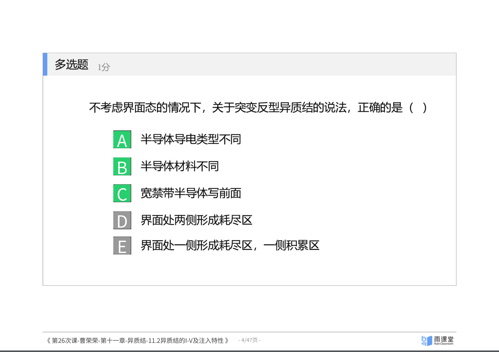
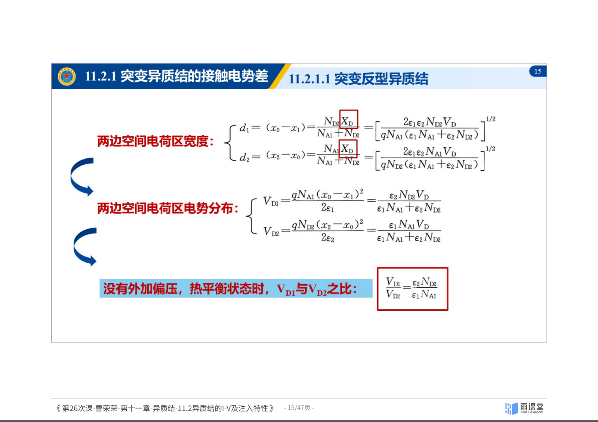
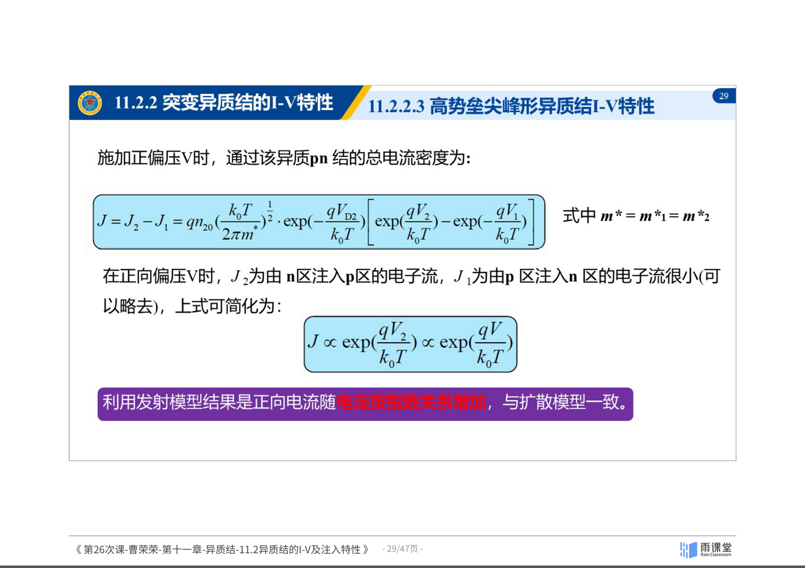
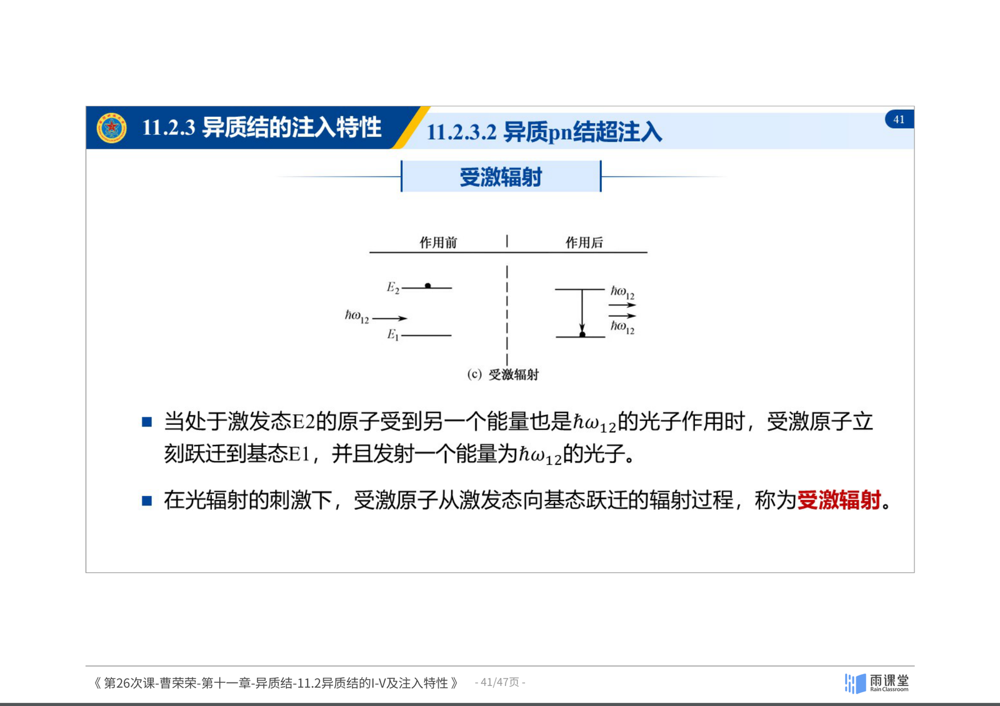

## 11.2 异质结的I-V特性及注入特性

### 异质结的电流输运机制

*图：突变反型异质结的空间电荷区与接触电势差。来源：曹荣荣老师课件（第26次课）*

#### 突变异质结的接触电势差

以突变反型pn异质结为例，两种半导体中杂质均匀分布，浓度分别为 $N_{A1}$ 和 $N_{D2}$。

**势垒区的电荷密度：**

$$\rho_1(x) = -qN_{A1} \quad (x_1 < x < x_0)$$

$$\rho_2(x) = qN_{D2} \quad (x_0 < x < x_2)$$

**泊松方程：**

$$\frac{d^2V_1(x)}{dx^2} = \frac{qN_{A1}}{\varepsilon_0 \varepsilon_{r1}} \quad (x_1 < x < x_0)$$

$$\frac{d^2V_2(x)}{dx^2} = -\frac{qN_{D2}}{\varepsilon_0 \varepsilon_{r2}} \quad (x_0 < x < x_2)$$

**两边空间电荷区宽度：**

$$d_1 = \left[\frac{2\varepsilon_1 \varepsilon_2 N_{D2} V_D}{qN_{A1}(\varepsilon_1 N_{A1} + \varepsilon_2 N_{D2})}\right]^{1/2}$$

$$d_2 = \left[\frac{2\varepsilon_1 \varepsilon_2 N_{A1} V_D}{qN_{D2}(\varepsilon_1 N_{A1} + \varepsilon_2 N_{D2})}\right]^{1/2}$$

**两边电势分布之比（热平衡时）：**

$$\frac{V_{D1}}{V_{D2}} = \frac{\varepsilon_2 N_{D2}}{\varepsilon_1 N_{A1}}$$

**施加外加偏压时（非平衡态）：**

$$\frac{V_{D1} - V_1}{V_{D2} - V_2} = \frac{\varepsilon_2 N_{D2}}{\varepsilon_1 N_{A1}}$$

#### 异质结的能带尖峰

在突变反型异质结中，由于能带不连续，在界面处会形成**尖峰**和**凹口**。尖峰的位置由两边材料的相对掺杂浓度决定：
- 当一侧重掺杂、另一侧轻掺杂时，尖峰偏向轻掺杂一侧（**高势垒尖峰形**）
- 当两侧掺杂接近时，尖峰居中（**低势垒尖峰形**）

*图：异质结的三种电流输运机制——热发射、隧穿、复合。来源：曹荣荣老师课件（第26次课）*

#### 电流输运机制

异质结的电流输运主要有以下几种机制：

**1. 发射模型（热发射）**

载流子越过势垒进行输运，与同质结类似。在平衡态下：

$$n(-x_p) = n_{n0}\exp\left(-\frac{qV_D}{k_0T}\right) = n_{p0}$$

施加正向偏压 $V$ 后：

$$n(-x_p) = n_{p0}\exp\left(\frac{qV}{k_0T}\right)$$

**2. 隧道模型**

隧穿电流等于**隧穿几率**与**入射电子流**的乘积：

$$J = J_s(T)\exp(AV_a)$$

其中：
- $J_s(T)$ 是与温度有微弱关系的常数
- $A$ 是与温度无关的常数
- $V_a$ 为外加偏压

> **关键结论**：隧穿电流只与所施加的**偏压**有关，与**温度**无关。这是区分隧穿机制和热发射机制的重要实验判据。

**3. 复合模型**

在势垒区中，载流子通过界面态或缺陷进行复合，产生复合电流。

> **小结**：异质结的电流输运机制包括热发射、隧穿和复合三种。突变异质结由于能带尖峰的存在，其I-V特性比同质结更为复杂。隧穿电流与温度无关是一个重要的判别特征。接触电势差在两侧的分配取决于 $\varepsilon N$ 的乘积之比。

---

*图：异质pn结的注入比与超注入效应。来源：曹荣荣老师课件（第26次课）*

### 注入特性

#### 异质pn结注入比

**注入比**是指pn结在正向电压下，n区向p区注入的电子电流与p区向n区注入的空穴电流之比：

$$\frac{J_n}{J_p} = \frac{D_{n1} N_{D2} L_{p2}}{D_{p2} N_{A1} L_{n1}} \exp\left(\frac{\Delta E}{k_0T}\right)$$

其中：

$$\Delta E = \Delta E_c + \Delta E_v = E_{g2} - E_{g1}$$

**关键分析：**

- 式中 $\Delta E$ 的指数项是决定注入比的**关键**
- 即使 $N_{A1} > N_{D2}$，由于指数函数 $\exp\left(\frac{\Delta E}{k_0T}\right)$ 远远大于1，仍可获得**很大的注入比**
- 这是异质结相比同质结的一个巨大优势——同质结 $\Delta E = 0$，注入比受限于掺杂浓度比

#### 异质pn结超注入

**超注入**的定义：在异质pn结中，窄禁带半导体的少数载流子浓度可以**超过**宽禁带半导体的多数载流子浓度。

以P-GaAs / n-Al$_x$Ga$_{1-x}$As为例，关键公式为：

$$\frac{n_1}{n_2} \approx \exp\left(\frac{E_{c2} - E_{c1}}{k_0T}\right)$$

**超注入的物理条件：**

1. 只要 $E_{c2} - E_{c1} > 0$，就有 $n_1 > n_2$
2. 室温下 $k_0T$ 的数值很小（约0.026 eV），只要 $E_{c2} - E_{c1}$ 比 $k_0T$ 大一倍，$n_1$ 就比 $n_2$ 大一个数量级
3. 施加正向偏压 $V$，使 $E_{c2}$ 远高于 $E_{c1}$，可有效保证 $n_1 \gg n_2$，实现**超注入**

*图：异质结注入特性与能带关系总结。来源：曹荣荣老师课件（第26次课）*

> **小结**：异质结的注入比中包含指数因子 $\exp(\Delta E/k_0T)$，这使得异质结即使在掺杂不对称的情况下也能获得极高的注入比。超注入效应使得窄禁带一侧的少子浓度可以超过宽禁带一侧的多子浓度，这是同质结不可能实现的，也是异质结激光器的物理基础。

---

