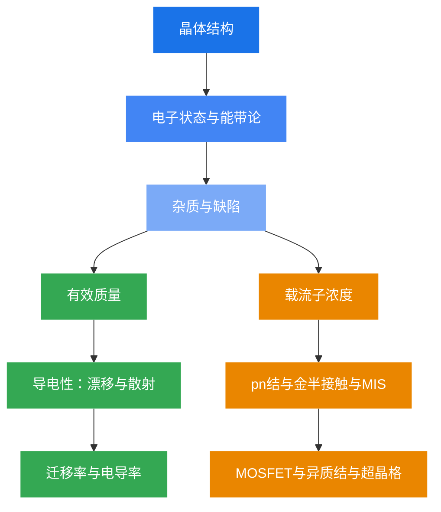

# 半导体物理学

> 基于《半导体物理学（第8版）》（刘恩科等）课程课件整理的学习笔记
>
> 授课教师：曹荣荣 | 笔记整理时间：2026 年春季学期

---

## 概念云

能带论
费米能级
pn结
MOSFET
载流子
有效质量
迁移率
异质结
布洛赫定理
施主
受主
散射
漂移
扩散
MIS
超晶格
肖特基
表面态
量子阱
带隙
空穴
声子
击穿
C-V特性
平带电压
阈值电压
复合
俄歇
雪崩
欧姆接触
钉扎
准费米
金半接触
金刚石结构
闪锌矿
态密度
简并
玻尔兹曼
隧穿
电导率

---

## 简介

半导体物理学是理解现代电子器件和光电器件的理论基础。本 Wiki 涵盖从**晶体结构与能带论**到**MOSFET 与异质结**的完整知识体系，共 10 章、27 节课。

核心线索：**从微观电子行为出发，理解宏观电学性质，最终指导半导体器件设计**。

## 知识脉络

## 快速导航

| 专题 | 章节 | 核心内容 |
|:---|:---|:---|
| **微观基础** | 第二、三章 | 晶体结构、能带论、有效质量、杂质能级 |
| **载流子与输运** | 第四、五、六章 | 状态密度、费米分布、漂移散射、非平衡载流子 |
| **结型器件** | 第七、八章 | pn结、金半接触、肖特基二极管、欧姆接触 |
| **表面与器件** | 第九、十、十一章 | MIS结构、C-V特性、MOSFET、异质结、超晶格 |

## 参考教材

刘恩科, 朱秉升, 罗晋生 等.《半导体物理学（第8版）》. 电子工业出版社.

授课课件：曹荣荣老师（第02次课 ~ 第28次课，共 27 份 PDF）

## 使用说明

建议配合教材和课件一起学习。支持全文搜索，公式由 MathJax 渲染。每章末尾有知识脉络总结与核心公式速查表。点击右上角编辑图标可跳转到 GitHub 仓库贡献内容。

## 共建仓库

本 Wiki 完全开源，欢迎每一位半导体物理学习者和研究者共同完善！

[:fontawesome-brands-github: GitHub 仓库](https://github.com/LiuandXu/semiconductor-physics-wiki){ .md-button .md-button--primary }

**参与方式：**

1. :octicons-git-branch-16: **Fork** 仓库到你的账号
2. :octicons-pencil-16: 编辑或新增 `docs/` 目录下的 Markdown 文件
3. :octicons-git-pull-request-16: 提交 **Pull Request**，审核通过后即可合并
4. :octicons-comment-discussion-16: 每页底部设有评论区，欢迎讨论交流

编辑器推荐 [VS Code](https://code.visualstudio.com/) + [Markdown All in One](https://marketplace.visualstudio.com/items?itemName=yzhang.markdown-all-in-one) 插件。

---

## 致谢

本 Wiki 的样式参考了 [OI Wiki](https://oi-wiki.org/)，基于 [MkDocs Material](https://squidfunk.github.io/mkdocs-material/) 主题构建。
