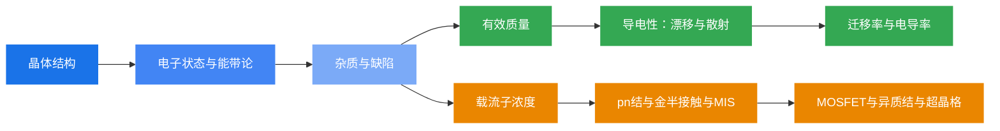

# 半导体物理学 · 学习笔记 Wiki

> 基于《半导体物理学（第8版）》（刘恩科 等）课程课件整理的学习笔记。
> 授课教师：曹荣荣 | 笔记整理时间：2026 年春季学期

---

## 课程概览

本 Wiki 涵盖了半导体物理学从基础到应用的完整知识体系，共 10 个章节、27 节课的内容。笔记以学习笔记的形式组织，力求用通俗易懂的语言梳理核心概念、重要公式和物理图像，方便复习和查阅。

## 知识脉络

半导体物理学的核心线索是：**从微观电子行为出发，理解宏观电学性质，最终指导半导体器件设计**。

## 目录

| 章节 | 主题 | 核心内容 | 课件 |
|:---:|:---|:---|:---:|
| 二 | [半导体中的电子状态](02-电子状态.md) | 晶体结构、能带论、有效质量、典型能带结构 | 3节 |
| 三 | [杂质和缺陷能级](03-杂质和缺陷能级.md) | Si/Ge杂质能级、III-V族化合物杂质能级 | 2节 |
| 四 | [平衡载流子](04-平衡载流子.md) | 状态密度、费米分布、本征/杂质半导体、简并半导体 | 4节 |
| 五 | [导电性](05-导电性.md) | 漂移运动、散射机制、迁移率、电导率 | 2节 |
| 六 | [非平衡载流子](06-非平衡载流子.md) | 载流子注入、准费米能级、复合理论、扩散运动 | 3节 |
| 七 | [pn结与金属-半导体接触](07-pn结与金属半导体接触.md) | 接触过程、能带图、pn结J-V特性、击穿 | 3节 |
| 八 | [金属-半导体接触](08-金半接触.md) | 金半接触能带图、整流接触、欧姆接触 | 2节 |
| 九 | [半导体表面与MIS结构](09-半导体表面与MIS结构.md) | 表面态、电场效应、C-V特性、Si-SiO₂系统 | 3节 |
| 十 | [MOSFET](10-MOSFET.md) | MOSFET原理、基本结构、I-V特性 | 1节 |
| 十一 | [异质结](11-异质结.md) | 异质结能带图、I-V特性、激光器、超晶格 | 4节 |

## 各章简介

### 第二章 · 半导体中的电子状态
从晶体结构出发，讲解周期性势场中电子的运动规律——布洛赫定理、能带的形成、有效质量的概念，以及 Si、Ge、GaAs 等典型材料的能带结构特征。这一章是理解一切半导体性质的微观基础。

### 第三章 · 杂质和缺陷能级
半导体之所以能被灵活调控，关键在于杂质。本章介绍施主/受主杂质如何在禁带中引入局域能级，类氢原子模型如何估算电离能，以及 III-V 族化合物中杂质的双性行为。此外还涉及点缺陷和位错对电学性质的影响。

### 第四章 · 平衡载流子
这是半导体物理最核心的章节之一。从状态密度和费米分布出发，推导出本征载流子浓度公式，再引入杂质后分析 n 型和 p 型半导体在不同温度下的载流子浓度变化，最后讨论简并半导体的特殊情况。

### 第五章 · 导电性
载流子在外电场下的漂移运动产生电流，但散射机制限制了载流子的速度。本章系统讲解电离杂质散射、声学波散射、光学波散射三大机制，以及它们如何决定迁移率和电导率随温度和杂质浓度的变化规律。

### 第六章 · 非平衡载流子
当半导体偏离热平衡时（如光照、电注入），产生额外的载流子。本章引入准费米能级的概念，讲解载流子的产生与复合过程（直接复合、间接复合、俄歇复合），以及扩散运动和爱因斯坦关系。

### 第七章 · pn 结与金属-半导体接触
pn 结是半导体器件的基石。本章从金属-半导体接触的物理过程讲起，推导 pn 结的载流子分布和肖克利方程，分析正向导通、反向截止和击穿（雪崩击穿与隧道击穿）的物理机制。

### 第八章 · 金属-半导体接触
深入讨论金半接触的能带图构建方法，表面态对势垒高度的钉扎效应，以及整流接触（肖特基二极管）和欧姆接触的工作原理与实现方法。

### 第九章 · 半导体表面与 MIS 结构
半导体表面存在独特的表面态和电场效应。本章分析 MIS 结构在堆积、耗尽、反型三种状态下的物理行为，推导 C-V 特性曲线，并讨论 Si-SiO₂ 界面系统的各种电荷及其对器件性能的影响。

### 第十章 · MOSFET
将第九章的 MIS 结构应用到实际器件——MOSFET。讲解其基本结构、工作原理（从阈值电压到沟道形成）、分类（NMOS/PMOS、增强型/耗尽型）以及输出特性曲线的四个工作区域。

### 第十一章 · 异质结
不同半导体材料构成的异质结是现代光电子器件的核心。本章介绍 Anderson 模型构建能带图的方法、异质结的电流输运与注入特性、双异质结激光器的原理，以及半导体超晶格和量子阱的概念。

## 使用说明

- 左侧导航栏可按章节浏览各章笔记，支持全文搜索
- 公式使用 LaTeX 格式，由 MathJax 渲染（支持行内公式 $...$ 和独立公式 $$...$$）
- 每小节末尾有"小结"段落归纳要点，每章末尾有"本章总结"梳理全章知识脉络
- 点击右上角编辑图标可跳转到 GitHub 仓库贡献内容
- 建议配合教材《半导体物理学（第8版）》和课件一起学习

## 参考教材

- 刘恩科, 朱秉升, 罗晋生 等. 《半导体物理学（第8版）》. 电子工业出版社.
- 授课课件：曹荣荣老师（第02次课 ~ 第28次课，共 27 份 PDF）

## 致谢

本 Wiki 的样式参考了 [OI Wiki](https://oi-wiki.org/)，基于 [MkDocs Material](https://squidfunk.github.io/mkdocs-material/) 主题构建。
